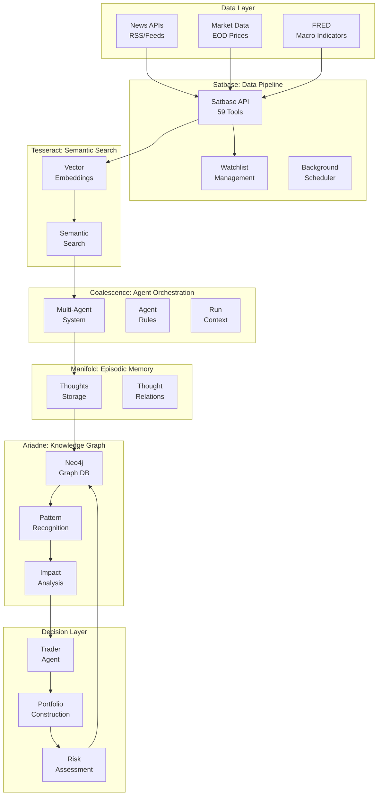
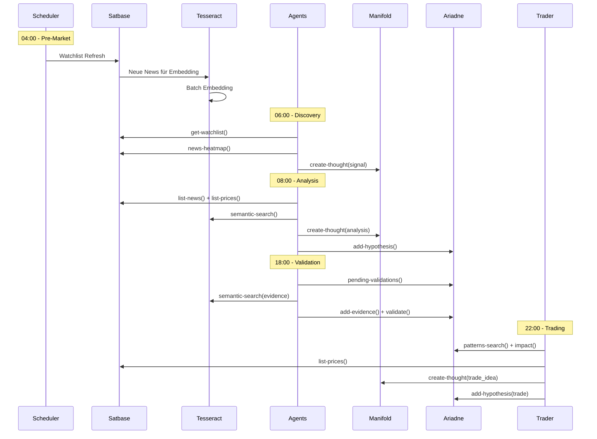

# System-Übersicht: Multi-Agent Knowledge Graph Trading System

## 🎯 System-Ziele

Das System erstellt ein umfassendes Weltmodell durch zyklische Datenerfassung und Multi-Agent-Analyse, um fundierte Trading-Entscheidungen zu treffen:

1. **Zyklische Datenerfassung**: Kontinuierliches Sammeln von News, Preisen und Makro-Daten
2. **Agent-basierte Analyse**: Spezialisierte Agents analysieren Daten und bauen Wissen auf
3. **Wissensgraph-Aufbau**: Strukturierung aller Erkenntnisse in einem kausalen Knowledge Graph
4. **Zusammenhang-Erkennung**: Verbindung neuer Erkenntnisse mit historischem und psychologischem Wissen
5. **Graph-Pflege**: Automatische Validierung und Optimierung des Wissensgraphen
6. **Trading-Entscheidungen**: Handlungsempfehlungen für Aktienkäufe/-verkäufe basierend auf dem Weltmodell
7. **Portfolio-Optimierung**: Aggregation, Reflexion und globale Validierung von Empfehlungen

---

## 🏗️ System-Architektur



---

## 📦 Komponenten-Übersicht

### 1. Satbase MCP (59 Tools)
**Rolle**: "Das Sensorium" - Datenquelle und -verwaltung

**Hauptfunktionen**:
- News-Erfassung und -Speicherung (Watchlist-gesteuert)
- Preis-Daten (EOD, historisch)
- Makro-Daten (FRED)
- Asynchrone Background-Jobs
- Qualitätskontrolle und Gap-Detection

**Key Tools**:
- `list-news` - Token-effiziente News-Abfrage
- `get-watchlist` - Watchlist-Management
- `news-gaps` - Coverage-Lücken identifizieren
- `enqueue-news` - Ingestion triggern

**Schedule**: Täglich, Watchlist-basiert

---

### 2. Tesseract MCP (11 Tools)
**Rolle**: "Das Sehvermögen" - Semantisches Verständnis

**Hauptfunktionen**:
- Multilinguale Embeddings (multilingual-e5-large)
- Semantische Suche über News-Corpus
- Quality-Filtering (Title-Body-Similarity)
- Batch-Embedding für neue Artikel

**Key Tools**:
- `semantic-search` - Semantische Suche mit Filtern
- `find-similar-articles` - Ähnliche Artikel finden
- `get-article-similarity` - Content-Qualität prüfen
- `start-batch-embedding` - Asynchrones Embedding

**Schedule**: Batch/Inkrementell, täglich

---

### 3. Manifold MCP (~50 Tools)
**Rolle**: "Die Gedanken" - Episodisches Gedächtnis

**Hauptfunktionen**:
- Thoughts speichern (Signale, Patterns, Risiken, Trade-Ideen)
- Semantische Suche über Thoughts
- Relation-Management (supports, contradicts, followup)
- Session/Workspace-Management
- Promotion zu Ariadne KG

**Key Tools**:
- `mf-create-thought` - Insights speichern
- `mf-search` - Thoughts durchsuchen
- `mf-link-related` - Verknüpfungen erstellen
- `mf-promote-thought` - Zu Ariadne promoten

**Schedule**: Agent-getrieben, kontinuierlich

---

### 4. Ariadne MCP (70+ Tools)
**Rolle**: "Das Weltmodell" - Strukturiertes Wissen

**Hauptfunktionen**:
- Knowledge Graph (Neo4j) mit Entities & Relations
- Hypothesis-Validation-Workflow
- Pattern-Recognition (erkannte Kausalitäten)
- Market-Regime-Detection
- Impact-Simulation (Kaskadeneffekte)
- Causal-Inference-Engine

**Key Tools**:
- `ar-add-hypothesis` - Hypothesen erstellen
- `ar-validate-hypothesis` - Hypothesen validieren
- `ar-impact` - Impact-Ranking
- `ar-patterns-search` - Patterns finden
- `ar-regimes-current` - Aktuelle Regimes
- `ar-decision-opportunities` - Opportunity-Scoring

**Schedule**: Stündlich/Täglich, Event-getrieben

---

### 5. Coalescence MCP (19 Tools)
**Rolle**: "Der Dirigent" - Agent-Orchestrierung

**Hauptfunktionen**:
- Agent-Konfiguration und -Verwaltung
- Multi-Turn-Workflows
- Context-Management (Pre-Run/Post-Run)
- Agent-zu-Agent-Kommunikation
- Tool-Discovery
- Rule-Management (wiederverwendbare Prompts)

**Key Tools**:
- `list-agents` - Agents auflisten
- `create-agent` - Agent erstellen
- `trigger-agent` - Manuelle Ausführung
- `get-run-context` - Context laden
- `save-insights` - Insights speichern
- `send-message` - Agent-Kommunikation

**Schedule**: Agent-spezifisch (Cron-basiert)

---

## 🔄 Datenfluss und Workflows

### Täglicher Zyklus



### Agent-Workflows

#### 1. Discovery Agent (Täglich 06:00)
```
get-watchlist() 
→ news-heatmap() 
→ trending-tickers() 
→ Synthesize TOP-5 Discoveries 
→ create-thought(signal)
```

#### 2. Analyst Agents (Täglich 08:00/16:00)
```
get-watchlist() 
→ list-news() + list-prices() 
→ semantic-search(queries) 
→ LLM Reasoning (Kausalitäten) 
→ create-thought(signal) 
→ add-hypothesis()
```

#### 3. Validator Agent (Täglich 18:00)
```
pending-validations() 
→ get-hypothesis() 
→ semantic-search(evidence) 
→ list-news() + list-prices() 
→ LLM Evaluation 
→ add-evidence() 
→ validate-hypothesis() → Pattern
```

#### 4. Trader Agent (Täglich 22:00)
```
patterns-search(confidence >= 0.8) 
→ regimes-current() 
→ impact(pattern) 
→ list-prices() 
→ LLM Evaluation (Risk/Reward) 
→ create-thought(trade_idea) 
→ add-hypothesis(trade)
```

#### 5. Reflection Agent (Wöchentlich)
```
search(trade_ideas, days_back: 7) 
→ get-hypothesis(trade) 
→ Evaluate (P&L, Accuracy) 
→ add-evidence(outcome) 
→ create-thought(meta, learnings)
```

---

## 🔍 Optimierungspotential

### ✅ Aktuelle Stärken

1. **Modulare Architektur**: Klare Trennung der Verantwortlichkeiten
2. **Token-Effizienz**: Phasenweise Datenabfrage (Discovery → Deep-Dive)
3. **Asynchrone Verarbeitung**: Non-blocking Background-Jobs
4. **Validation-Workflow**: Strukturierte Hypothesis-Validierung
5. **Learning-Loop**: Trade-Hypothesis-Verknüpfung für kontinuierliches Lernen

### 🚀 Identifizierte Optimierungsmöglichkeiten

#### 1. **Feedback-Loop zwischen Trading und Graph verstärken**

**Problem**: Trade-Outcomes werden nur wöchentlich reflektiert. Direkte Rückkopplung fehlt.

**Lösung**:
- **Real-time Trade-Monitoring**: Trade-Ideas automatisch mit aktuellen Preisen vergleichen
- **Hypothesis-Updates**: Bei Trade-Close automatisch `ar-add-evidence()` mit Outcome
- **Confidence-Calibration**: Kontinuierliche Anpassung der Confidence-Scores basierend auf Trade-Performance
- **Pattern-Validation**: Erfolgreiche Trades → schneller Pattern-Validation

**Implementierung**:
```typescript
// Neuer Agent: Trade-Monitor (stündlich)
TradeMonitor → get-trade-ideas(open) 
→ list-prices(current) 
→ calculate-pnl() 
→ if closed: add-evidence(hypothesis, outcome) 
→ update-confidence()
```

---

#### 2. **Historisches Wissen besser nutzen**

**Problem**: Historische Patterns werden zwar erkannt, aber nicht proaktiv für aktuelle Situationen genutzt.

**Lösung**:
- **Regime-basierte Pattern-Aktivierung**: Bei Regime-Wechsel automatisch relevante historische Patterns aktivieren
- **Temporal-Context**: `ar-time-slice()` und `ar-timeline()` für historische Vergleiche nutzen
- **Analogous-Situation-Detection**: Ähnliche historische Situationen automatisch identifizieren

**Implementierung**:
```typescript
// Erweitere Trader Agent
Trader → regimes-current() 
→ patterns-search(regime=current) 
→ ar-time-slice(as_of=similar_date) 
→ ar-timeline(ticker, from=similar_date) 
→ compare-historical-outcomes()
```

---

#### 3. **Psychologisches Wissen integrieren**

**Problem**: Psychologische Faktoren (Marktstimmung, Herdenverhalten) fehlen im aktuellen System.

**Lösung**:
- **Sentiment-Analysis**: News-Sentiment über Tesseract-Suche analysieren
- **Volatility-Regime-Mapping**: Hohe Volatilität → Fear/Greed-Indikatoren
- **Correlation-Patterns**: Herdenverhalten über Correlation-Cluster erkennen
- **Behavioral-Factors**: Ariadne Relations für psychologische Muster (FOMO, Panic-Selling)

**Implementierung**:
```typescript
// Neuer Agent: Sentiment-Analyst (täglich)
SentimentAnalyst → semantic-search("fear greed panic euphoria") 
→ ar-analytics-communities() 
→ identify-herd-behavior() 
→ create-thought(sentiment) 
→ link-to-regime()
```

---

#### 4. **Portfolio-Vektor-Berechnung automatisiert**

**Problem**: Portfolio-Konstruktion wird erwähnt, aber nicht detailliert beschrieben.

**Lösung**:
- **Opportunity-Scoring**: `ar-decision-opportunities()` für systematische Opportunity-Rankings
- **Risk-Aggregation**: `ar-decision-risk()` für Portfolio-Risk-Assessment
- **Diversification-Constraints**: Graph-basierte Diversifikation (Sektoren, Korrelationen)
- **Position-Sizing**: Confidence-basierte Position-Größen

**Implementierung**:
```typescript
// Portfolio-Construction Agent (täglich EOD)
PortfolioAgent → ar-decision-opportunities() 
→ ar-decision-risk(tickers) 
→ ar-analytics-similarity() // Diversifikation
→ optimize-portfolio(allocation) 
→ create-thought(portfolio_vector)
```

---

#### 5. **Graph-Qualität und Deduplication verbessern**

**Problem**: Graph-Maintenance läuft, aber könnte proaktiver sein.

**Lösung**:
- **Automatische Deduplication**: Regelmäßige `ar-quality-duplicates()` Checks
- **Contradiction-Detection**: Automatische `ar-quality-contradictions()` mit Resolution
- **Gap-Detection**: Proaktive `ar-quality-gaps()` für Knowledge-Lücken
- **Confidence-Propagation**: `ar-analytics-confidence-propagate()` für transitive Confidence

**Implementierung**:
```typescript
// Graph-Maintenance Agent (täglich)
MaintenanceAgent → ar-quality-duplicates() 
→ ar-dedup-plan() 
→ ar-dedup-execute(dry_run=true) 
→ review → execute
→ ar-quality-contradictions() 
→ resolve-contradictions()
```

---

#### 6. **Multi-Agent-Koordination verbessern**

**Problem**: Agents arbeiten parallel, aber Koordination könnte besser sein.

**Lösung**:
- **Message-Broadcasting**: Wichtige Discoveries → `send-message(to_agent="all")`
- **Context-Sharing**: Run-Context zwischen ähnlichen Agents teilen
- **Workload-Balancing**: Analyst-Agents dynamisch nach Workload verteilen
- **Collaborative-Validation**: Mehrere Agents validieren kritische Hypothesen

**Implementierung**:
```typescript
// Discovery Agent erweitern
DiscoveryAgent → identify-critical-event() 
→ send-message(to_agent="all", type="warning") 
→ Analyst-Agents reagieren prioritär
```

---

#### 7. **Token-Budget-Optimierung**

**Problem**: Token-Budgets sind konservativ, könnten aber intelligenter verteilt werden.

**Lösung**:
- **Dynamic-Budget-Allocation**: Mehr Budget für kritische Events
- **Caching-Strategien**: Häufige Queries cachen (z.B. Watchlist)
- **Batch-Processing**: Ähnliche Queries zusammenfassen
- **Selective-Deep-Dive**: Nur relevante Artikel vollständig laden

**Implementierung**:
```typescript
// Budget-Manager erweitern
BudgetManager → monitor-event-importance() 
→ allocate-budget-dynamically() 
→ cache-frequent-queries() 
→ batch-similar-queries()
```

---

#### 8. **Temporal-Awareness verbessern**

**Problem**: Zeitliche Zusammenhänge werden erkannt, aber nicht proaktiv genutzt.

**Lösung**:
- **Event-Seasonality**: Erkennung saisonaler Patterns
- **Lead-Lag-Analysis**: Verzögerte Effekte identifizieren
- **Decay-Functions**: `ar-decision-impact(decay)` für zeitliche Abnahme
- **Temporal-Validation**: Hypothesen mit Zeitfenstern validieren

**Implementierung**:
```typescript
// Temporal-Analysis Agent (wöchentlich)
TemporalAgent → ar-pattern-occurrences(time_range) 
→ identify-seasonality() 
→ ar-timeline(lead_lag_analysis) 
→ create-thought(temporal_pattern)
```

---

## 📊 Metriken und Monitoring

### Erfolgs-KPIs

1. **Graph-Qualität**:
   - Anzahl validierter Patterns
   - Confidence-Score-Verteilung
   - Contradiction-Rate
   - Gap-Coverage

2. **Trading-Performance**:
   - Trade-Accuracy (Hypothesis vs. Outcome)
   - Portfolio-Returns
   - Risk-Adjusted-Returns (Sharpe Ratio)
   - Win-Rate nach Pattern-Typ

3. **Agent-Effizienz**:
   - Token-Verbrauch pro Agent
   - Run-Duration
   - Quality der generierten Thoughts/Hypotheses
   - Context-Reuse-Rate

4. **System-Gesundheit**:
   - Data-Coverage (News, Prices, Macro)
   - Embedding-Latency
   - Graph-Query-Performance
   - Job-Success-Rate

---

## 🎯 Roadmap-Vorschläge

### Phase 1: Stabilisierung (Woche 1-2)
- ✅ Trade-Monitor Agent implementieren
- ✅ Portfolio-Construction Agent detaillieren
- ✅ Graph-Maintenance automatisiert

### Phase 2: Optimierung (Woche 3-4)
- ✅ Sentiment-Analysis integrieren
- ✅ Temporal-Awareness verbessern
- ✅ Multi-Agent-Koordination verstärken

### Phase 3: Erweiterung (Woche 5-6)
- ✅ Historisches Wissen proaktiv nutzen
- ✅ Psychologische Faktoren integrieren
- ✅ Advanced Portfolio-Optimization

---

## 📚 Weiterführende Dokumentation

- [Satbase MCP Manual](./satbase-mcp-manual.md)
- [Ariadne MCP Manual](./ariadne-mcp-manual.md)
- [Tesseract MCP Manual](./tesseract-mcp-manual.md)
- [Manifold MCP Manual](./manifold-mcp-manual.md)
- [Coalescence MCP Manual](./coalescence-mcp-manual.md)
- [Multi-Agent Architecture](../ARCHITECTURE_MULTI_AGENT_SYSTEM.md)

---

**Version**: 1.0.0  
**Letzte Aktualisierung**: 2025-01-24  
**Status**: System in aktiver Entwicklung

## Zusammenfassung der Optimierungsvorschläge

Die wichtigsten Punkte:

1. Feedback-Loop verstärken: Trade-Outcomes schneller zurück in den Graph
2. Historisches Wissen: Regime-basierte Pattern-Aktivierung
3. Psychologische Faktoren: Sentiment-Analysis und Herdenverhalten
4. Portfolio-Vektor: Automatisierte Opportunity-Scoring und Risk-Aggregation
5. Graph-Qualität: Proaktive Deduplication und Contradiction-Resolution
6. Multi-Agent-Koordination: Bessere Kommunikation zwischen Agents
7. Token-Optimierung: Dynamische Budget-Allocation
8. Temporal-Awareness: Saisonalität und Lead-Lag-Analysis

Soll ich einzelne Punkte vertiefen oder mit der Implementierung beginnen?
