# Ariadne MCP - Komplettes Manual

## Inhaltsverzeichnis

1. [Übersicht](#übersicht)
2. [Architektur](#architektur)
3. [Tool-Katalog](#tool-katalog)
4. [Tool-Strategien](#tool-strategien)
5. [Workflows & Best Practices](#workflows--best-practices)
6. [Erweiterte Nutzung](#erweiterte-nutzung)

---

## Übersicht

Der **Ariadne MCP** (Model Context Protocol Server) ist eine umfassende Schnittstelle für den Zugriff auf einen **Knowledge Graph** basierend auf Neo4j. Er bietet **70+ Tools** für:

- 📊 **Read**: Graph-Abfragen, Kontext-Extraktion, Impact-Analyse
- ✍️ **Write**: Fakten, Beobachtungen und Hypothesen hinzufügen
- ✅ **Validate**: Hypothesen-Validierung mit Evidence-Tracking
- 📈 **Analytics**: Graph-Algorithmen (Centrality, Communities, Similarity)
- 🎯 **Decision**: Risiko-Scoring, Impact-Simulation, Opportunity-Detection
- 🔍 **Quality**: Widersprüche, Lücken, Anomalien und Duplikate erkennen
- 🛠️ **Admin**: Graph-Pflege, Deduplizierung, Learning
- 🎓 **Learn**: Korrelationen und Community-Detection (Background-Tasks)
- 📥 **Ingest**: Preis-Daten-Import und Event-Detection
- 💡 **Suggestions**: Auto-Complete für Entities, Relationen, Patterns

### System-Architektur

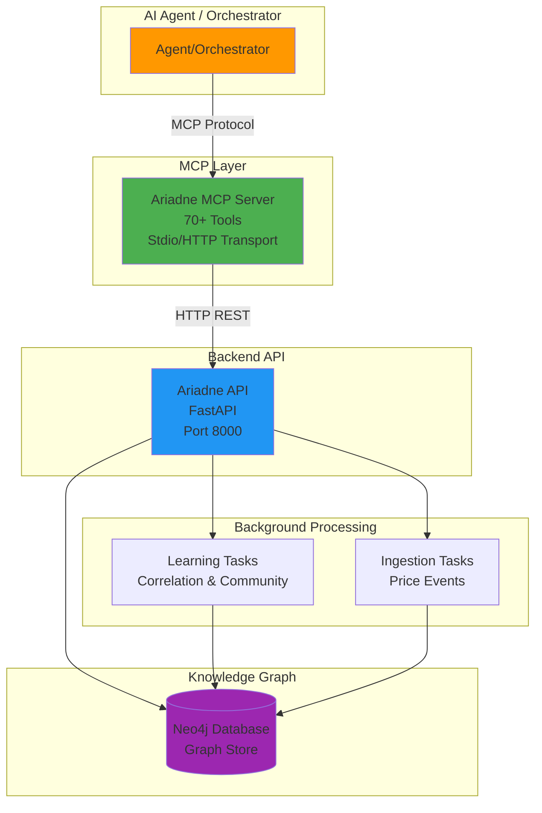

### Knowledge Graph Schema

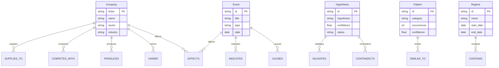

---

## Architektur

### Tool-Kategorien-Hierarchie

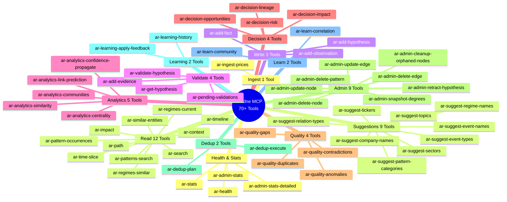

### Datenfluss: Hypothesis Validation Workflow

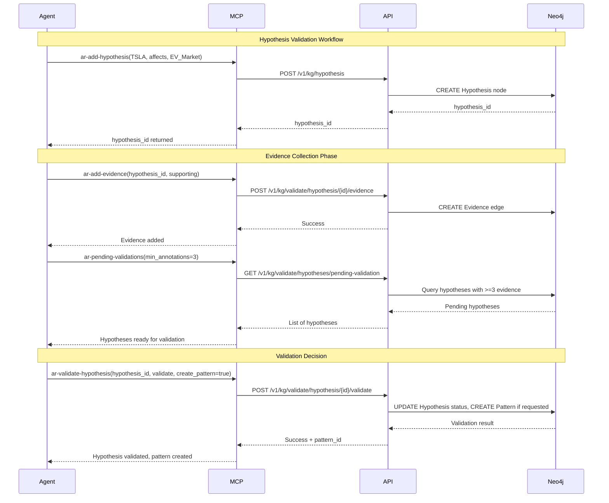

### Graph Traversal: Impact Analysis Flow

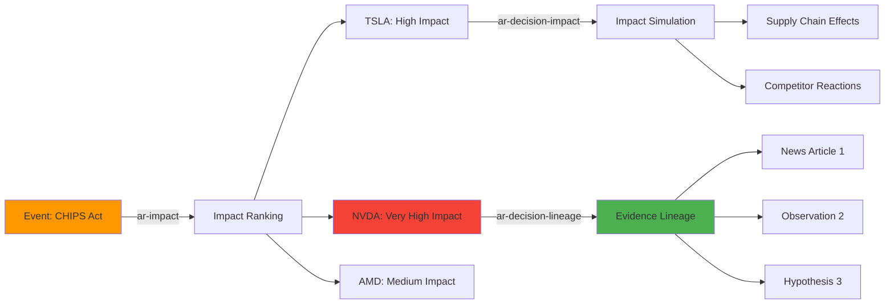

---

## Tool-Katalog

### Health & Stats (4 Tools)

#### `ar-health`
**Beschreibung**: Health-Check für die Ariadne API. Prüft Verbindung zu Neo4j und gibt Status zurück.

**Parameter**: Keine

**Rückgabe**:
```json
{
  "status": "healthy",
  "neo4j_connected": true,
  "version": "0.1.0"
}
```

**Verwendung**:
- System-Status prüfen vor kritischen Operationen
- Monitoring und Health-Checks
- Debugging bei Verbindungsproblemen

**Strategie**: Immer zuerst ausführen, wenn Unsicherheit über System-Status besteht.

---

#### `ar-stats`
**Beschreibung**: Grundlegende Graph-Statistiken (Node-Counts, Edge-Counts, Label-Verteilung).

**Parameter**:
- `detailed` (boolean, optional): Detaillierte Statistiken abrufen

**Rückgabe**:
```json
{
  "nodes": {
    "Company": 500,
    "Event": 1200,
    "Hypothesis": 150
  },
  "edges": {
    "SUPPLIES_TO": 300,
    "AFFECTS": 800,
    "COMPETES_WITH": 200
  },
  "total_nodes": 1850,
  "total_edges": 1300
}
```

**Verwendung**:
- Graph-Größe überwachen
- Datenqualität prüfen (z.B. zu viele Hypothesen ohne Validation)
- Monitoring und Reporting

**Strategie**: Regelmäßig ausführen, um Graph-Wachstum zu überwachen.

---

#### `ar-admin-stats`
**Beschreibung**: Admin-Übersicht mit zusätzlichen Metriken (Hypothesen-Status, Pattern-Counts).

**Parameter**: Keine

**Rückgabe**: Erweiterte Statistiken mit Hypothesen-Status, Pattern-Counts, Regime-Info.

**Verwendung**: Detailliertere Analyse als `ar-stats`, aber schneller als `ar-admin-stats-detailed`.

---

#### `ar-admin-stats-detailed`
**Beschreibung**: Sehr detaillierte Statistiken für Deep-Dive-Analysen.

**Parameter**: Keine

**Rückgabe**: Umfassende Statistiken mit Zeitreihen, Confidence-Verteilungen, Temporal-Analysen.

**Verwendung**: Tiefgreifende Analyse der Graph-Qualität und -Struktur.

**Strategie**: Nur bei Bedarf verwenden, da ressourcenintensiv.

---

### Read Tools (12 Tools)

#### `ar-context`
**Beschreibung**: Extrahiert einen kontextuellen Subgraph für ein Topic oder eine Liste von Tickers. Zeigt verwandte Entities und deren Beziehungen.

**Parameter**:
- `topic` (string, optional): Topic-Name (z.B. "semiconductor", "EV")
- `tickers` (string[], optional): Liste von Ticker-Symbolen
- `as_of` (string, optional): Zeitpunkt für temporal Query (ISO-Datum)
- `depth` (number, 1-3, optional): Traversal-Tiefe (default: 2)
- `limit` (number, 1-1000, optional): Maximale Anzahl Nodes (default: 200)

**Rückgabe**: Subgraph mit Nodes und Edges (inkl. Properties, Confidence-Werte).

**Verwendung**:
- Schneller Überblick über ein Thema oder Unternehmen
- Exploration des Graphs um eine Entity herum
- Historische Analyse mit `as_of`

**Strategie**:
- **Exploration**: Starte mit `depth=1`, dann erhöhen bei Bedarf
- **Performance**: `limit` niedrig halten für schnelle Antworten
- **Temporal**: `as_of` verwenden für "Wie sah der Graph zu Zeitpunkt X aus?"

**Beispiel-Workflow**:
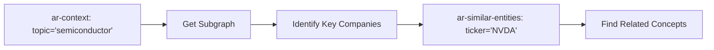

---

#### `ar-impact`
**Beschreibung**: Rankt Entities nach Impact durch ein Event. Verwendet Graph-Traversal und Confidence-Aggregation.

**Parameter**:
- `event_id` (string, optional): Event Node-ID
- `event_query` (string, optional): Event-Suche nach Name/Type
- `k` (number, 1-100, optional): Top-K Entities (default: 10)
- `as_of` (string, optional): Zeitpunkt für Impact-Berechnung

**Rückgabe**: Sortierte Liste von Entities mit Impact-Scores und Confidence-Werten.

**Verwendung**:
- "Welche Unternehmen sind von Event X betroffen?"
- Impact-Analyse für Entscheidungsfindung
- Portfolio-Risiko-Assessment

**Strategie**:
- Kombiniere mit `ar-decision-impact` für detaillierte Simulation
- Verwende `ar-decision-lineage` um Evidence zu verfolgen
- Nutze für Portfolio-Risiko-Analyse

---

#### `ar-timeline`
**Beschreibung**: Chronologische Timeline von Events und Relationen für eine Entity oder einen Ticker.

**Parameter**:
- `entity_id` (string, optional): Node-ID
- `ticker` (string, optional): Ticker-Symbol
- `from_date` (string, optional): Start-Datum (ISO-Format)
- `to_date` (string, optional): End-Datum (ISO-Format)

**Rückgabe**: Zeitlich sortierte Liste von Events, Relationen, Observations.

**Verwendung**:
- Historische Analyse einer Company
- "Was ist mit TSLA in Q1 2024 passiert?"
- Event-Sequenz-Analyse

**Strategie**:
- Kombiniere mit `ar-regimes-current` um Markt-Regime zu verstehen
- Verwende für Storytelling und Narrative-Aufbau
- Nutze für Backtesting von Hypothesen

---

#### `ar-similar-entities`
**Beschreibung**: Findet ähnliche Companies basierend auf Graph-Struktur (Jaccard-Similarity oder GDS Node Similarity).

**Parameter**:
- `ticker` (string, required): Referenz-Ticker
- `method` (enum: 'weighted_jaccard' | 'gds', optional): Similarity-Algorithmus
- `limit` (number, 1-100, optional): Anzahl ähnlicher Entities

**Rückgabe**: Liste ähnlicher Companies mit Similarity-Scores.

**Verwendung**:
- "Welche Companies sind ähnlich zu NVDA?"
- Peer-Group-Analyse
- Substitute-Identifikation

**Strategie**:
- `weighted_jaccard`: Schneller, basierend auf gemeinsamen Relationen
- `gds`: Präziser, verwendet Graph Data Science Library
- Kombiniere mit `ar-analytics-communities` für Clustering

---

#### `ar-patterns-search`
**Beschreibung**: Sucht nach validierten Patterns im Graph. Patterns sind wiederkehrende Kausalitäten oder Zusammenhänge.

**Parameter**:
- `category` (string, optional): Pattern-Kategorie filtern
- `min_confidence` (number, 0-1, optional): Minimaler Confidence-Wert
- `min_occurrences` (number, optional): Minimale Anzahl Vorkommen

**Rückgabe**: Liste von Patterns mit Metadaten (Category, Confidence, Occurrences).

**Verwendung**:
- "Welche Patterns gibt es für Tech-Sector?"
- Pattern-Discovery für Analogie-Reasoning
- Validierte Kausalitäten finden

**Strategie**:
- Kombiniere mit `ar-pattern-occurrences` für historische Analyse
- Verwende für "Similar Situation"-Reasoning
- Nutze Patterns als Templates für neue Hypothesen

---

#### `ar-pattern-occurrences`
**Beschreibung**: Historische Vorkommen eines Patterns mit Zeitstempeln.

**Parameter**:
- `pattern_id` (string, required): Pattern-ID
- `from_date` (string, optional): Start-Datum
- `to_date` (string, optional): End-Datum

**Rückgabe**: Liste von Pattern-Occurrences mit Zeitstempeln und Kontext.

**Verwendung**:
- "Wie oft ist Pattern X aufgetreten?"
- Backtesting von Patterns
- Erfolgsrate-Analyse

**Strategie**: Wichtig für Pattern-Validation und Confidence-Calibration.

---

#### `ar-regimes-current`
**Beschreibung**: Aktuelle Markt-Regimes (z.B. "Bull Market", "Crisis", "Recovery").

**Parameter**: Keine

**Rückgabe**: Liste aktueller Regimes mit Metadaten.

**Verwendung**:
- Aktueller Markt-Kontext
- Regime-basierte Strategien
- Context für Entscheidungen

**Strategie**: Wichtig für Regime-aware Decision-Making.

---

#### `ar-regimes-similar`
**Beschreibung**: Findet historische Regimes mit ähnlichen Charakteristika.

**Parameter**:
- `characteristics` (string[], required): Liste von Charakteristika
- `limit` (number, 1-50, optional): Anzahl ähnlicher Regimes

**Rückgabe**: Liste ähnlicher Regimes mit Similarity-Scores.

**Verwendung**:
- "Welche historischen Regimes ähneln der aktuellen Situation?"
- Analogie-Reasoning
- "Was ist in ähnlichen Situationen passiert?"

**Strategie**: Kombiniere mit `ar-pattern-occurrences` für historische Muster-Analyse.

---

#### `ar-search`
**Beschreibung**: Fulltext-Suche über alle Node-Properties via Neo4j Fulltext-Index.

**Parameter**:
- `text` (string, required): Suchtext
- `labels` (string, optional): Node-Labels filtern (z.B. "Company", "Event")
- `limit` (number, 1-100, optional): Maximale Ergebnisse (default: 10)

**Rückgabe**: Liste von Nodes, die den Suchtext enthalten.

**Verwendung**:
- "Finde alle Entities die 'Tesla' oder 'EV' enthalten"
- Entity-Discovery
- Exploration des Graphs

**Strategie**:
- Verwende für initiale Exploration
- Kombiniere mit `ar-context` für detaillierte Analyse
- Nutze `labels` Parameter für fokussierte Suche

---

#### `ar-path`
**Beschreibung**: Findet Pfade zwischen zwei Nodes mittels APOC Path Expansion.

**Parameter**:
- `from_id` (string, required): Start-Node-ID
- `to_id` (string, required): Ziel-Node-ID
- `max_hops` (number, 1-20, optional): Maximale Hops (default: 5)
- `algo` (enum: 'shortest' | 'ksp', optional): Algorithmus (default: 'shortest')

**Rückgabe**: Pfad(e) zwischen den Nodes mit Zwischenknoten und Relationen.

**Verwendung**:
- "Wie ist TSLA mit AAPL verbunden?"
- Verbindungs-Analyse
- Impact-Propagation verstehen

**Strategie**:
- `shortest`: Schnellster Pfad (nur einer)
- `ksp`: K-Shortest-Paths (mehrere alternative Pfade)
- Verwende für Dependency-Analyse und Impact-Tracing

---

#### `ar-time-slice`
**Beschreibung**: Graph-Snapshot zu einem bestimmten Zeitpunkt basierend auf `valid_from`/`valid_to` Properties.

**Parameter**:
- `as_of` (string, required): Zeitpunkt (ISO-Datum)
- `topic` (string, optional): Topic filtern
- `tickers` (string, optional): Comma-separated Ticker-Liste
- `limit` (number, 1-1000, optional): Maximale Nodes

**Rückgabe**: Subgraph der zum Zeitpunkt `as_of` gültig war.

**Verwendung**:
- "Wie sah der Graph am 2024-01-01 aus?"
- Historische Rekonstruktion
- Temporal-Analyse

**Strategie**:
- Wichtig für "Point-in-Time"-Analysen
- Kombiniere mit `ar-timeline` für vollständiges Bild
- Nutze für Backtesting und Validierung

---

### Write Tools (3 Tools)

#### `ar-add-fact`
**Beschreibung**: Erstellt oder aktualisiert eine Fact-Relation zwischen zwei Entities mit Provenance-Tracking.

**Parameter**:
- `source_label` (string, required): Label des Source-Nodes (z.B. "Company")
- `source_id` (string, required): ID des Source-Nodes
- `target_label` (string, required): Label des Target-Nodes
- `target_id` (string, required): ID des Target-Nodes
- `rel_type` (string, required): Relation-Type (z.B. "SUPPLIES_TO", "COMPETES_WITH")
- `source` (string, optional): Provenance-Quelle (z.B. "news_article_123")
- `confidence` (number, 0-1, optional): Confidence-Wert (default: 0.7)
- `method` (string, optional): Extraktions-Methode (z.B. "llm", "rule-based")
- `valid_from` (string, optional): Gültigkeitsbeginn (ISO-Datum)
- `valid_to` (string, optional): Gültigkeitsende (ISO-Datum)
- `properties` (object, optional): Zusätzliche Properties

**Rückgabe**: Erstellte/aktualisierte Edge mit Metadaten.

**Verwendung**:
- Strukturierte Fakten hinzufügen
- Relationen aus News/Events extrahieren
- Graph-Wachstum

**Strategie**:
- **Confidence**: 
  - 0.9+: Verifizierte Fakten (z.B. aus Financial Reports)
  - 0.7-0.9: Hohe Wahrscheinlichkeit (z.B. aus News)
  - 0.5-0.7: Moderate Confidence (z.B. aus LLM-Extraktion)
  - <0.5: Spekulativ → Verwende `ar-add-hypothesis` stattdessen
- **Temporal**: Verwende `valid_from`/`valid_to` für zeitlich begrenzte Relationen
- **Provenance**: Immer `source` angeben für Audit-Trail

**Workflow**:
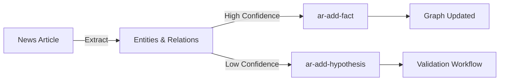

---

#### `ar-add-observation`
**Beschreibung**: Erstellt eine Observation-Node und verlinkt sie zu Entities/Events.

**Parameter**:
- `date` (string, required): Beobachtungsdatum (ISO-Format)
- `content` (string, required): Beobachtungstext
- `tags` (string[], optional): Tags für Kategorisierung
- `confidence` (number, 0-1, optional): Confidence-Wert (default: 0.7)
- `related_tickers` (string[], optional): Verwandte Ticker
- `related_events` (string[], optional): Verwandte Event-IDs

**Rückgabe**: Erstellte Observation-Node mit ID.

**Verwendung**:
- Tägliche Beobachtungen speichern
- Roh-Daten vor Hypothesis-Formulierung
- Evidence-Sammlung

**Strategie**:
- Verwende für "Raw Observations" die noch nicht zu Hypothesen verdichtet wurden
- Kombiniere mit `ar-add-evidence` um Observations als Evidence zu verwenden
- Tags verwenden für spätere Suche und Gruppierung

---

#### `ar-add-hypothesis`
**Beschreibung**: Erstellt eine Hypothesis zwischen zwei Entities. Hypothesen müssen validiert werden bevor sie zu Facts werden.

**Parameter**:
- `source_label` (string, required): Source-Node-Label
- `source_id` (string, required): Source-Node-ID
- `target_label` (string, required): Target-Node-Label
- `target_id` (string, required): Target-Node-ID
- `hypothesis` (string, required): Hypothese-Text
- `confidence` (number, 0-1, optional): Initiale Confidence (default: 0.5)
- `properties` (object, optional): Zusätzliche Properties

**Rückgabe**: Erstellte Hypothesis-Node mit ID.

**Verwendung**:
- Spekulative Relationen speichern
- Kausale Zusammenhänge formulieren
- Für Validation-Workflow

**Strategie**:
- **Hypothesis vs Fact**: 
  - Fact (`ar-add-fact`): Verifizierte, hochkonfidente Relationen
  - Hypothesis (`ar-add-hypothesis`): Spekulative, unverifizierte Relationen
- **Workflow**: Hypothesis → Evidence sammeln → Validation → Pattern (optional)
- **Confidence**: Starte niedrig (0.5), erhöhe durch Evidence

**Validation Workflow**:
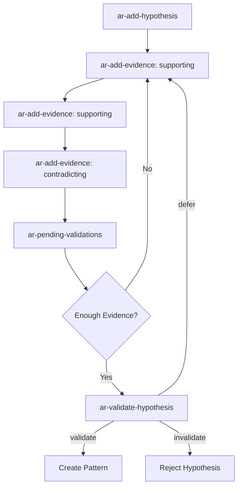

---

### Validate Tools (4 Tools)

#### `ar-add-evidence`
**Beschreibung**: Fügt Evidence (unterstützend oder widersprechend) zu einer Hypothesis hinzu.

**Parameter**:
- `hypothesis_id` (string, required): Hypothesis-ID
- `body` (object, required): Evidence-Body mit:
  - `evidence_source_type` (string): Typ der Quelle (z.B. "news", "observation", "pattern")
  - `evidence_source_id` (string): ID der Quelle
  - `evidence_type` (enum: 'supporting' | 'contradicting'): Evidence-Typ
  - `confidence` (number, 0-1, optional): Confidence-Wert (default: 0.7)
  - `notes` (string, optional): Zusätzliche Notizen
  - `annotated_by` (string, optional): Wer hat annotiert

**Rückgabe**: Erstellte Evidence-Edge.

**Verwendung**:
- Evidence für Hypothesen sammeln
- Validation-Workflow unterstützen
- Audit-Trail aufbauen

**Strategie**:
- **Supporting Evidence**: Stärkt die Hypothese → Erhöht Confidence
- **Contradicting Evidence**: Schwächt die Hypothese → Verringert Confidence
- **Source Types**: Verwende konsistente Typen für bessere Traceability
- **Minimum Evidence**: Meist 3+ Evidence-Points bevor Validation

---

#### `ar-validate-hypothesis`
**Beschreibung**: Finale Validation-Entscheidung für eine Hypothesis. Kann optional ein Pattern erstellen.

**Parameter**:
- `hypothesis_id` (string, required): Hypothesis-ID
- `body` (object, required): Validation-Body mit:
  - `decision` (enum: 'validate' | 'invalidate' | 'defer'): Entscheidung
  - `validated_by` (string, optional): Wer hat validiert (default: "agent")
  - `reasoning` (string, optional): Begründung
  - `create_pattern` (boolean, optional): Pattern erstellen? (default: true)

**Rückgabe**: Validation-Result mit optionaler Pattern-ID.

**Verwendung**:
- Hypothesen final validieren oder ablehnen
- Patterns aus validierten Hypothesen erstellen
- Graph-Qualität sicherstellen

**Strategie**:
- **validate**: Hypothese ist korrekt → Kann zu Fact werden oder Pattern erstellen
- **invalidate**: Hypothese ist falsch → Wird als negativ markiert
- **defer**: Nicht genug Evidence → Weiter sammeln
- **create_pattern**: Wenn Hypothese validiert und wiederkehrend → Pattern erstellen

---

#### `ar-pending-validations`
**Beschreibung**: Listet Hypothesen die das Validation-Threshold erreicht haben (z.B. >=3 Evidence-Points).

**Parameter**:
- `min_annotations` (number, >=1, optional): Minimaler Evidence-Count (default: 3)

**Rückgabe**: Liste von Hypothesen mit Evidence-Counts.

**Verwendung**:
- Finden von Hypothesen die validiert werden können
- Workflow-Management
- Monitoring

**Strategie**: Regelmäßig ausführen um Validation-Backlog zu überwachen.

---

#### `ar-get-hypothesis`
**Beschreibung**: Holt Details einer Hypothesis inkl. aller Evidence (supporting + contradicting).

**Parameter**:
- `hypothesis_id` (string, required): Hypothesis-ID

**Rückgabe**: Hypothesis mit vollständiger Evidence-Liste.

**Verwendung**:
- Detaillierte Hypothesis-Analyse
- Evidence-Review vor Validation
- Debugging

**Strategie**: Immer vor `ar-validate-hypothesis` ausführen um vollständigen Kontext zu haben.

---

### Analytics Tools (5 Tools)

#### `ar-analytics-centrality`
**Beschreibung**: Berechnet Centrality-Scores (PageRank, Betweenness, Closeness) für Nodes.

**Parameter**:
- `algo` (enum: 'pagerank' | 'betweenness' | 'closeness', optional): Algorithmus
- `label` (string, optional): Node-Label filtern (z.B. "Company")
- `topk` (number, optional): Top-K Nodes zurückgeben

**Rückgabe**: Nodes sortiert nach Centrality-Score.

**Verwendung**:
- "Welche Entities sind am wichtigsten im Graph?"
- Influencer-Identifikation
- Graph-Struktur-Analyse

**Strategie**:
- **PageRank**: Allgemeine Wichtigkeit (default)
- **Betweenness**: Bridge-Nodes zwischen Communities
- **Closeness**: Nodes die schnell zu anderen kommen
- Kombiniere mit `ar-decision-opportunities` für Opportunity-Scoring

---

#### `ar-analytics-communities`
**Beschreibung**: Detektiert Communities (Clusters) im Graph mittels Louvain oder Leiden Algorithmus.

**Parameter**:
- `algo` (enum: 'louvain' | 'leiden', optional): Algorithmus (default: 'louvain')
- `label` (string, optional): Node-Label filtern

**Rückgabe**: Communities mit Member-Nodes.

**Verwendung**:
- "Welche Companies bilden Cluster?"
- Sector-Identifikation
- Graph-Struktur verstehen

**Strategie**:
- **Louvain**: Schneller, gut für große Graphs
- **Leiden**: Präziser, besser für kleine Graphs
- Kombiniere mit `ar-similar-entities` für Peer-Group-Analyse

---

#### `ar-analytics-similarity`
**Beschreibung**: Findet ähnliche Nodes mittels GDS Node Similarity.

**Parameter**:
- `node_id` (string, required): Referenz-Node-ID
- `method` (string, optional): Similarity-Methode
- `topk` (number, optional): Top-K ähnliche Nodes

**Rückgabe**: Ähnliche Nodes mit Similarity-Scores.

**Verwendung**:
- Ähnliche Entities finden
- Alternative zu `ar-similar-entities` (präziser)

**Strategie**: Präziser als `ar-similar-entities` aber langsamer.

---

#### `ar-analytics-link-prediction`
**Beschreibung**: Vorhersage fehlender Links zwischen Nodes.

**Parameter**:
- `node_id` (string, required): Referenz-Node-ID
- `topk` (number, optional): Top-K vorhergesagte Links

**Rückgabe**: Vorhergesagte Links mit Probability-Scores.

**Verwendung**:
- "Welche Links fehlen wahrscheinlich?"
- Graph-Completion
- Discovery von versteckten Zusammenhängen

**Strategie**: Verwende für Graph-Exploration und Discovery.

---

#### `ar-analytics-confidence-propagate`
**Beschreibung**: Berechnet transitive Confidence von Source zu Target Nodes.

**Parameter**:
- `from_ticker` (string, optional): Start-Ticker
- `from_id` (string, optional): Start-Node-ID
- `to_label` (string, optional): Target-Label filtern
- `max_depth` (number, optional): Maximale Traversal-Tiefe
- `mode` (string, optional): Propagation-Mode
- `min_confidence` (number, 0-1, optional): Minimaler Confidence-Threshold
- `limit` (number, optional): Maximale Ergebnisse

**Rückgabe**: Target-Nodes mit propagierter Confidence.

**Verwendung**:
- "Wie sicher können wir über Entity Y sein basierend auf Entity X?"
- Confidence-Aggregation über Pfade
- Uncertainty-Quantification

**Strategie**: Wichtig für Entscheidungen basierend auf indirekten Evidenzen.

---

### Decision Tools (4 Tools)

#### `ar-decision-risk`
**Beschreibung**: Berechnet Risiko-Score für eine Company basierend auf negativen Events, Dependencies und Low-Confidence-Relations.

**Parameter**:
- `ticker` (string, required): Company-Ticker
- `include_centrality` (boolean, optional): PageRank-Centrality einbeziehen

**Rückgabe**:
```json
{
  "ticker": "TSLA",
  "risk_score": 65.3,
  "severity": "medium",
  "factors": {
    "negative_events": 3,
    "dependents": 5,
    "low_confidence_ratio": 0.25
  }
}
```

**Verwendung**:
- Portfolio-Risiko-Assessment
- "Wie riskant ist Company X?"
- Risk-Aware Decision-Making

**Strategie**:
- Kombiniere mit `ar-decision-lineage` um Evidence zu verstehen
- Verwende für Portfolio-Optimierung
- Regelmäßig für Watchlist-Companies ausführen

---

#### `ar-decision-lineage`
**Beschreibung**: Verfolgt Evidence-Lineage: Company ← Hypothesis ← Observation ← News/Event.

**Parameter**:
- `ticker` (string, required): Company-Ticker
- `max_depth` (number, optional): Maximale Tiefe
- `limit` (number, optional): Maximale Ergebnisse

**Rückgabe**: Evidence-Chain mit allen Zwischenknoten.

**Verwendung**:
- "Warum denken wir dass TSLA riskant ist?"
- Evidence-Traceability
- Explainability für Entscheidungen

**Strategie**: Kritisch für transparente und nachvollziehbare Entscheidungen.

---

#### `ar-decision-impact`
**Beschreibung**: Simuliert Impact eines Nodes/Events auf andere Nodes durch den Graph mit Decay-Modellen.

**Parameter**:
- `ticker` (string, optional): Company-Ticker
- `node_id` (string, optional): Node-ID
- `max_depth` (number, optional): Maximale Traversal-Tiefe
- `rel_filter` (string, optional): Relation-Type-Filter
- `decay` (string, optional): Decay-Modell
- `min_confidence` (number, 0-1, optional): Minimaler Confidence-Threshold
- `limit` (number, optional): Maximale Ergebnisse

**Rückgabe**: Impact-Scores für betroffene Nodes.

**Verwendung**:
- "Welche Companies sind von Event X betroffen?"
- Impact-Simulation für Entscheidungen
- Cascade-Effekte verstehen

**Strategie**:
- Kombiniere mit `ar-impact` für vollständige Impact-Analyse
- Verwende für "What-If"-Szenarien
- Wichtig für Portfolio-Risk-Management

---

#### `ar-decision-opportunities`
**Beschreibung**: Scored Nodes nach Opportunity: Kombiniert Gaps, Centrality und Anomalies.

**Parameter**:
- `label` (string, optional): Node-Label filtern
- `w_gap` (number, optional): Gewichtung für Gaps
- `w_centrality` (number, optional): Gewichtung für Centrality
- `w_anomaly` (number, optional): Gewichtung für Anomalies
- `limit` (number, optional): Maximale Ergebnisse

**Rückgabe**: Nodes sortiert nach Opportunity-Score.

**Verwendung**:
- "Welche Opportunities gibt es?"
- Discovery von unterbewerteten Entities
- Portfolio-Optimierung

**Strategie**: Kombiniere mit `ar-quality-gaps` und `ar-quality-anomalies` für vollständiges Bild.

---

### Quality Tools (4 Tools)

#### `ar-quality-contradictions`
**Beschreibung**: Findet widersprüchliche Statements im Graph (opposite effects, conflicting relations).

**Parameter**: Keine

**Rückgabe**: Liste von Widersprüchen mit Details.

**Verwendung**:
- Graph-Qualität prüfen
- Inkonsistenzen finden
- Data-Cleaning

**Strategie**: Regelmäßig ausführen für Graph-Maintenance.

---

#### `ar-quality-gaps`
**Beschreibung**: Findet Nodes mit hoher Connectivity aber Low-Confidence-Relations (schwache Evidenz).

**Parameter**:
- `label` (string, optional): Node-Label filtern
- `min_relations` (number, optional): Minimale Anzahl Relationen
- `low_confidence_threshold` (number, 0-1, optional): Confidence-Threshold (default: 0.5)
- `gap_threshold` (number, optional): Gap-Score-Threshold

**Rückgabe**: Nodes mit Knowledge-Gaps.

**Verwendung**:
- "Wo fehlt Wissen?"
- Identifikation von Research-Gaps
- Graph-Completion

**Strategie**: Kombiniere mit `ar-decision-opportunities` für Opportunity-Discovery.

---

#### `ar-quality-anomalies`
**Beschreibung**: Findet strukturelle und temporale Anomalien (statistische Outliers, plötzliche Degree-Änderungen).

**Parameter**:
- `label` (string, optional): Node-Label filtern
- `z_threshold` (number, optional): Z-Score-Threshold
- `growth_threshold` (number, optional): Growth-Threshold

**Rückgabe**: Anomale Nodes mit Details.

**Verwendung**:
- Anomalie-Detection
- "Was ist ungewöhnlich?"
- Early-Warning-System

**Strategie**: Wichtig für Anomalie-basierte Trading-Signale.

---

#### `ar-quality-duplicates`
**Beschreibung**: Findet potenzielle Duplikate mittels GDS Similarity (nur Detection, manuelle Review erforderlich).

**Parameter**:
- `label` (string, optional): Node-Label filtern
- `similarity_threshold` (number, 0-1, optional): Similarity-Threshold
- `limit` (number, optional): Maximale Ergebnisse

**Rückgabe**: Potenzielle Duplikate mit Similarity-Scores.

**Verwendung**:
- Duplikat-Detection
- Graph-Cleaning
- Vor `ar-dedup-execute`

**Strategie**: Regelmäßig ausführen, dann `ar-dedup-plan` für Merge-Plan.

---

### Admin Tools (9 Tools)

#### `ar-admin-update-node`
**Beschreibung**: Aktualisiert Properties eines Nodes.

**Parameter**:
- `node_id` (string, required): Node-ID
- `properties` (object, required): Properties zum Update

**Rückgabe**: Aktualisierter Node.

**Verwendung**: Node-Properties korrigieren, Updates durchführen.

**Strategie**: Verwende für Data-Correction und Maintenance.

---

#### `ar-admin-update-edge`
**Beschreibung**: Aktualisiert Properties einer Edge.

**Parameter**:
- `source_id` (string, required): Source-Node-ID
- `target_id` (string, required): Target-Node-ID
- `rel_type` (string, required): Relation-Type
- `properties` (object, required): Properties zum Update

**Rückgabe**: Aktualisierte Edge.

**Verwendung**: Edge-Properties korrigieren (z.B. Confidence-Werte).

---

#### `ar-admin-delete-node`
**Beschreibung**: ⚠️ Löscht einen Node. Kann Graph-Integrität brechen wenn `force=true`.

**Parameter**:
- `node_id` (string, required): Node-ID
- `force` (boolean, optional): Force-Deletion auch bei Connections (default: false)

**Rückgabe**: Lösch-Result.

**Verwendung**: Falsche/duplizierte Nodes entfernen.

**Strategie**: 
- ⚠️ **Vorsicht**: Kann Graph-Integrität brechen
- Verwende `force=false` (default) um Connections zu schützen
- Nur wenn sicher dass Node falsch ist

---

#### `ar-admin-delete-edge`
**Beschreibung**: ⚠️ Löscht eine Edge (Relation). Entfernt Relationen permanent.

**Parameter**:
- `source_id` (string, required): Source-Node-ID
- `target_id` (string, required): Target-Node-ID
- `rel_type` (string, required): Relation-Type
- `version` (number, optional): Edge-Version

**Rückgabe**: Lösch-Result.

**Verwendung**: Falsche Relationen entfernen.

**Strategie**: 
- ⚠️ **Vorsicht**: Entfernt Relationen permanent
- Verwende für Graph-Pflege und Fehlerkorrektur
- Teil des Maintenance-Workflows

---

#### `ar-admin-retract-hypothesis`
**Beschreibung**: Zieht eine Hypothesis zurück (Soft-Delete) vor Validation.

**Parameter**:
- `hypothesis_id` (string, required): Hypothesis-ID
- `reasoning` (string, required): Begründung

**Rückgabe**: Retraction-Result.

**Verwendung**: Hypothesen zurückziehen die falsch sind.

**Strategie**: Soft-Delete, nicht destruktiv. Wichtig für Audit-Trail.

---

#### `ar-admin-delete-pattern`
**Beschreibung**: Löscht ein Pattern-Node.

**Parameter**:
- `pattern_id` (string, required): Pattern-ID
- `reasoning` (string, required): Begründung

**Rückgabe**: Lösch-Result.

**Verwendung**: Falsche Patterns entfernen.

**Strategie**: Patterns können falsch sein, Löschung ist sinnvoll.

---

#### `ar-admin-cleanup-orphaned-nodes`
**Beschreibung**: Findet/löscht orphaned Nodes (Nodes ohne Connections).

**Parameter**:
- `dry_run` (boolean, optional): Nur Preview, keine Löschung (default: true)
- `label` (string, optional): Node-Label filtern

**Rückgabe**: Liste von orphaned Nodes (und Lösch-Result wenn `dry_run=false`).

**Verwendung**: Graph-Cleaning, Orphan-Removal.

**Strategie**: 
- Immer mit `dry_run=true` starten
- Review Ergebnisse
- Dann mit `dry_run=false` ausführen

---

#### `ar-admin-snapshot-degrees`
**Beschreibung**: Erstellt temporale Snapshots für Anomalie-Detection (aktualisiert `degree_7d_ago` Property).

**Parameter**:
- `label` (string, optional): Node-Label filtern

**Rückgabe**: Snapshot-Result.

**Verwendung**: Temporal-Analyse für Anomalie-Detection.

**Strategie**: Regelmäßig ausführen (z.B. täglich) für Anomalie-Tracking.

---

### Dedup Tools (2 Tools)

#### `ar-dedup-plan`
**Beschreibung**: Findet potenzielle Duplikate und zeigt Merge-Preview mit Property-Unterschieden.

**Parameter**:
- `label` (string, optional): Node-Label filtern
- `threshold` (number, 0-1, optional): Similarity-Threshold
- `limit` (number, optional): Maximale Ergebnisse

**Rückgabe**: Liste von Duplikat-Paaren mit Merge-Plan.

**Verwendung**: Vor `ar-dedup-execute` um Merge-Plan zu reviewen.

**Strategie**: 
- Immer vor `ar-dedup-execute` ausführen
- Review Merge-Pläne sorgfältig
- Property-Unterschiede prüfen

---

#### `ar-dedup-execute`
**Beschreibung**: Führt sicheren Merge von zwei Nodes durch mit Strategie-Auswahl.

**Parameter**:
- `source_id` (string, required): Source-Node-ID (wird gelöscht)
- `target_id` (string, required): Target-Node-ID (bleibt)
- `strategy` (enum: 'prefer_target' | 'prefer_source' | 'merge_all_properties', required): Merge-Strategie
- `dry_run` (boolean, optional): Nur Preview (default: true)

**Rückgabe**: Merge-Result.

**Verwendung**: Duplikate zusammenführen.

**Strategie**:
- **prefer_target**: Target-Properties haben Priorität
- **prefer_source**: Source-Properties haben Priorität
- **merge_all_properties**: Alle Properties werden kombiniert
- Immer mit `dry_run=true` starten!

---

### Learning Tools (2 Tools)

#### `ar-learning-apply-feedback`
**Beschreibung**: Passt automatisch Relationship-Confidences basierend auf Observation-Counts und Temporal-Patterns an.

**Parameter**:
- `dry_run` (boolean, optional): Nur Preview (default: true)
- `label` (string, optional): Node-Label filtern
- `min_observations` (number, optional): Minimale Observations für Update

**Rückgabe**: Confidence-Adjustments.

**Verwendung**: Automatische Confidence-Calibration.

**Strategie**:
- Immer mit `dry_run=true` starten
- Review Adjustments
- Dann mit `dry_run=false` ausführen

---

#### `ar-learning-history`
**Beschreibung**: Ruft Confidence-Adjustment-History für eine spezifische Relation ab (Auditability).

**Parameter**:
- `relation_id` (string, required): Relation-ID
- `limit` (number, optional): Maximale Ergebnisse

**Rückgabe**: History von Confidence-Adjustments.

**Verwendung**: Audit-Trail für Learning-Changes.

**Strategie**: Wichtig für Transparenz und Debugging.

---

### Learn Tools (2 Tools)

#### `ar-learn-correlation`
**Beschreibung**: Berechnet Preis-Korrelationen zwischen Symbols und speichert im Graph (Background-Task).

**Parameter**:
- `symbols` (string[], required, min 2): Liste von Symbolen
- `window` (number, optional): Rolling-Window in Tagen (default: 30)
- `from_date` (string, optional): Start-Datum
- `to_date` (string, optional): End-Datum
- `method` (enum: 'pearson' | 'spearman', optional): Korrelations-Methode (default: 'spearman')

**Rückgabe**: Job-ID für Background-Task.

**Verwendung**: Korrelationen für Pattern-Detection berechnen.

**Strategie**: 
- Background-Task, läuft asynchron
- Verwende für "Welche Stocks korrelieren?"
- Kombiniere mit `ar-analytics-link-prediction`

---

#### `ar-learn-community`
**Beschreibung**: Führt Louvain Community-Detection auf Company-Graph aus (Background-Task).

**Parameter**: Keine

**Rückgabe**: Job-ID für Background-Task.

**Verwendung**: Community-Detection für Clustering.

**Strategie**: 
- Background-Task, läuft asynchron
- Verwende für automatische Sector-Identifikation
- Kombiniere mit `ar-analytics-communities`

---

### Ingest Tools (1 Tool)

#### `ar-ingest-prices`
**Beschreibung**: Triggert Preis-Ingestion und Event-Detection (Background-Task).

**Parameter**:
- `symbols` (string[], optional): Liste von Symbolen (leer = alle Watchlist)
- `from_date` (string, optional): Start-Datum
- `to_date` (string, optional): End-Datum

**Rückgabe**: Job-ID für Background-Task.

**Verwendung**: Preis-Daten importieren und Events detektieren.

**Strategie**: 
- Background-Task, läuft asynchron
- Verwende für initiale Datenaufnahme oder Backfill
- Events werden automatisch aus Preis-Daten extrahiert

---

### Suggestions Tools (9 Tools)

Alle Suggestions-Tools haben die gleiche Struktur: Sie geben Auto-Complete-Vorschläge zurück.

#### `ar-suggest-tickers`
**Beschreibung**: Alle Ticker die im Graph vorhanden sind.

**Verwendung**: Auto-Complete für Ticker-Eingaben.

---

#### `ar-suggest-topics`
**Beschreibung**: Kombinierte Topics aus Sectors, Events, Concepts, Patterns.

**Verwendung**: Auto-Complete für Topic-Eingaben.

---

#### `ar-suggest-event-types`
**Beschreibung**: Alle Event-Types.

**Verwendung**: Auto-Complete für Event-Type-Eingaben.

---

#### `ar-suggest-sectors`
**Beschreibung**: Company-Sectors.

**Verwendung**: Auto-Complete für Sector-Eingaben.

---

#### `ar-suggest-relation-types`
**Beschreibung**: Alle Relationship-Types.

**Verwendung**: Auto-Complete für Relation-Type-Eingaben.

---

#### `ar-suggest-event-names`
**Beschreibung**: Event-Titles.

**Verwendung**: Auto-Complete für Event-Namen.

---

#### `ar-suggest-company-names`
**Beschreibung**: Company-Namen und Ticker.

**Verwendung**: Auto-Complete für Company-Namen.

---

#### `ar-suggest-pattern-categories`
**Beschreibung**: Pattern-Categories.

**Verwendung**: Auto-Complete für Pattern-Category-Eingaben.

---

#### `ar-suggest-regime-names`
**Beschreibung**: Regime-Namen.

**Verwendung**: Auto-Complete für Regime-Namen.

**Strategie für alle Suggestions**: Verwende für User-Experience und Fehlerprävention.

---

## Tool-Strategien

### Exploration-Strategie

**Phase 1: Breite Exploration**
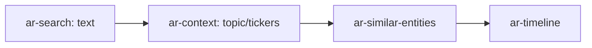

**Phase 2: Tiefe Analyse**
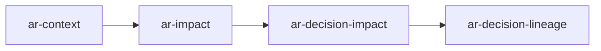

---

### Hypothesis-Workflow-Strategie

**Vollständiger Workflow**:
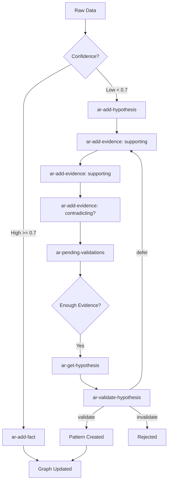

**Strategie-Regeln**:
1. **Confidence >= 0.7**: Direkt `ar-add-fact`
2. **Confidence < 0.7**: `ar-add-hypothesis` → Evidence sammeln
3. **Minimum 3 Evidence-Points** bevor Validation
4. **Pattern erstellen** wenn Hypothese validiert und wiederkehrend

---

### Risk-Assessment-Strategie

**Multi-Layer Risk-Analyse**:
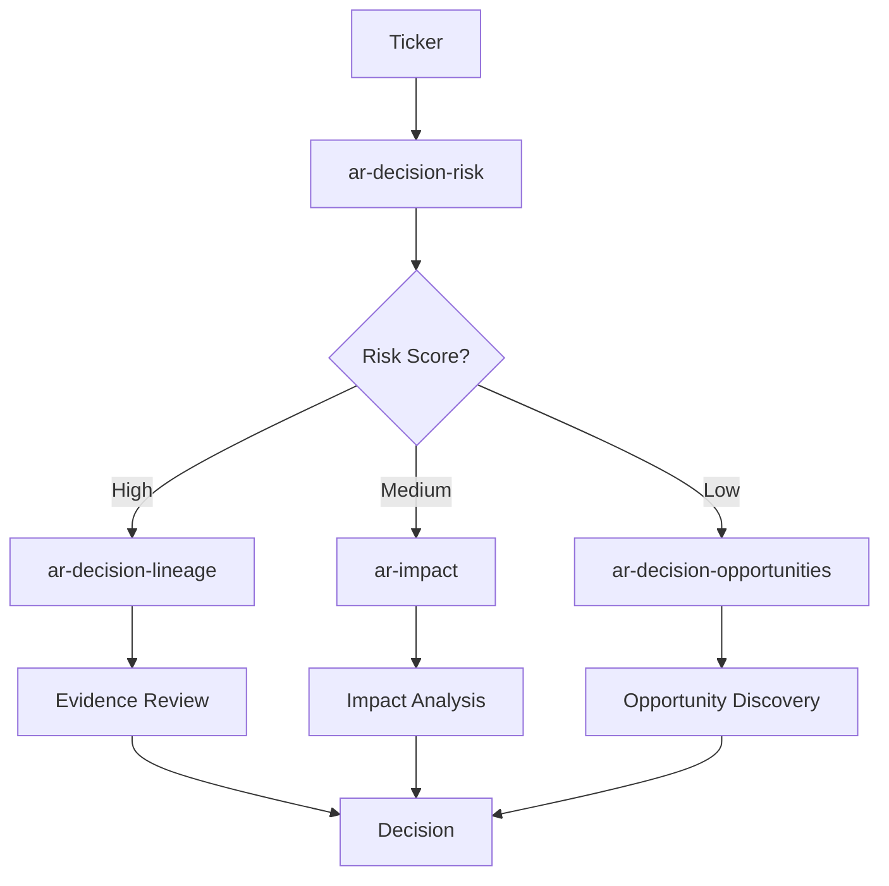

**Strategie**:
- **High Risk**: Detaillierte Lineage-Analyse
- **Medium Risk**: Impact-Analyse
- **Low Risk**: Opportunity-Discovery

---

### Graph-Maintenance-Strategie

**Regelmäßige Wartung**:
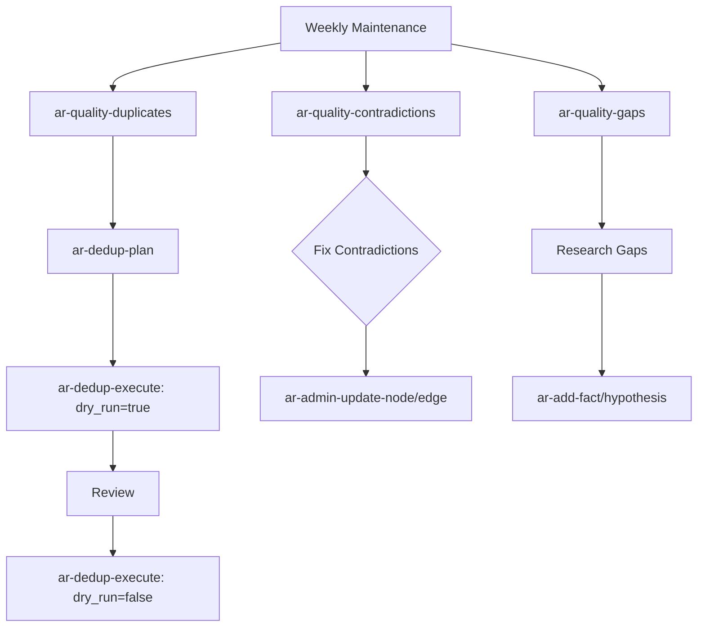

**Strategie**:
- **Wöchentlich**: Quality-Checks ausführen
- **Monatlich**: Deduplizierung durchführen
- **Täglich**: Snapshot-Degrees für Anomalie-Detection

---

### Decision-Support-Strategie

**Entscheidungs-Workflow**:
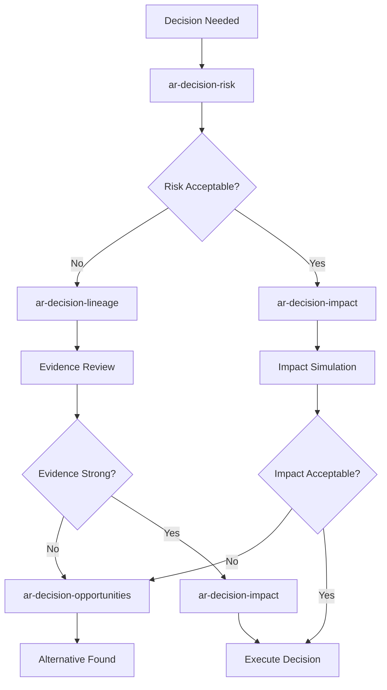

**Strategie**:
- Immer Risk-Assessment zuerst
- Lineage für Transparenz
- Impact-Simulation für "What-If"
- Opportunities als Alternative

---

## Workflows & Best Practices

### Workflow 1: Neue Company-Analyse

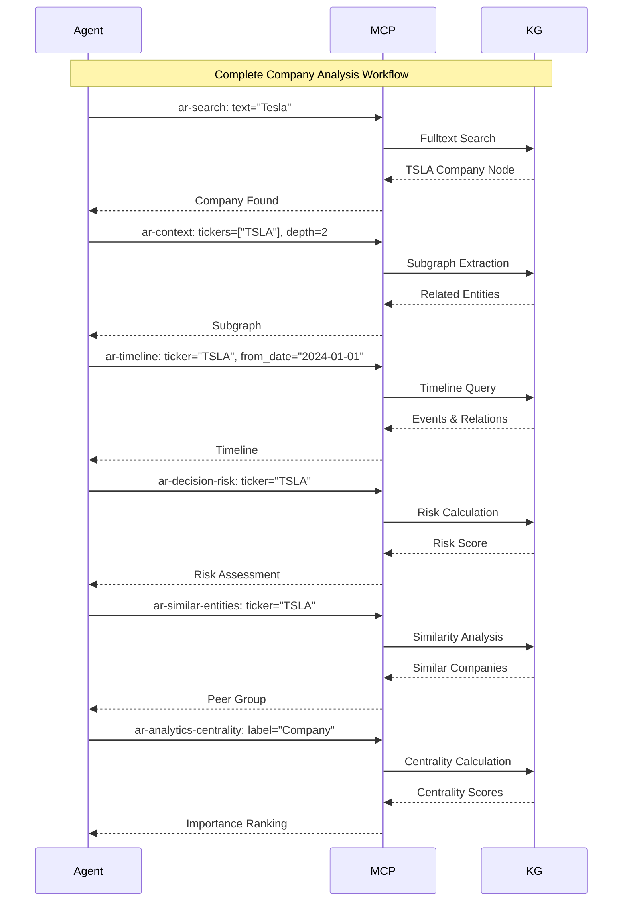

**Best Practices**:
1. Starte mit `ar-search` für Discovery
2. Verwende `ar-context` für Überblick
3. `ar-timeline` für historischen Kontext
4. `ar-decision-risk` für Risk-Assessment
5. `ar-similar-entities` für Peer-Analysis
6. `ar-analytics-centrality` für Importance

---

### Workflow 2: Event-Impact-Analyse

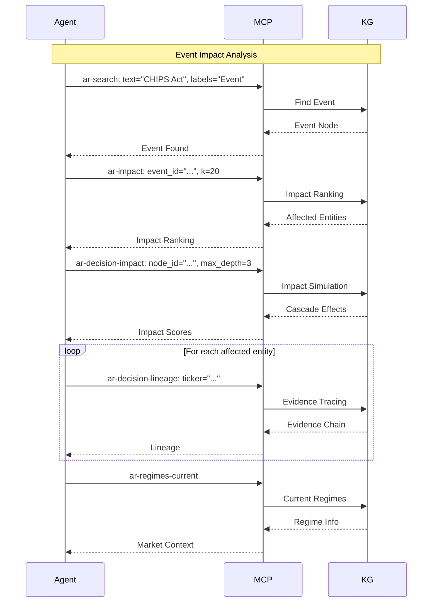

**Best Practices**:
1. Finde Event mit `ar-search`
2. Impact-Ranking mit `ar-impact`
3. Detaillierte Simulation mit `ar-decision-impact`
4. Evidence-Tracing mit `ar-decision-lineage`
5. Regime-Context für Markt-Situation

---

### Workflow 3: Hypothesis-Validation

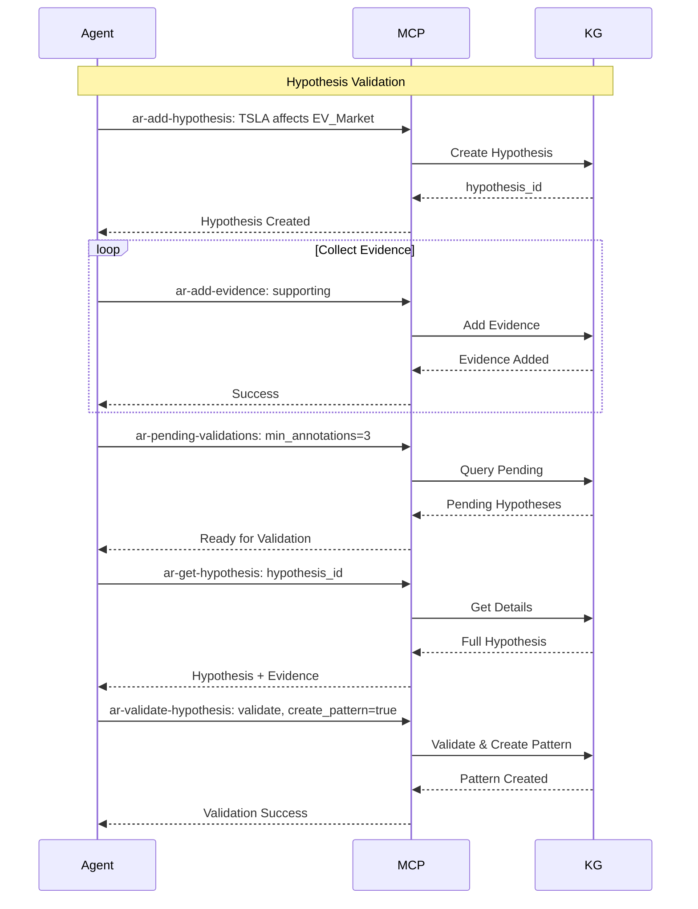

**Best Practices**:
1. Minimum 3 Evidence-Points sammeln
2. Immer `ar-get-hypothesis` vor Validation
3. `create_pattern=true` wenn wiederkehrend
4. `reasoning` Parameter für Audit-Trail

---

### Best Practices: Allgemein

#### 1. **Confidence-Management**
- **Facts**: >= 0.7 (verifiziert)
- **Hypotheses**: 0.5-0.7 (spekulativ)
- **Observations**: 0.7 (default)

#### 2. **Temporal-Queries**
- Verwende `as_of` für historische Analysen
- `valid_from`/`valid_to` für zeitlich begrenzte Relationen
- `ar-time-slice` für Point-in-Time-Snapshots

#### 3. **Performance**
- Starte mit niedrigen `limit`-Werten
- Erhöhe `depth` schrittweise
- Verwende `label`-Filter für fokussierte Queries

#### 4. **Graph-Qualität**
- Regelmäßige Quality-Checks (`ar-quality-*`)
- Deduplizierung monatlich
- Orphan-Cleanup wöchentlich

#### 5. **Safety**
- ⚠️ **Delete-Operations**: Immer mit `force=false` (default)
- ⚠️ **Dedup/Learning**: Immer mit `dry_run=true` starten
- ⚠️ **Admin-Tools**: Nur für Graph-Pflege verwenden

---

## Erweiterte Nutzung

### Pattern-basiertes Reasoning

**Use Case**: "Ähnliche Situation finden"

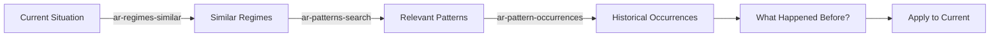

**Tools**:
1. `ar-regimes-similar`: Finde ähnliche Regimes
2. `ar-patterns-search`: Suche relevante Patterns
3. `ar-pattern-occurrences`: Historische Vorkommen
4. `ar-decision-impact`: Simuliere Impact

---

### Confidence-Propagation für Unsicherheit

**Use Case**: "Wie sicher können wir über Entity Y sein?"

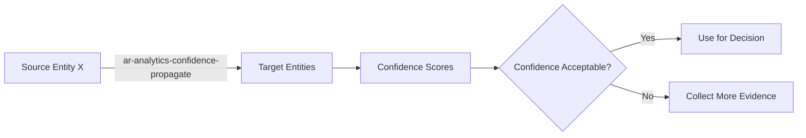

**Tools**:
1. `ar-analytics-confidence-propagate`: Transitive Confidence
2. `ar-decision-lineage`: Evidence-Traceability
3. `ar-add-evidence`: Mehr Evidence sammeln

---

### Opportunity-Discovery

**Use Case**: "Welche Opportunities gibt es?"

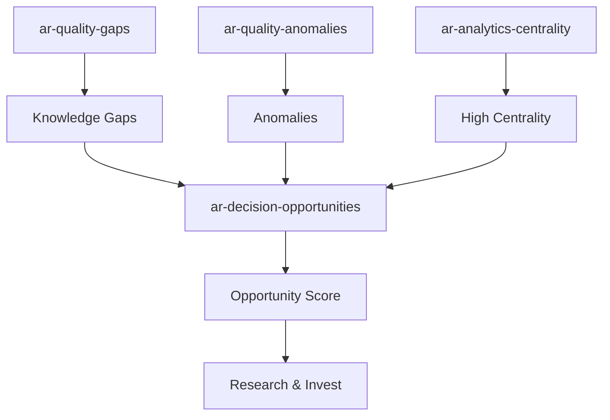

**Tools**:
1. `ar-quality-gaps`: Wissenslücken
2. `ar-quality-anomalies`: Anomalien
3. `ar-analytics-centrality`: Wichtige Entities
4. `ar-decision-opportunities`: Opportunity-Scoring

---

### Graph-Exploration für Discovery

**Use Case**: "Entdecke versteckte Zusammenhänge"

```mermaid
graph LR
    A[ar-search: text] --> B[ar-context: depth=1]
    B --> C[ar-path: find connections]
    C --> D[ar-analytics-link-prediction]
    D --> E[Hidden Links]
    E --> F[ar-add-hypothesis]
```

**Tools**:
1. `ar-search`: Initial Discovery
2. `ar-context`: Überblick
3. `ar-path`: Verbindungen finden
4. `ar-analytics-link-prediction`: Versteckte Links
5. `ar-add-hypothesis`: Hypothesen formulieren

---

## Zusammenfassung

### Tool-Kategorien Übersicht

| Kategorie | Anzahl | Hauptzweck |
|----------|-------|------------|
| **Read** | 12 | Graph-Abfragen, Exploration |
| **Write** | 3 | Daten hinzufügen (Facts, Observations, Hypotheses) |
| **Validate** | 4 | Hypothesis-Validation mit Evidence |
| **Analytics** | 5 | Graph-Algorithmen (Centrality, Communities, etc.) |
| **Decision** | 4 | Risk-Scoring, Impact-Analysis, Opportunities |
| **Quality** | 4 | Graph-Qualität prüfen (Contradictions, Gaps, etc.) |
| **Admin** | 9 | Graph-Pflege und Maintenance |
| **Dedup** | 2 | Duplikat-Detection und Merging |
| **Learning** | 2 | Automatische Confidence-Calibration |
| **Learn** | 2 | Background-Tasks (Correlation, Community) |
| **Ingest** | 1 | Preis-Daten-Import |
| **Suggestions** | 9 | Auto-Complete für UX |
| **Health** | 4 | System-Status und Statistiken |

**Gesamt: 70+ Tools**

### Wichtigste Workflows

1. **Company-Analyse**: `ar-search` → `ar-context` → `ar-timeline` → `ar-decision-risk`
2. **Event-Impact**: `ar-impact` → `ar-decision-impact` → `ar-decision-lineage`
3. **Hypothesis-Validation**: `ar-add-hypothesis` → `ar-add-evidence` → `ar-validate-hypothesis`
4. **Graph-Maintenance**: `ar-quality-*` → `ar-dedup-plan` → `ar-dedup-execute`
5. **Opportunity-Discovery**: `ar-quality-gaps` + `ar-quality-anomalies` → `ar-decision-opportunities`

### Sicherheitshinweise

⚠️ **Gefährliche Operationen**:
- `ar-admin-delete-node`: Kann Graph-Integrität brechen
- `ar-admin-delete-edge`: Entfernt Relationen permanent
- `ar-dedup-execute`: Merges Nodes (immer `dry_run=true` zuerst!)
- `ar-learning-apply-feedback`: Ändert Confidences (immer `dry_run=true` zuerst!)

✅ **Sichere Patterns**:
- Immer `dry_run=true` für Learning/Dedup
- `force=false` (default) für Delete-Operations
- Review-Phasen einbauen vor kritischen Operationen

---

**Version**: 1.0  
**Letzte Aktualisierung**: 2025-01-XX  
**Status**: ✅ Vollständig dokumentiert


