# Coalescence MCP - Komplettes Manual

## Inhaltsverzeichnis

1. [Übersicht](#übersicht)
2. [Architektur](#architektur)
3. [Tool-Katalog](#tool-katalog)
4. [Tool-Strategien](#tool-strategien)
5. [Workflows & Best Practices](#workflows--best-practices)
6. [Erweiterte Nutzung](#erweiterte-nutzung)

---

## Übersicht

Der **Coalescence MCP** (Model Context Protocol Server) ist die zentrale Verwaltungs- und Orchestrierungsschnittstelle für ein Multi-Agent-System. Er bietet **19 Tools** für:

- 🤖 **Agents**: Konfiguration, Verwaltung und Ausführung von AI-Agenten
- 📋 **Rules**: Wiederverwendbare Prompt-Instruktionen für Agent-Turns
- 💾 **Context**: Wissenspersistenz und Run-Context-Verwaltung
- 💡 **Insights**: Speicherung und Abruf von Agent-Erkenntnissen
- 💬 **Messages**: Agent-zu-Agent-Kommunikation
- 🔧 **Tools**: Discovery aller verfügbaren MCP-Tools

### System-Architektur

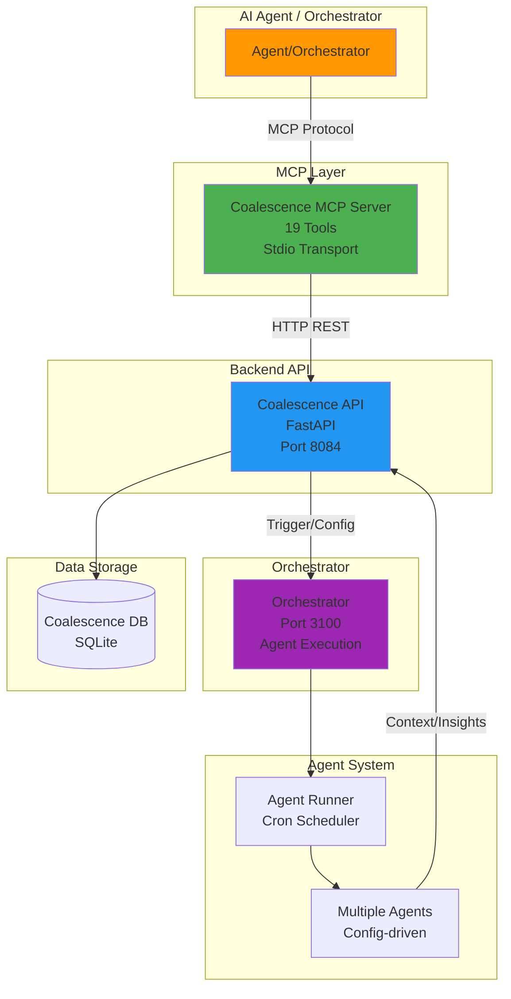

---

## Architektur

### Tool-Kategorien-Hierarchie

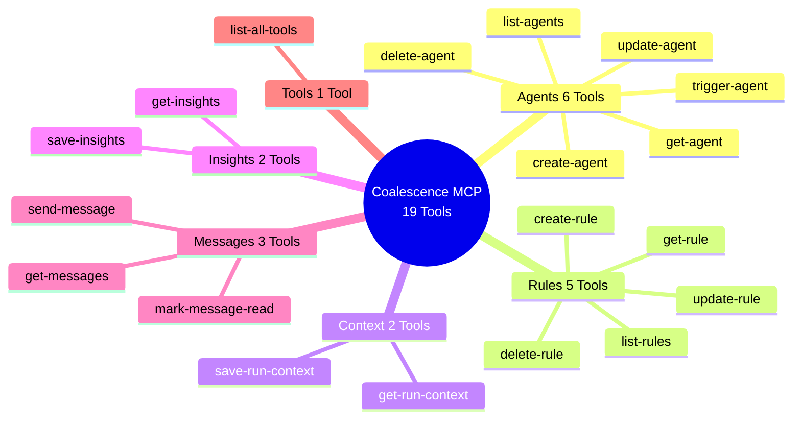

### Agent-Lifecycle-Diagramm

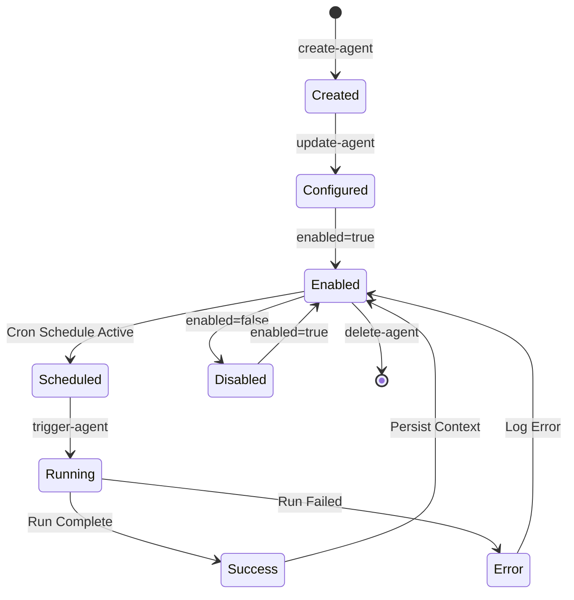

### Datenfluss: Agent-Ausführung

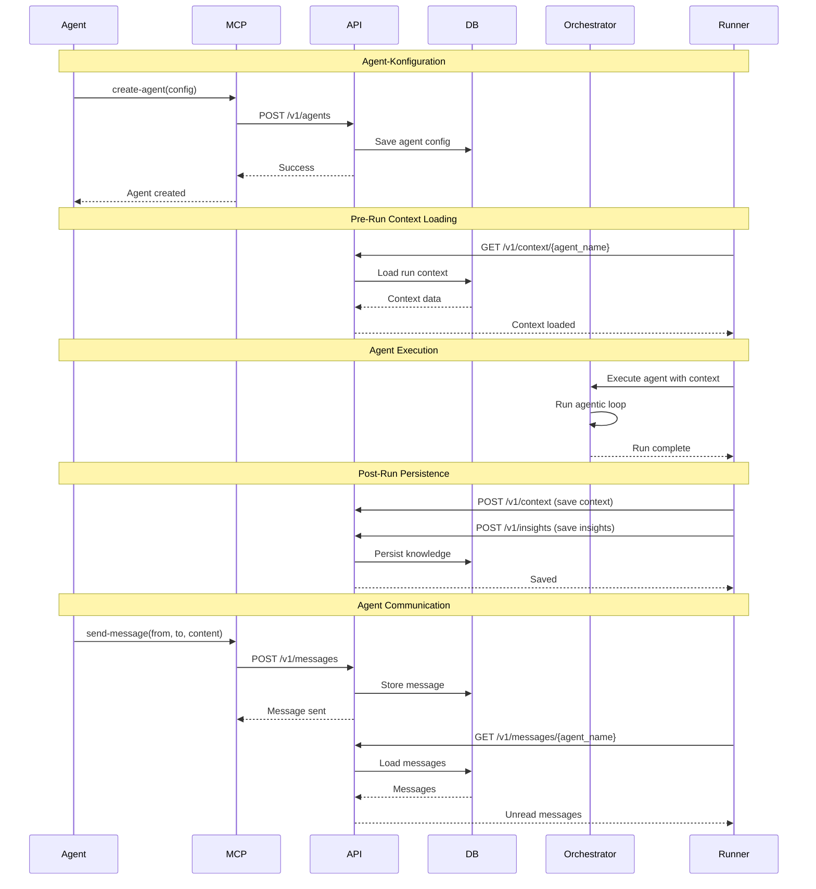

---

## Tool-Katalog

### Agents Tools (6 Tools)

#### `list-agents`
**Beschreibung**: Listet alle Agent-Konfigurationen mit Metadaten.

**Parameter**: Keine

**Rückgabe**:
- `count`: Anzahl der Agents
- `agents`: Array von Agent-Objekten mit:
  - `name`: Agent-Name
  - `enabled`: Aktivierungsstatus
  - `model`: Modell (z.B. "haiku-3.5")
  - `schedule`: Cron-Ausdruck
  - `turns`: Array von Turn-Konfigurationen
  - `last_run_at`: Letzte Ausführung
  - `total_runs`: Gesamtanzahl Runs
  - `total_tokens`: Gesamt-Token-Verbrauch
  - `total_cost_usd`: Gesamtkosten

**Verwendung**:
- System-Übersicht: Welche Agents existieren?
- Status-Check: Welche Agents sind aktiv?
- Monitoring: Run-Statistiken prüfen

**Strategie**: **Immer zuerst aufrufen**, um verfügbare Agents zu sehen.

#### `get-agent`
**Beschreibung**: Ruft die vollständige Konfiguration eines Agents ab.

**Parameter**:
- `name` (string, required): Agent-Name

**Rückgabe**: Vollständige Agent-Konfiguration mit:
- Basis-Konfiguration (model, schedule, enabled, etc.)
- `turns`: Array von Turn-Konfigurationen mit:
  - `id`: Turn-ID
  - `name`: Turn-Name
  - `model`: Optionales Modell für diesen Turn
  - `max_tokens`: Max. Tokens pro Turn
  - `max_steps`: Max. Agentic-Loop-Schritte
  - `mcps`: Array von MCP-Namen (deprecated)
  - `tools`: Array von Tool-Namen (z.B. "satbase_list-news")
  - `prompt`: Turn-spezifischer Prompt
  - `prompt_file`: Optionaler Prompt-Datei-Pfad
  - `rules`: Array von Rule-IDs

**Verwendung**:
- Vor `update-agent`: Aktuelle Konfiguration prüfen
- Debugging: Vollständige Konfiguration analysieren
- Turn-Struktur verstehen

**Workflow**:
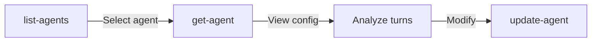

#### `create-agent`
**Beschreibung**: Erstellt eine neue Agent-Konfiguration.

**Parameter**:
- `name` (string, required): Eindeutiger Agent-Name
- `enabled` (boolean, default: true): Aktivierungsstatus
- `model` (string, required): Modell (z.B. "haiku-3.5", "sonnet-4.5")
- `schedule` (string, required): Cron-Ausdruck (z.B. "0 9 * * *" für täglich 9 Uhr)
- `system_prompt` (string, optional): System-Prompt für den Agent
- `max_tokens_per_turn` (number, optional): Max. Tokens pro Turn
- `max_steps` (number, default: 5): Max. Agentic-Loop-Schritte
- `budget_daily_tokens` (number, required): Tägliches Token-Budget
- `timeout_minutes` (number, required): Timeout in Minuten
- `turns` (array, required): Array von Turn-Konfigurationen

**Turn-Konfiguration**:
```typescript
{
  id: number,              // Turn-ID (0, 1, 2, ...)
  name: string,            // Turn-Name (z.B. "observe", "reason")
  model?: string,          // Optional: Override für diesen Turn
  max_tokens: number,      // Max. Tokens für diesen Turn
  max_steps?: number,      // Optional: Max. Steps für diesen Turn
  mcps?: string[],         // Deprecated: MCP-Namen
  tools?: string[],        // Tool-Namen (z.B. ["satbase_list-news", "tesseract_search"])
  prompt?: string,         // Turn-spezifischer Prompt
  prompt_file?: string,    // Optional: Prompt-Datei
  rules?: string[]         // Array von Rule-IDs
}
```

**Verwendung**:
- Neue Agents erstellen
- Multi-Turn-Workflows konfigurieren
- Tool-Zuweisung pro Turn

**Best Practices**:
1. **Turn-Reihenfolge**: Logische Abfolge (observe → reason → act)
2. **Tool-Verteilung**: Tools pro Turn zuweisen, nicht alle in einem Turn
3. **Model-Selection**: Haiku für einfache Turns, Sonnet für komplexe Reasoning
4. **Token-Budget**: Realistische Limits setzen

**Workflow**:
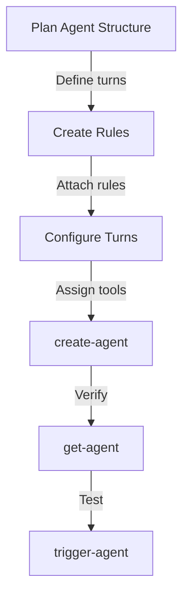

#### `update-agent`
**Beschreibung**: Aktualisiert eine bestehende Agent-Konfiguration (partial update).

**Parameter**:
- `name` (string, required): Agent-Name
- `enabled` (boolean, optional): Aktivierungsstatus ändern
- `model` (string, optional): Modell ändern
- `schedule` (string, optional): Cron-Ausdruck ändern
- `system_prompt` (string, optional): System-Prompt ändern
- `max_tokens_per_turn` (number, optional): Token-Limit ändern
- `max_steps` (number, optional): Max. Steps ändern
- `budget_daily_tokens` (number, optional): Tägliches Budget ändern
- `timeout_minutes` (number, optional): Timeout ändern
- `turns` (array, optional): Turn-Konfigurationen aktualisieren

**Verwendung**:
- Agent temporär deaktivieren (`enabled=false`)
- Schedule anpassen
- Turn-Konfiguration verfeinern
- Tool-Zuweisung ändern

**Strategie**: **Partial Updates** - Nur geänderte Felder übergeben.

**Beispiel**:
```typescript
// Nur Schedule ändern
update-agent({
  name: "my-agent",
  schedule: "0 10 * * *"  // Nur dieses Feld ändern
})

// Turn-Konfiguration aktualisieren
update-agent({
  name: "my-agent",
  turns: [
    {
      id: 0,
      name: "observe",
      tools: ["satbase_list-news", "satbase_list-prices"]  // Tools hinzufügen
    }
  ]
})
```

#### `delete-agent`
**Beschreibung**: Löscht eine Agent-Konfiguration.

**Parameter**:
- `name` (string, required): Agent-Name zum Löschen

**Verwendung**: **Vorsichtig verwenden** - Agent wird vollständig entfernt.

**Hinweis**: Löscht nur die Konfiguration, nicht die Ausführungs-Historie.

#### `trigger-agent`
**Beschreibung**: Triggert eine manuelle Agent-Ausführung (sofort).

**Parameter**:
- `name` (string, required): Agent-Name zum Triggern

**Rückgabe**: Status-Informationen über den gestarteten Run.

**Verwendung**:
- Manuelle Tests
- Sofortige Ausführung (außerhalb des Cron-Schedules)
- Debugging: Agent isoliert ausführen

**Timeout**: 30 Sekunden (länger als andere Tools, da Agent-Ausführung)

**Workflow**:
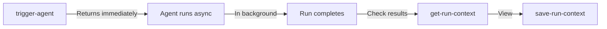

---

### Rules Tools (5 Tools)

#### `list-rules`
**Beschreibung**: Listet alle verfügbaren Rules (wiederverwendbare Prompt-Instruktionen).

**Parameter**: Keine

**Rückgabe**:
- `count`: Anzahl der Rules
- `rules`: Array von Rule-Objekten mit:
  - `id`: Rule-ID
  - `name`: Rule-Name (eindeutig)
  - `content`: Rule-Inhalt (der eigentliche Prompt)
  - `description`: Optionale Beschreibung

**Verwendung**:
- Übersicht verfügbarer Rules
- Rule-Discovery für Agent-Konfiguration
- Rule-Verwaltung

**Strategie**: **Vor Agent-Erstellung aufrufen**, um verfügbare Rules zu sehen.

#### `get-rule`
**Beschreibung**: Ruft eine einzelne Rule anhand der ID ab.

**Parameter**:
- `id` (string, required): Rule-ID

**Rückgabe**: Vollständige Rule mit `id`, `name`, `content`, `description`.

**Verwendung**:
- Rule-Inhalt prüfen vor Verwendung
- Rule-Referenzierung verstehen

#### `create-rule`
**Beschreibung**: Erstellt eine neue Rule (wiederverwendbare Prompt-Instruktion).

**Parameter**:
- `name` (string, required): Rule-Name (muss eindeutig sein)
- `content` (string, required): Rule-Inhalt (der eigentliche Prompt/Instruktion)
- `description` (string, optional): Beschreibung der Rule

**Verwendung**:
- Wiederverwendbare Prompts erstellen
- Best Practices dokumentieren
- Turn-spezifische Instruktionen

**Best Practices**:
1. **Klare Namen**: Beschreibende Namen (z.B. "sector-analysis-prompt")
2. **Konsistente Struktur**: Ähnliche Rules sollten ähnlich strukturiert sein
3. **Beschreibungen**: Dokumentiere, wann die Rule verwendet wird

**Workflow**:
```mermaid
graph LR
    A[Create Rule] -->|Document pattern| B[create-rule]
    B -->|Attach to turn| C[update-agent<br/>turns[].rules]
    C -->|Reuse| D[Multiple agents]
```

#### `update-rule`
**Beschreibung**: Aktualisiert eine bestehende Rule.

**Parameter**:
- `id` (string, required): Rule-ID
- `name` (string, optional): Neuer Rule-Name
- `content` (string, optional): Neuer Rule-Inhalt
- `description` (string, optional): Neue Beschreibung

**Verwendung**:
- Rule-Inhalt verfeinern
- Rule-Namen ändern
- Beschreibungen aktualisieren

**Hinweis**: Änderungen wirken sich auf alle Agents aus, die diese Rule verwenden.

#### `delete-rule`
**Beschreibung**: Löscht eine Rule.

**Parameter**:
- `id` (string, required): Rule-ID zum Löschen

**Warnung**: **Entfernt die Rule aus allen Agent-Turns**, die sie verwenden.

**Verwendung**: **Vorsichtig verwenden** - Prüfe zuerst, welche Agents die Rule nutzen.

---

### Context Tools (2 Tools)

#### `get-run-context`
**Beschreibung**: Lädt Run-Context für einen Agent (Pre-Run-Context-Loading).

**Parameter**:
- `agent_name` (string, required): Agent-Name
- `days_back` (number, default: 7): Anzahl Tage zurückblicken

**Rückgabe**:
- `agent_name`: Agent-Name
- `days_back`: Verwendeter Zeitraum
- `context`: Context-Daten mit:
  - Frühere Run-Contexts
  - Verknüpfte Knowledge-Graph-Entities
  - Verknüpfte Manifold-Thoughts

**Verwendung**:
- **Pre-Run**: Kontext für Agent-Ausführung laden
- Wissen aus früheren Runs einbeziehen
- Kontinuität zwischen Runs sicherstellen

**Strategie**: **Wird typischerweise vom Orchestrator vor Agent-Ausführung aufgerufen**.

**Workflow**:
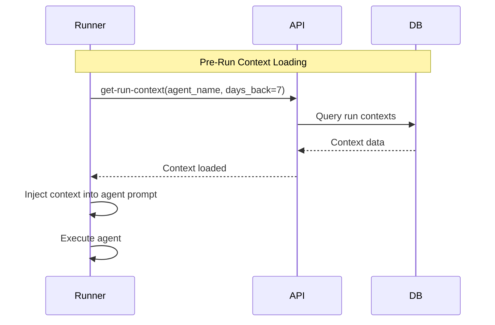

#### `save-run-context`
**Beschreibung**: Speichert Run-Context für einen Agent (Post-Run-Wissenspersistenz).

**Parameter**:
- `agent_name` (string, required): Agent-Name
- `run_id` (string, required): Run-ID (z.B. UUID)
- `context_summary` (string, required): Context-Zusammenfassung
- `kg_entities` (array of strings, optional): Knowledge-Graph-Entity-IDs
- `manifold_thoughts` (array of strings, optional): Manifold-Thought-IDs

**Rückgabe**:
- `status`: "saved"
- `context_id`: Generierte Context-ID
- `agent_name`: Agent-Name
- `run_id`: Run-ID

**Verwendung**:
- **Post-Run**: Wissen aus Agent-Ausführung persistieren
- Knowledge-Graph-Integration
- Manifold-Integration
- Kontinuität für zukünftige Runs

**Strategie**: **Wird typischerweise vom Orchestrator nach Agent-Ausführung aufgerufen**.

**Best Practices**:
1. **Strukturierte Summaries**: Klare, strukturierte Context-Zusammenfassungen
2. **Entity-Verknüpfungen**: Verknüpfe relevante KG-Entities
3. **Thought-Verknüpfungen**: Verknüpfe relevante Manifold-Thoughts

---

### Insights Tools (2 Tools)

#### `save-insights`
**Beschreibung**: Speichert Insights für einen Agent (Post-Run-Wissenspersistenz).

**Parameter**:
- `agent_name` (string, required): Agent-Name
- `insight` (string, required): Insight-Text
- `priority` (enum: 'high' | 'medium' | 'low', default: 'medium'): Prioritätsstufe
- `run_id` (string, optional): Assoziierte Run-ID
- `related_entities` (array of strings, optional): Verwandte Entity-IDs

**Rückgabe**:
- `status`: "saved"
- `insight_id`: Generierte Insight-ID
- `agent_name`: Agent-Name

**Verwendung**:
- **Post-Run**: Wichtige Erkenntnisse speichern
- Priorisierung von Insights
- Entity-Verknüpfungen für Kontext

**Strategie**: **Wird während oder nach Agent-Ausführung aufgerufen**.

**Best Practices**:
1. **Priorisierung**: Nutze `priority` für wichtige Insights
2. **Strukturierte Insights**: Klare, strukturierte Formate
3. **Entity-Verknüpfungen**: Verknüpfe relevante Entities

#### `get-insights`
**Beschreibung**: Ruft Insights für einen Agent ab.

**Parameter**:
- `agent_name` (string, required): Agent-Name
- `days_back` (number, default: 7): Anzahl Tage zurückblicken

**Rückgabe**:
- `agent_name`: Agent-Name
- `days_back`: Verwendeter Zeitraum
- `count`: Anzahl Insights
- `insights`: Array von Insight-Objekten mit:
  - `insight_id`: Insight-ID
  - `insight`: Insight-Text
  - `priority`: Prioritätsstufe
  - `run_id`: Assoziierte Run-ID
  - `related_entities`: Array von Entity-IDs
  - `created_at`: Erstellungszeitpunkt

**Verwendung**:
- **Pre-Run**: Frühere Insights für Agent-Kontext laden
- Research: Insights eines Agents analysieren
- Pattern-Detection: Wiederkehrende Insights identifizieren

**Workflow**:
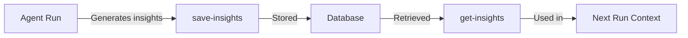

---

### Messages Tools (3 Tools)

#### `send-message`
**Beschreibung**: Sendet eine Nachricht von einem Agent an einen anderen (Agent-zu-Agent-Kommunikation).

**Parameter**:
- `from_agent` (string, required): Sender-Agent-Name
- `to_agent` (string, required): Empfänger-Agent-Name (oder "all" für Broadcast)
- `type` (enum: 'insight' | 'warning' | 'question' | 'data', required): Nachrichtentyp
- `content` (string, required): Nachrichteninhalt
- `related_entities` (array of strings, optional): Verwandte Entity-IDs

**Rückgabe**:
- `status`: "sent"
- `message_id`: Generierte Message-ID
- `from_agent`: Sender-Agent
- `to_agent`: Empfänger-Agent

**Verwendung**:
- **Agent-Koordination**: Agents kommunizieren miteinander
- **Broadcast**: Wichtige Informationen an alle Agents senden
- **Warnungen**: Kritische Informationen weiterleiten
- **Fragen**: Agent fragt anderen Agent um Rat

**Nachrichtentypen**:
- `insight`: Erkenntnis/Beobachtung
- `warning`: Warnung/Kritische Information
- `question`: Frage an anderen Agent
- `data`: Daten/Informationen

**Workflow**:
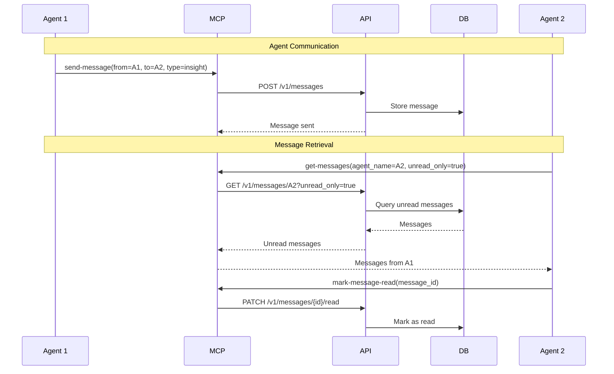

#### `get-messages`
**Beschreibung**: Ruft Nachrichten für einen Agent ab.

**Parameter**:
- `agent_name` (string, required): Agent-Name
- `unread_only` (boolean, default: true): Nur ungelesene Nachrichten
- `from_agent` (string, optional): Nach Sender-Agent filtern

**Rückgabe**:
- `agent_name`: Agent-Name
- `unread_only`: Verwendeter Filter
- `count`: Anzahl Nachrichten
- `messages`: Array von Message-Objekten mit:
  - `message_id`: Message-ID
  - `from_agent`: Sender-Agent
  - `to_agent`: Empfänger-Agent
  - `type`: Nachrichtentyp
  - `content`: Nachrichteninhalt
  - `related_entities`: Array von Entity-IDs
  - `read`: Gelesen-Status
  - `created_at`: Erstellungszeitpunkt

**Verwendung**:
- **Pre-Run**: Ungelesene Nachrichten für Agent-Kontext laden
- **Monitoring**: Nachrichtenfluss überwachen
- **Debugging**: Kommunikation zwischen Agents analysieren

**Strategie**: **Wird typischerweise vor Agent-Ausführung aufgerufen**, um Kontext zu laden.

#### `mark-message-read`
**Beschreibung**: Markiert eine Nachricht als gelesen.

**Parameter**:
- `message_id` (string, required): Message-ID zum Markieren

**Rückgabe**:
- `status`: "read"
- `message_id`: Message-ID

**Verwendung**:
- Nach Verarbeitung einer Nachricht
- Status-Management
- Verhindert doppelte Verarbeitung

---

### Tools Tools (1 Tool)

#### `list-all-tools`
**Beschreibung**: Listet alle verfügbaren Tools von allen MCPs (Tool-Discovery).

**Parameter**:
- `mcp_name` (string, optional): Nach MCP-Name filtern (z.B. "satbase", "tesseract")

**Rückgabe**: Liste aller verfügbaren Tools mit:
- Tool-Namen (z.B. "satbase_list-news")
- MCP-Zugehörigkeit
- Tool-Beschreibungen

**Verwendung**:
- **Tool-Discovery**: Welche Tools sind verfügbar?
- **Agent-Konfiguration**: Tools für Turns auswählen
- **MCP-Exploration**: Verfügbare MCPs entdecken

**Strategie**: **Vor Agent-Erstellung aufrufen**, um verfügbare Tools zu sehen.

**Workflow**:
```mermaid
graph LR
    A[list-all-tools] -->|See all tools| B[Filter by MCP]
    B -->|Select tools| C[create-agent<br/>turns[].tools]
    C -->|Agent uses| D[MCP Tools]
```

---

## Tool-Strategien

### Strategie 1: Agent-Erstellung und -Konfiguration

**Workflow**: Plan → Rules → Tools → Agent → Test

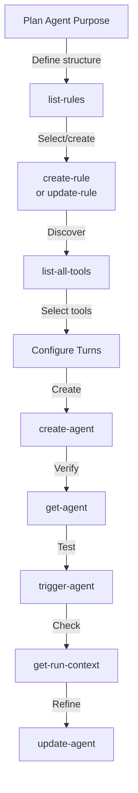

**Best Practices**:
1. **Rules zuerst**: Erstelle/verwende Rules vor Agent-Erstellung
2. **Tool-Discovery**: Nutze `list-all-tools` für Tool-Auswahl
3. **Turn-Struktur**: Logische Abfolge (observe → reason → act)
4. **Test-Driven**: Erstelle Agent, teste mit `trigger-agent`, verfeinere

**Beispiel**:
```typescript
// 1. Rules prüfen
list-rules()

// 2. Tools entdecken
list-all-tools({ mcp_name: "satbase" })

// 3. Agent erstellen
create-agent({
  name: "market-observer",
  model: "haiku-3.5",
  schedule: "0 9 * * *",
  budget_daily_tokens: 100000,
  timeout_minutes: 30,
  turns: [
    {
      id: 0,
      name: "observe",
      tools: ["satbase_list-news", "satbase_list-prices"],
      rules: ["observation-prompt-rule"]
    },
    {
      id: 1,
      name: "analyze",
      model: "sonnet-4.5",  // Sonnet für komplexe Analyse
      tools: ["tesseract_search"],
      rules: ["analysis-prompt-rule"]
    }
  ]
})

// 4. Testen
trigger-agent({ name: "market-observer" })
```

---

### Strategie 2: Context-Management und Wissenspersistenz

**Workflow**: Pre-Run Context → Execute → Post-Run Persistence

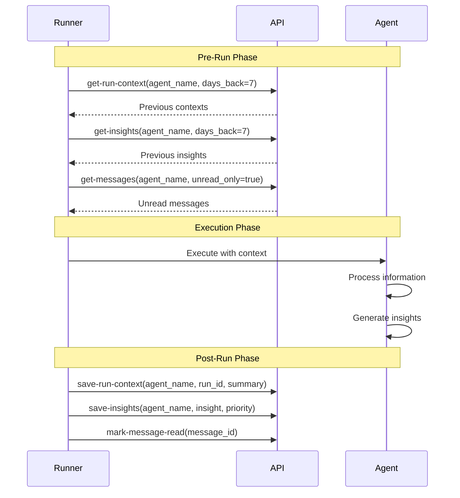

**Best Practices**:
1. **Context-Loading**: Lade Context vor jeder Ausführung
2. **Strukturierte Summaries**: Klare, strukturierte Context-Zusammenfassungen
3. **Entity-Verknüpfungen**: Verknüpfe KG-Entities und Manifold-Thoughts
4. **Insight-Priorisierung**: Nutze Prioritäten für wichtige Insights

---

### Strategie 3: Agent-zu-Agent-Kommunikation

**Workflow**: Observe → Analyze → Communicate → Coordinate

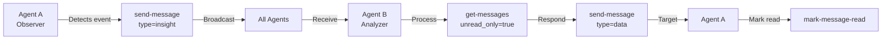

**Best Practices**:
1. **Broadcast für wichtige Events**: Nutze `to_agent="all"` für kritische Informationen
2. **Typisierte Nachrichten**: Nutze `type` für strukturierte Kommunikation
3. **Entity-Verknüpfungen**: Verknüpfe `related_entities` für Kontext
4. **Read-Management**: Markiere Nachrichten als gelesen nach Verarbeitung

**Nachrichtentyp-Strategien**:
- `insight`: Erkenntnisse teilen
- `warning`: Kritische Warnungen
- `question`: Fragen an spezialisierte Agents
- `data`: Daten/Informationen weiterleiten

---

### Strategie 4: Rule-Management und Wiederverwendbarkeit

**Workflow**: Create → Attach → Reuse → Update

```mermaid
graph TD
    A[Identify Pattern] -->|Document| B[create-rule]
    B -->|Attach| C[update-agent<br/>turns[].rules]
    C -->|Reuse| D[Multiple Agents]
    D -->|Refine| E[update-rule]
    E -->|Improve| F[All Agents Benefit]
```

**Best Practices**:
1. **Pattern-Detection**: Identifiziere wiederkehrende Prompt-Patterns
2. **Dokumentation**: Nutze `description` für Rule-Dokumentation
3. **Konsistenz**: Ähnliche Rules sollten ähnlich strukturiert sein
4. **Refactoring**: Aktualisiere Rules für alle Agents gleichzeitig

**Rule-Lebenszyklus**:
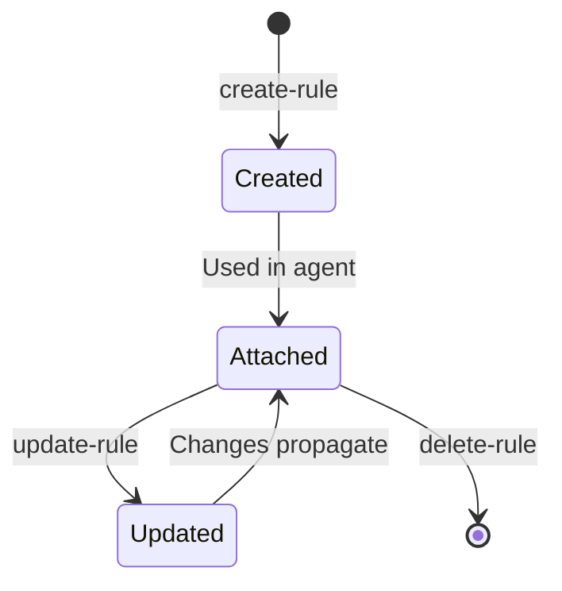

---

### Strategie 5: Tool-Discovery und Agent-Konfiguration

**Workflow**: Discover → Filter → Select → Configure

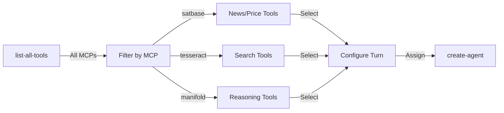

**Best Practices**:
1. **MCP-spezifische Filterung**: Nutze `mcp_name` für fokussierte Suche
2. **Tool-Verteilung**: Verteile Tools auf verschiedene Turns
3. **Model-Matching**: Passe Model an Turn-Komplexität an
4. **Tool-Constraints**: Respektiere Tool-Limits pro Turn

---

## Workflows & Best Practices

### Workflow 1: Agent-Lifecycle-Management

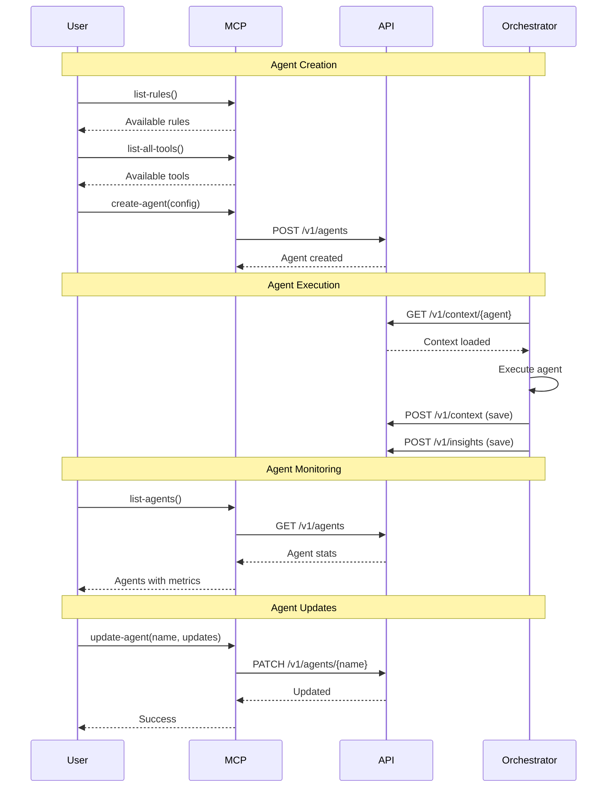

**Best Practices**:
- **Iterative Development**: Erstelle Agent, teste, verfeinere
- **Monitoring**: Überwache Run-Statistiken regelmäßig
- **Context-Management**: Nutze Context für Kontinuität
- **Insight-Tracking**: Verfolge wichtige Erkenntnisse

---

### Workflow 2: Multi-Agent-Koordination

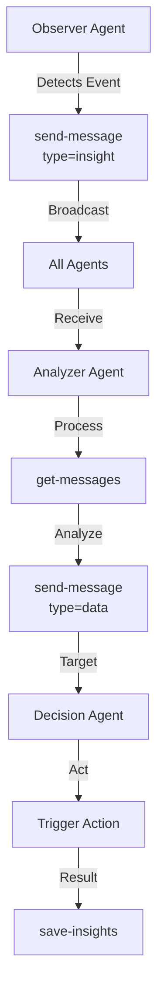

**Best Practices**:
- **Clear Roles**: Definiere klare Rollen für Agents
- **Message Types**: Nutze typisierte Nachrichten
- **Broadcast Strategically**: Nur wichtige Events broadcasten
- **Read Management**: Markiere Nachrichten als gelesen

---

### Workflow 3: Rule-Evolution

```mermaid
graph LR
    A[Identify Pattern] -->|Document| B[create-rule]
    B -->|Attach| C[Agent Turn]
    C -->|Use| D[Multiple Agents]
    D -->|Learn| E[Update Rule]
    E -->|Improve| F[All Agents Benefit]
    F -->|Refine| E
```

**Best Practices**:
- **Pattern Recognition**: Identifiziere wiederkehrende Patterns
- **Documentation**: Dokumentiere Rules klar
- **Versioning**: Überwache Rule-Änderungen
- **Testing**: Teste Rule-Änderungen mit `trigger-agent`

---

## Erweiterte Nutzung

### Agent-Konfiguration: Advanced Patterns

#### Multi-Turn-Workflows

```mermaid
graph LR
    A[Turn 0: Observe] -->|Tools: satbase| B[Turn 1: Reason]
    B -->|Tools: tesseract| C[Turn 2: Analyze]
    C -->|Tools: manifold| D[Turn 3: Act]
    D -->|Tools: ariadne| E[Complete]
```

**Best Practices**:
- **Progressive Complexity**: Einfache Turns zuerst, komplexe später
- **Model Selection**: Haiku für einfache Turns, Sonnet für komplexe
- **Tool Distribution**: Verteile Tools auf Turns
- **Context Flow**: Context fließt durch Turns

#### Token-Budget-Management

```mermaid
graph TD
    A[Daily Budget] -->|Distribute| B[Turn Budgets]
    B -->|Monitor| C[Usage Tracking]
    C -->|Adjust| D[Update Config]
    D -->|Optimize| A
```

**Strategien**:
- **Conservative Budgets**: Starte mit konservativen Budgets
- **Monitoring**: Überwache Token-Verbrauch
- **Optimization**: Optimiere Prompts für Effizienz
- **Model Selection**: Nutze Haiku für einfache Tasks

---

### Context-Management: Advanced Patterns

#### Context-Aggregation

```mermaid
graph TD
    A[get-run-context<br/>days_back=7] -->|Load| B[Previous Contexts]
    C[get-insights<br/>days_back=7] -->|Load| D[Previous Insights]
    E[get-messages<br/>unread_only=true] -->|Load| F[Unread Messages]
    B -->|Aggregate| G[Full Context]
    D -->|Aggregate| G
    F -->|Aggregate| G
    G -->|Inject| H[Agent Prompt]
```

**Best Practices**:
- **Time Windows**: Nutze `days_back` für relevante Contexts
- **Filtering**: Filtere nach Relevanz
- **Aggregation**: Kombiniere verschiedene Context-Quellen
- **Injection**: Injiziere Context in Agent-Prompt

---

### Message-Patterns: Advanced Communication

#### Broadcast-Patterns

```mermaid
graph TD
    A[Critical Event] -->|Broadcast| B[send-message<br/>to_agent=all]
    B -->|Received by| C[All Agents]
    C -->|Process| D[Agent-specific Logic]
    D -->|Response| E[Targeted Messages]
```

**Strategien**:
- **Event-Driven**: Broadcast bei wichtigen Events
- **Selective Response**: Agents antworten selektiv
- **Coordination**: Koordiniere Multi-Agent-Aktionen

#### Question-Answer-Pattern

```mermaid
sequenceDiagram
    participant A1 as Agent 1
    participant A2 as Agent 2
    
    A1->>A2: send-message(type=question)
    A2->>A2: get-messages(unread_only=true)
    A2->>A2: Process question
    A2->>A1: send-message(type=data)
    A1->>A1: get-messages()
    A1->>A1: mark-message-read()
```

---

### Performance-Optimierung

#### Tool-Timeouts

| Tool-Kategorie | Timeout | Grund |
|----------------|---------|-------|
| Agent CRUD | 10-15s | Schnelle DB-Operationen |
| Context/Insights | 10s | Schnelle Queries |
| Messages | 10s | Schnelle Queries |
| Rules | 10s | Orchestrator-Queries |
| Tools Discovery | 10s | ToolExecutor-Queries |
| Trigger Agent | 30s | Agent-Ausführung |

#### Batch-Operationen

**Context-Loading**:
```typescript
// Parallel loading
const [context, insights, messages] = await Promise.all([
  get-run-context({ agent_name, days_back: 7 }),
  get-insights({ agent_name, days_back: 7 }),
  get-messages({ agent_name, unread_only: true })
])
```

---

## Fazit

Der Coalescence MCP bietet eine umfassende Verwaltungs- und Orchestrierungsschnittstelle für Multi-Agent-Systeme. Die **19 Tools** decken alle Aspekte von Agent-Konfiguration, Wissenspersistenz, Agent-Kommunikation und Tool-Discovery ab.

**Key Takeaways**:
1. **Agent-Lifecycle**: Create → Configure → Execute → Monitor → Refine
2. **Context-Management**: Pre-Run Context Loading → Post-Run Persistence
3. **Agent-Kommunikation**: Typisierte Nachrichten für Koordination
4. **Rule-Reusability**: Wiederverwendbare Prompts für Konsistenz
5. **Tool-Discovery**: Explorative Tool-Auswahl für Agent-Konfiguration

---

## Anhang

### Tool-Übersicht nach Kategorie

| Kategorie | Anzahl | Haupt-Tools |
|-----------|--------|-------------|
| **Agents** | 6 | `list-agents`, `create-agent`, `trigger-agent` |
| **Rules** | 5 | `list-rules`, `create-rule`, `update-rule` |
| **Context** | 2 | `get-run-context`, `save-run-context` |
| **Insights** | 2 | `save-insights`, `get-insights` |
| **Messages** | 3 | `send-message`, `get-messages` |
| **Tools** | 1 | `list-all-tools` |
| **Total** | **19** | |

### Agent-Konfiguration: Schema-Referenz

```typescript
interface AgentConfig {
  name: string
  enabled: boolean
  model: string                    // z.B. "haiku-3.5", "sonnet-4.5"
  schedule: string                 // Cron-Ausdruck
  system_prompt?: string
  max_tokens_per_turn?: number
  max_steps: number                // Default: 5
  budget_daily_tokens: number
  timeout_minutes: number
  turns: TurnConfig[]
}

interface TurnConfig {
  id: number                       // 0, 1, 2, ...
  name: string                     // z.B. "observe", "reason"
  model?: string                   // Optional: Override
  max_tokens: number
  max_steps?: number               // Optional: Override
  mcps?: string[]                  // Deprecated
  tools?: string[]                 // z.B. ["satbase_list-news"]
  prompt?: string
  prompt_file?: string
  rules?: string[]                 // Rule-IDs
}
```

### Cron-Schedule-Beispiele

| Schedule | Bedeutung |
|----------|-----------|
| `0 9 * * *` | Täglich um 9:00 Uhr |
| `0 */6 * * *` | Alle 6 Stunden |
| `0 0 * * 0` | Wöchentlich (Sonntag) |
| `0 9-17 * * 1-5` | Werktags 9-17 Uhr (stündlich) |

---

**Version**: 1.0.0  
**Letzte Aktualisierung**: 2025-01-24  
**Autor**: Coalescence MCP Documentation

