# Manifold MCP - Komplettes Manual

## Inhaltsverzeichnis

1. [Übersicht](#übersicht)
2. [Architektur](#architektur)
3. [Tool-Katalog](#tool-katalog)
4. [Tool-Strategien](#tool-strategien)
5. [Workflows & Best Practices](#workflows--best-practices)
6. [Erweiterte Nutzung](#erweiterte-nutzung)
7. [Datenmodelle](#datenmodelle)

---

## Übersicht

Der **Manifold MCP** (Model Context Protocol Server) ist ein intelligentes Gedächtnissystem für KI-Agenten. Er ermöglicht die strukturierte Speicherung, Organisation und Analyse von Gedanken (Thoughts) mit semantischer Suche, Graph-basierten Relationen und umfassenden Analysemöglichkeiten.

### Kernfunktionen

- 🧠 **Thought Management**: CRUD-Operationen für strukturierte Gedanken
- 🔗 **Relationen**: Typisierte Verknüpfungen zwischen Thoughts (supports, contradicts, followup, duplicate, related)
- 🌳 **Hierarchien**: Parent-Child-Strukturen für organisierte Gedankenbäume
- 🔍 **Semantic Search**: Multi-Vector-Suche über text, title und summary mit Filters, Boosts und Diversity
- 📊 **Analytics**: Statistiken, Graph-Metriken, Timeline-Analysen
- 🎯 **Qualitätsmanagement**: Duplikat-Erkennung, Quarantine, Versionierung
- 🚀 **Promotion**: Integration mit Ariadne Knowledge Graph

### System-Architektur

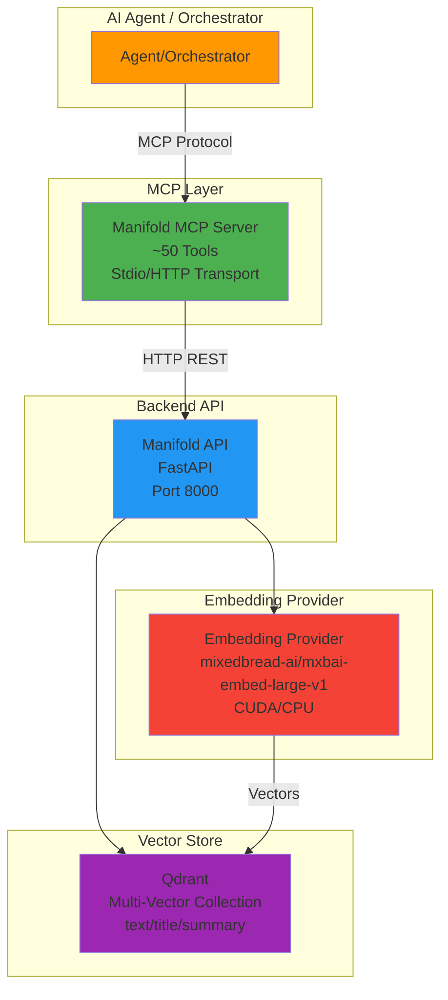

---

## Architektur

### Thought-Envelope Struktur

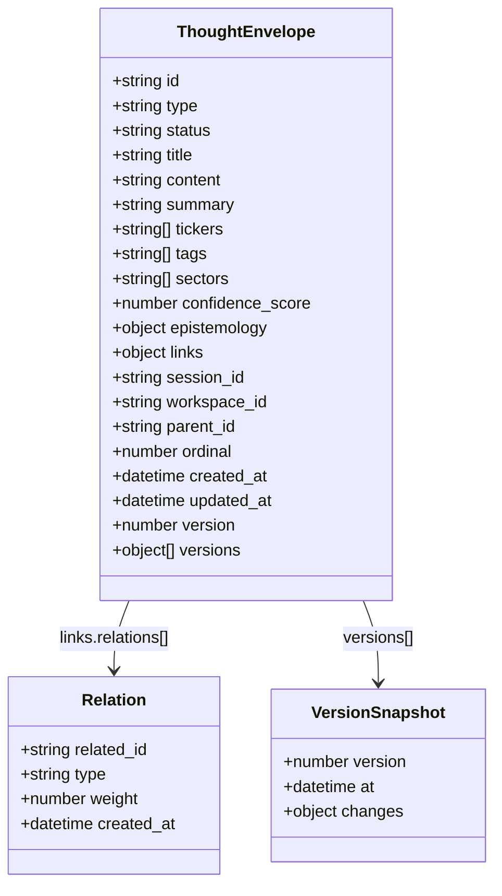

### Multi-Vector Embedding System

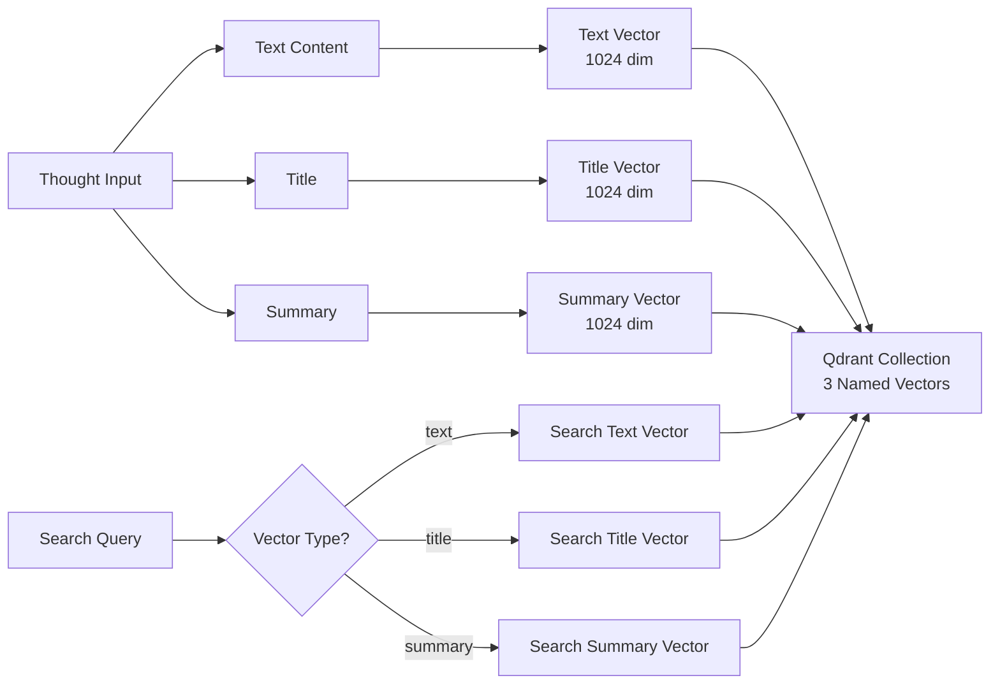

### Tool-Kategorien-Hierarchie

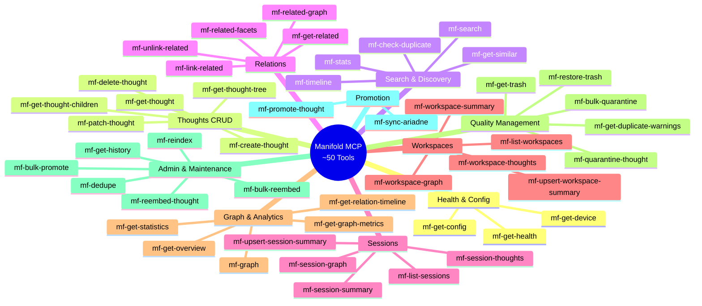

---

## Tool-Katalog

### Health & Configuration

#### `mf-get-health`

**Beschreibung**: Prüft den Gesundheitszustand der Manifold API und die Verbindung zu Qdrant.

**Parameter**: Keine

**Rückgabe**:
```json
{
  "status": "ok",
  "qdrant": "connected",
  "collection": "manifold_thoughts",
  "point_count": 1234
}
```

**Verwendung**: 
- ✅ Vor kritischen Operationen prüfen
- ✅ System-Monitoring
- ✅ Debugging bei Verbindungsproblemen

**Strategie**: Immer zuerst aufrufen, wenn System-Status unklar ist.

---

#### `mf-get-config`

**Beschreibung**: Gibt die Konfiguration des Systems zurück (Collection-Name, Vector-Dimensionen, Embedding-Provider).

**Parameter**: Keine

**Rückgabe**:
```json
{
  "collection": "manifold_thoughts",
  "vector_dim": 1024,
  "embedding_provider": "mixedbread-ai/mxbai-embed-large-v1",
  "multi_vector": true
}
```

**Verwendung**:
- ✅ System-Informationen abrufen
- ✅ Validierung der Konfiguration

---

#### `mf-get-device`

**Beschreibung**: Gibt GPU/CPU-Informationen für das Embedding-Modell zurück.

**Parameter**: Keine

**Rückgabe**:
```json
{
  "device": "cuda",
  "gpu_name": "NVIDIA RTX 4090",
  "gpu_memory_gb": 24.0,
  "cuda_version": "12.1"
}
```

**Verwendung**:
- ✅ Performance-Optimierung
- ✅ Debugging von Embedding-Problemen

---

### Thoughts CRUD

#### `mf-create-thought`

**Beschreibung**: Erstellt einen neuen Thought mit automatischem Multi-Vector-Embedding (text, title, summary).

**Parameter**:
```typescript
{
  id?: string;                    // Optional, wird generiert wenn nicht angegeben
  type: string;                    // Required: "fact", "hypothesis", "question", etc.
  status?: string;                // Optional: "active", "draft", etc.
  title?: string;                 // Optional
  content?: string;               // Optional
  summary?: string;               // Optional, falls nicht angegeben wird title oder content[:280] verwendet
  tickers?: string[];             // Optional: ["AAPL", "TSLA"]
  tags?: string[];                // Optional: ["tech", "analysis"]
  sectors?: string[];             // Optional: ["technology", "energy"]
  confidence_score?: number;      // Optional: 0.0-1.0
  epistemology?: object;          // Optional: Metadaten
  links?: object;                 // Optional: Vorhandene Links
  session_id?: string;           // Optional: Session-Gruppierung
  workspace_id?: string;         // Optional: Workspace-Gruppierung
  parent_id?: string;            // Optional: Für Hierarchien
  ordinal?: number;               // Optional: Sortierung innerhalb Hierarchie
}
```

**Rückgabe**:
```json
{
  "status": "created",
  "thought_id": "uuid-here"
}
```

**Embedding-Strategie**:
- **Text Vector**: Wird aus `content` generiert (leerer String falls nicht vorhanden)
- **Title Vector**: Wird aus `title` generiert (leerer String falls nicht vorhanden)
- **Summary Vector**: Wird aus `summary` generiert, falls nicht vorhanden aus `title`, falls auch nicht vorhanden aus `content[:280]`

**Verwendung**:
- ✅ Neue Gedanken speichern
- ✅ Strukturierte Informationen organisieren
- ✅ Analysen und Hypothesen dokumentieren

**Best Practices**:
- 🎯 Immer `type` angeben für bessere Organisation
- 🎯 `summary` sollte eine prägnante Zusammenfassung sein (idealerweise < 280 Zeichen)
- 🎯 `tickers` und `tags` für bessere Filterbarkeit nutzen
- 🎯 `confidence_score` für Qualitätsbewertung verwenden

**Warnung**: Embedding ist rechenintensiv (besonders bei GPU). Bei vielen gleichzeitigen Erstellungen kann es zu Timeouts kommen.

---

#### `mf-get-thought`

**Beschreibung**: Lädt einen Thought anhand seiner ID.

**Parameter**:
```typescript
{
  id: string;  // Required: Thought-ID
}
```

**Rückgabe**: Vollständiger Thought mit allen Metadaten, Vektoren (IDs) und Version-History.

**Verwendung**:
- ✅ Thought-Details abrufen
- ✅ Nach Updates überprüfen
- ✅ Kontext für weitere Operationen

**Performance**: Sehr schnell (< 100ms), da direkter Lookup in Qdrant.

---

#### `mf-patch-thought`

**Beschreibung**: Teilweise Aktualisierung eines Thoughts mit automatischem Re-Embedding bei Änderungen von title/content/summary.

**Parameter**:
```typescript
{
  id: string;         // Required: Thought-ID
  patch: {            // Required: Teilweise Updates
    title?: string;
    content?: string;
    summary?: string;
    status?: string;
    tickers?: string[];
    // ... alle anderen Felder
  }
}
```

**Automatisches Re-Embedding**:
- ✅ Wird nur ausgeführt wenn `title`, `content` oder `summary` geändert werden
- ✅ Nur die geänderten Vektoren werden neu berechnet
- ✅ `summary` Vector wird automatisch aktualisiert wenn `content` geändert wird (falls kein explizites `summary` im Patch)

**Versionierung**:
- ✅ Jedes Patch inkrementiert `version`
- ✅ Alte Version wird in `versions[]` Array gespeichert
- ✅ `updated_at` wird automatisch aktualisiert

**Rückgabe**:
```json
{
  "status": "updated"
}
```

**Verwendung**:
- ✅ Thought-Inhalte aktualisieren
- ✅ Metadaten korrigieren
- ✅ Status ändern

**Best Practices**:
- 🎯 Nur geänderte Felder senden (nicht vollständiges Objekt)
- 🎯 Bei häufigen Updates: Bulk-Operationen nutzen

---

#### `mf-delete-thought`

**Beschreibung**: Löscht einen Thought (standardmäßig Soft-Delete).

**Parameter**:
```typescript
{
  id: string;        // Required: Thought-ID
  soft?: boolean;    // Optional: true (default) = Soft-Delete, false = Hard-Delete
}
```

**Soft-Delete**:
- ✅ Setzt `deleted_at` Timestamp
- ✅ Setzt `status` auf "deleted"
- ✅ Thought bleibt in Qdrant (wird in Filtern ausgeschlossen)
- ✅ Kann mit `mf-restore-trash` wiederhergestellt werden

**Hard-Delete**:
- ⚠️ Entfernt Thought komplett aus Qdrant
- ⚠️ Nicht wiederherstellbar
- ⚠️ Kann zu verwaisten Relationen führen

**Rückgabe**:
```json
{
  "status": "deleted"
}
```

**Verwendung**:
- ✅ Thought entfernen (standardmäßig Soft-Delete)
- ✅ Endgültige Löschung (Hard-Delete nur wenn nötig)

**Best Practices**:
- 🎯 Standardmäßig Soft-Delete verwenden
- 🎯 Hard-Delete nur bei Datenschutz-Anforderungen oder kompletter Bereinigung

---

#### `mf-get-thought-children`

**Beschreibung**: Ruft alle Child-Thoughts eines Thoughts ab (parent_id == thought_id), sortiert nach `ordinal`.

**Parameter**:
```typescript
{
  id: string;  // Required: Parent Thought-ID
}
```

**Rückgabe**:
```json
{
  "status": "ok",
  "parent_id": "uuid",
  "children_count": 5,
  "children": [
    {
      "id": "child-1",
      "title": "Child 1",
      "ordinal": 0,
      // ... vollständiger Thought
    },
    // ...
  ]
}
```

**Verwendung**:
- ✅ Hierarchische Strukturen navigieren
- ✅ Organisierte Listen abrufen
- ✅ Thought-Bäume aufbauen

**Performance**: Kann bei vielen Children langsam sein (scrollt durch alle Thoughts mit parent_id).

---

#### `mf-get-thought-tree`

**Beschreibung**: Ruft vollständigen Kontext ab: Parent → Thought → Children + Related Thoughts.

**Parameter**:
```typescript
{
  thought_id: string;     // Required: Thought-ID
  depth?: number;         // Optional: 1-3 (default: 2) für Related-Tiefe
}
```

**Rückgabe**: Vollständiger Baum mit:
- Parent Thought (falls vorhanden)
- Thought selbst
- Alle Children (sortiert nach ordinal)
- Related Thoughts (bis zu `depth` Ebenen)

**Verwendung**:
- ✅ Vollständigen Kontext verstehen
- ✅ Thought-Hierarchie visualisieren
- ✅ Zusammenhänge erkennen

**Best Practices**:
- 🎯 `depth=1` für schnelle Übersicht
- 🎯 `depth=2-3` für tiefere Exploration

---

### Search & Discovery

#### `mf-search`

**Beschreibung**: Semantische Suche mit Multi-Vector-Support, Filtern, Boosts und optionaler Diversity (MMR).

**Parameter**:
```typescript
{
  query?: string;                    // Optional: Suchanfrage (leer = Filter-only)
  vector_type?: "text" | "title" | "summary";  // Optional: Welcher Vector (default: "summary")
  include_content?: boolean;        // Optional: false = Cheap Discovery (nur id/title/summary/type/tickers/score)
  filters?: {                       // Optional: Komplexe Filter
    must?: FilterClause[];
    must_not?: FilterClause[];
    facets?: string[];              // Für Facet-Berechnung
  };
  boosts?: {                        // Optional: Score-Boosts
    recency?: number;               // Zeit-basierter Boost
    type?: Record<string, number>;  // Type-basierter Boost
    tickers?: Record<string, number>; // Ticker-basierter Boost
  };
  diversity?: {                     // Optional: Maximal Marginal Relevance
    mmr_lambda?: number;            // 0.0-1.0 (0 = diverse, 1 = relevant)
  };
  limit?: number;                   // Optional: 1-200 (default: 50)
  offset?: number;                  // Optional: Pagination (default: 0)
}
```

**FilterClause**:
```typescript
{
  field: string;      // z.B. "type", "status", "tickers"
  op: "match" | "any" | "range";
  value: any;         // Wert oder Array für "any"
}
```

**Rückgabe**:
```json
{
  "status": "ok",
  "count": 25,
  "facets": {
    "type": {"fact": 10, "hypothesis": 15},
    "status": {"active": 20, "draft": 5}
  },
  "facet_suggest": {
    // Top-Keys nach Häufigkeit (falls keine facets angegeben)
  },
  "results": [
    {
      "id": "uuid",
      "score": 0.92,
      "score_components": {
        "base_similarity": 0.85,
        "recency_boost": 0.05,
        "type_boost": 0.02,
        "final": 0.92
      },
      "thought": {
        // Vollständiger Thought oder Cheap Discovery
      }
    }
  ]
}
```

**Multi-Vector-Strategie**:
- **`vector_type: "summary"`** (Default): Schnell, gute Übersicht, für allgemeine Suche
- **`vector_type: "title"`**: Für präzise Titel-Matches
- **`vector_type: "text"`**: Für detaillierte Content-Suche (langsamer, aber präziser)

**Cheap Discovery Mode** (`include_content: false`):
- ✅ Schneller (weniger Daten übertragen)
- ✅ Geeignet für erste Suche/Exploration
- ✅ Später `mf-get-thought` für Details

**Diversity (MMR)**:
- ✅ `mmr_lambda: 0.0` = Maximale Diversität (weniger ähnliche Ergebnisse)
- ✅ `mmr_lambda: 1.0` = Maximale Relevanz (ähnlichste Ergebnisse)
- ✅ `mmr_lambda: 0.5` = Balance zwischen Relevanz und Diversität

**Verwendung**:
- ✅ Semantische Suche nach ähnlichen Gedanken
- ✅ Filter-basierte Exploration
- ✅ Facet-basierte Navigation
- ✅ Prefetch-Strategien (Cheap Discovery → Detail-Abruf)

**Best Practices**:
- 🎯 Erst `include_content: false` für Übersicht, dann Details abrufen
- 🎯 `vector_type: "summary"` für allgemeine Suche, `"text"` für detaillierte Suche
- 🎯 Boosts für relevantere Ergebnisse nutzen
- 🎯 MMR für diverse Ergebnislisten (z.B. bei Exploration)

**Performance**: 
- ⚠️ Kann bei großen Collections langsam sein (10-30s)
- ⚠️ Filter sind schneller als Vector-Search
- ⚠️ Cheap Discovery ist deutlich schneller

---

#### `mf-timeline`

**Beschreibung**: Zeitliche Darstellung von Thoughts, gruppiert nach Tag oder Woche.

**Parameter**:
```typescript
{
  from_dt?: string;         // Optional: ISO8601 Start-Datum
  to_dt?: string;           // Optional: ISO8601 End-Datum
  days?: number;            // Optional: Letzte N Tage (wenn keine from_dt/to_dt)
  bucket?: "day" | "week";  // Optional: Gruppierung (default: "day")
  type?: string;            // Optional: Filter nach Type
  tickers?: string;         // Optional: Komma-getrennte Ticker-Liste
  session_id?: string;      // Optional: Filter nach Session
  workspace_id?: string;    // Optional: Filter nach Workspace
  limit?: number;           // Optional: Max Results (default: 1000, max: 5000)
}
```

**Rückgabe**:
```json
{
  "status": "ok",
  "timeline": [
    // Alle Thoughts chronologisch
  ],
  "bucketed": {
    "2025-01-15": [/* Thoughts */],
    "2025-01-16": [/* Thoughts */],
    "2025-W03": [/* Thoughts */]  // Falls bucket="week"
  }
}
```

**Verwendung**:
- ✅ Zeitliche Entwicklung verstehen
- ✅ Thought-Historie analysieren
- ✅ Chronologische Exploration

**Best Practices**:
- 🎯 `bucket: "day"` für detaillierte Timeline
- 🎯 `bucket: "week"` für Überblick über längere Zeiträume
- 🎯 Kombiniert mit `session_id` oder `workspace_id` für fokussierte Analyse

---

#### `mf-stats`

**Beschreibung**: Aggregierte Statistiken nach Type, Status, durchschnittlichem Confidence-Score.

**Parameter**:
```typescript
{
  tickers?: string;         // Optional: Komma-getrennte Ticker-Liste
  timeframe?: string;        // Optional: Filter nach Timeframe
  session_id?: string;       // Optional: Filter nach Session
  workspace_id?: string;    // Optional: Filter nach Workspace
}
```

**Rückgabe**:
```json
{
  "status": "ok",
  "total": 1234,
  "by_type": {
    "fact": 500,
    "hypothesis": 300,
    "question": 200,
    "summary": 234
  },
  "by_status": {
    "active": 1000,
    "draft": 200,
    "deleted": 34
  },
  "avg_confidence": 0.75,
  "validation_rate": 0.15  // Anteil promoted_to_kg
}
```

**Verwendung**:
- ✅ System-Überblick
- ✅ Qualitäts-Metriken
- ✅ Typ-Verteilung verstehen

---

#### `mf-get-similar`

**Beschreibung**: Findet ähnliche Thoughts via Vector-Ähnlichkeit (K-Nearest Neighbors).

**Parameter**:
```typescript
{
  thought_id: string;  // Required: Thought-ID
  k?: number;         // Optional: Anzahl ähnlicher Thoughts (1-50, default: 10)
}
```

**Rückgabe**: Array von ähnlichen Thoughts mit Similarity-Scores.

**Verwendung**:
- ✅ Ähnliche Gedanken finden
- ✅ Duplikat-Erkennung
- ✅ Verwandte Konzepte entdecken

**Performance**: Schnell (< 2s), da direkter Vector-Lookup.

---

#### `mf-check-duplicate`

**Beschreibung**: Prüft ob ein Thought (title/summary/content) ähnlich zu existierenden Thoughts ist.

**Parameter**:
```typescript
{
  title?: string;          // Optional: Title zu prüfen
  summary?: string;        // Optional: Summary zu prüfen
  content?: string;        // Optional: Content zu prüfen
  threshold?: number;      // Optional: Similarity-Schwelle 0.0-1.0 (default: 0.90)
}
```

**Rückgabe**:
```json
{
  "is_duplicate": true,
  "similar_thoughts": [
    {
      "id": "uuid",
      "similarity": 0.95,
      "title": "Similar Thought"
    }
  ]
}
```

**Verwendung**:
- ✅ Vor Erstellung prüfen ob ähnlicher Thought existiert
- ✅ Duplikat-Vermeidung
- ✅ Qualitätssicherung

**Best Practices**:
- 🎯 Immer vor `mf-create-thought` aufrufen
- 🎯 `threshold: 0.90` für strikte Duplikat-Erkennung
- 🎯 `threshold: 0.85` für ähnliche Gedanken

---

### Relations

#### `mf-link-related`

**Beschreibung**: Erstellt eine typisierte Relation von einem Thought zu einem anderen.

**Parameter**:
```typescript
{
  thought_id: string;     // Required: Source Thought-ID
  payload: {
    related_id: string;   // Required: Target Thought-ID
    relation_type: "supports" | "contradicts" | "followup" | "duplicate" | "related";  // Optional: default "related"
    weight?: number;       // Optional: 0.0-1.0 (default: 1.0)
  }
}
```

**Relation-Typen**:
- **`supports`**: Thought unterstützt einen anderen (z.B. Evidence → Hypothesis)
- **`contradicts`**: Thought widerspricht einem anderen
- **`followup`**: Thought ist Nachfolger (z.B. Frage → Antwort)
- **`duplicate`**: Thought ist Duplikat
- **`related`**: Allgemeine Verwandtschaft

**Rückgabe**:
```json
{
  "status": "linked",
  "created_at": "2025-01-15T10:00:00Z"
}
```

**Verwendung**:
- ✅ Gedanken-Verknüpfungen erstellen
- ✅ Argumentationsketten aufbauen
- ✅ Hierarchien verbinden

**Best Practices**:
- 🎯 `relation_type` immer explizit angeben
- 🎯 `weight` für wichtige Relationen erhöhen
- 🎯 Bidirektionale Relationen manuell erstellen (falls nötig)

---

#### `mf-unlink-related`

**Beschreibung**: Entfernt eine Relation zwischen zwei Thoughts.

**Parameter**:
```typescript
{
  thought_id: string;    // Required: Source Thought-ID
  related_id: string;     // Required: Target Thought-ID
}
```

**Rückgabe**:
```json
{
  "status": "unlinked"
}
```

**Verwendung**:
- ✅ Falsche Relationen entfernen
- ✅ Relationen korrigieren

---

#### `mf-get-related`

**Beschreibung**: Ruft verwandte Thoughts bis zu einer bestimmten Tiefe ab.

**Parameter**:
```typescript
{
  thought_id: string;  // Required: Thought-ID
  depth?: number;      // Optional: 1-3 (default: 1)
}
```

**Rückgabe**: Verwandte Thoughts mit Relation-Typen, gruppiert nach Tiefe.

**Verwendung**:
- ✅ Kontext-Verknüpfungen verstehen
- ✅ Thought-Netzwerk navigieren
- ✅ Argumentationsketten folgen

**Performance**: Kann bei großer Tiefe und vielen Relationen langsam sein.

---

#### `mf-related-facets`

**Beschreibung**: Gibt Facet-Counts (Typ/Status/Ticker-Verteilung) in der Nachbarschaft eines Thoughts zurück.

**Parameter**:
```typescript
{
  thought_id: string;  // Required: Thought-ID
}
```

**Rückgabe**: Facet-Verteilung der verwandten Thoughts.

**Verwendung**:
- ✅ Kontext-Verständnis
- ✅ Thought-Umgebung analysieren

---

#### `mf-related-graph`

**Beschreibung**: Gibt Nodes/Edges für den Subgraph um einen Thought zurück.

**Parameter**:
```typescript
{
  thought_id: string;  // Required: Thought-ID
  depth?: number;      // Optional: 1-3 (default: 1)
}
```

**Rückgabe**: Graph-Struktur mit Nodes und Edges (typisiert).

**Verwendung**:
- ✅ Graph-Visualisierung
- ✅ Netzwerk-Analyse
- ✅ Thought-Kontext visualisieren

---

### Sessions

#### `mf-list-sessions`

**Beschreibung**: Listet alle Sessions mit Thought-Counts und Typ-Verteilung.

**Parameter**:
```typescript
{
  limit?: number;  // Optional: 1-10000 (default: 100)
}
```

**Rückgabe**:
```json
{
  "sessions": [
    {
      "session_id": "session-uuid",
      "count": 25,
      "types": {
        "fact": 10,
        "hypothesis": 15
      },
      "created_at": "2025-01-15T10:00:00Z"
    }
  ]
}
```

**Verwendung**:
- ✅ Session-Überblick
- ✅ Session-Auswahl
- ✅ Session-Management

---

#### `mf-session-thoughts`

**Beschreibung**: Ruft alle Thoughts einer Session ab.

**Parameter**:
```typescript
{
  session_id: string;       // Required: Session-ID
  limit?: number;           // Optional: 1-5000 (default: 1000)
  include_content?: boolean; // Optional: Content einbeziehen
}
```

**Rückgabe**: Array von Thoughts der Session.

**Verwendung**:
- ✅ Session-Inhalte abrufen
- ✅ Session-Analyse

---

#### `mf-session-graph`

**Beschreibung**: Gibt Graph-Struktur (Nodes/Edges) für eine Session zurück.

**Parameter**:
```typescript
{
  session_id: string;  // Required: Session-ID
  limit?: number;      // Optional: 10-5000 (default: 500)
}
```

**Rückgabe**: Graph mit allen Thoughts und Relationen der Session.

**Verwendung**:
- ✅ Session-Visualisierung
- ✅ Session-Struktur analysieren

---

#### `mf-session-summary`

**Beschreibung**: Ruft die Summary-Thought einer Session ab (type="summary").

**Parameter**:
```typescript
{
  session_id: string;  // Required: Session-ID
}
```

**Rückgabe**: Summary-Thought oder 404 wenn nicht vorhanden.

**Verwendung**:
- ✅ Session-Zusammenfassung abrufen

---

#### `mf-upsert-session-summary`

**Beschreibung**: Erstellt oder aktualisiert die Summary-Thought einer Session.

**Parameter**:
```typescript
{
  session_id: string;  // Required: Session-ID
  title?: string;      // Optional: Summary-Title
  summary?: string;    // Optional: Summary-Text
  content?: string;    // Optional: Summary-Content
}
```

**Rückgabe**: Summary-Thought.

**Verwendung**:
- ✅ Session-Zusammenfassung erstellen/aktualisieren
- ✅ Session-Reflexion

**Best Practices**:
- 🎯 Summary sollte prägnant sein (< 500 Zeichen für summary)
- 🎯 Wird automatisch mit `session_id` verlinkt

---

### Workspaces

#### `mf-list-workspaces`

**Beschreibung**: Listet alle Workspaces mit Thought-Counts und Typ-Verteilung.

**Parameter**:
```typescript
{
  limit?: number;  // Optional: 1-10000 (default: 100)
}
```

**Rückgabe**: Ähnlich wie `mf-list-sessions`, aber für Workspaces.

**Verwendung**:
- ✅ Workspace-Überblick
- ✅ Workspace-Auswahl

**Unterschied zu Sessions**: Workspaces sind langlebig, Sessions temporär.

---

#### `mf-workspace-thoughts`

**Beschreibung**: Ruft alle Thoughts eines Workspaces ab.

**Parameter**:
```typescript
{
  workspace_id: string;     // Required: Workspace-ID
  limit?: number;          // Optional: 1-5000 (default: 1000)
  include_content?: boolean; // Optional: Content einbeziehen
}
```

**Rückgabe**: Array von Thoughts des Workspaces.

**Verwendung**:
- ✅ Workspace-Inhalte abrufen
- ✅ Projekt-Analyse

---

#### `mf-workspace-graph`

**Beschreibung**: Gibt Graph-Struktur für einen Workspace zurück.

**Parameter**:
```typescript
{
  workspace_id: string;  // Required: Workspace-ID
  limit?: number;       // Optional: 10-5000 (default: 500)
}
```

**Rückgabe**: Graph mit allen Thoughts und Relationen des Workspaces.

**Verwendung**:
- ✅ Workspace-Visualisierung
- ✅ Projekt-Struktur analysieren

---

#### `mf-workspace-summary`

**Beschreibung**: Ruft die Summary-Thought eines Workspaces ab.

**Parameter**:
```typescript
{
  workspace_id: string;  // Required: Workspace-ID
}
```

**Rückgabe**: Summary-Thought oder 404 wenn nicht vorhanden.

---

#### `mf-upsert-workspace-summary`

**Beschreibung**: Erstellt oder aktualisiert die Summary-Thought eines Workspaces.

**Parameter**:
```typescript
{
  workspace_id: string;  // Required: Workspace-ID
  title?: string;       // Optional
  summary?: string;     // Optional
  content?: string;     // Optional
}
```

**Verwendung**:
- ✅ Projekt-Zusammenfassung erstellen/aktualisieren
- ✅ Workspace-Reflexion

---

### Graph & Analytics

#### `mf-graph`

**Beschreibung**: Globaler Graph-Überblick (Birdview) mit optionalen Filtern.

**Parameter**:
```typescript
{
  limit?: number;         // Optional: 10-5000 (default: 500)
  type?: string;          // Optional: Filter nach Type
  status?: string;        // Optional: Filter nach Status
  tickers?: string;       // Optional: Komma-getrennte Ticker-Liste
  session_id?: string;    // Optional: Filter nach Session
  workspace_id?: string;  // Optional: Filter nach Workspace
}
```

**Rückgabe**:
```json
{
  "nodes": [
    {
      "id": "uuid",
      "type": "fact",
      "title": "Thought Title"
    }
  ],
  "edges": [
    {
      "from": "uuid-1",
      "to": "uuid-2",
      "type": "supports",
      "weight": 1.0
    }
  ]
}
```

**Verwendung**:
- ✅ System-Überblick
- ✅ Graph-Visualisierung
- ✅ Netzwerk-Analyse

**Performance**: Kann bei großen Collections langsam sein (10-30s).

---

#### `mf-get-statistics`

**Beschreibung**: Umfassende Statistiken über Thoughts (Distributions, Metriken).

**Parameter**:
```typescript
{
  session_id?: string;  // Optional: Filter nach Session
}
```

**Rückgabe**: Detaillierte Statistiken mit Distributions, Trends, etc.

**Verwendung**:
- ✅ System-Analyse
- ✅ Qualitäts-Metriken
- ✅ Trends verstehen

---

#### `mf-get-graph-metrics`

**Beschreibung**: Berechnet Graph-Metriken (Centrality, Density, Degree Distribution, etc.).

**Parameter**:
```typescript
{
  session_id?: string;  // Optional: Filter nach Session
}
```

**Rückgabe**:
```json
{
  "centrality": {
    "top_nodes": [/* IDs mit höchster Centrality */]
  },
  "density": 0.15,
  "degree_distribution": {
    "min": 0,
    "max": 50,
    "avg": 5.2
  },
  "isolated_nodes": 100
}
```

**Verwendung**:
- ✅ Netzwerk-Struktur analysieren
- ✅ Wichtige Thoughts identifizieren
- ✅ Isolierte Thoughts finden

**Performance**: Kann bei großen Graphen sehr langsam sein (30-60s).

---

#### `mf-get-overview`

**Beschreibung**: Kombiniert Statistics + Graph Metrics für vollständigen Überblick.

**Parameter**:
```typescript
{
  session_id?: string;  // Optional: Filter nach Session
}
```

**Rückgabe**: Kombinierte Statistik- und Graph-Metriken.

**Verwendung**:
- ✅ System-Health-Check
- ✅ Vollständiger Überblick
- ✅ Dashboard-Daten

**Performance**: Langsam (kombiniert mehrere Operationen).

---

#### `mf-get-relation-timeline`

**Beschreibung**: Timeline aller Relation-Erstellungen mit Timestamps.

**Parameter**:
```typescript
{
  session_id?: string;  // Optional: Filter nach Session
}
```

**Rückgabe**: Chronologische Liste aller Relation-Erstellungen.

**Verwendung**:
- ✅ Entwicklung von Relationen verstehen
- ✅ Netzwerk-Wachstum analysieren

---

### Quality Management

#### `mf-quarantine-thought`

**Beschreibung**: Markiert einen Thought als quarantined (qualitätsproblematisch).

**Parameter**:
```typescript
{
  thought_id: string;  // Required: Thought-ID
  reason?: string;      // Optional: Grund für Quarantine
}
```

**Rückgabe**:
```json
{
  "status": "quarantined"
}
```

**Verwendung**:
- ✅ Problematische Thoughts markieren
- ✅ Qualitätskontrolle

**Best Practices**:
- 🎯 `reason` immer angeben für Nachvollziehbarkeit
- 🎯 Quarantined Thoughts werden in Filtern ausgeschlossen

---

#### `mf-bulk-quarantine`

**Beschreibung**: Markiert mehrere Thoughts gleichzeitig als quarantined.

**Parameter**:
```typescript
{
  ids: string[];     // Required: Array von Thought-IDs
  reason?: string;   // Optional: Grund für Quarantine
}
```

**Rückgabe**: Anzahl quarantined Thoughts.

**Verwendung**:
- ✅ Bulk-Qualitätskontrolle
- ✅ Effiziente Wartung

---

#### `mf-get-duplicate-warnings`

**Beschreibung**: Findet potenzielle Duplikate im System.

**Parameter**:
```typescript
{
  threshold?: number;     // Optional: 0.0-1.0 (default: 0.92)
  limit?: number;         // Optional: 1-1000 (default: 100)
  session_id?: string;    // Optional: Filter nach Session
  workspace_id?: string;  // Optional: Filter nach Workspace
}
```

**Rückgabe**: Liste von Duplikat-Paaren mit Similarity-Scores.

**Verwendung**:
- ✅ Systemweite Duplikat-Erkennung
- ✅ Qualitäts-Management
- ✅ Bereinigung

**Performance**: Kann sehr langsam sein (30-60s) bei großen Collections.

---

#### `mf-get-trash`

**Beschreibung**: Ruft alle Soft-Deleted Thoughts ab.

**Parameter**: Keine

**Rückgabe**: Array von Soft-Deleted Thoughts.

**Verwendung**:
- ✅ Gelöschte Thoughts wiederfinden
- ✅ Wiederherstellung vorbereiten

---

#### `mf-restore-trash`

**Beschreibung**: Stellt einen Soft-Deleted Thought wieder her.

**Parameter**:
```typescript
{
  thought_id: string;  // Required: Thought-ID
}
```

**Rückgabe**:
```json
{
  "status": "restored"
}
```

**Verwendung**:
- ✅ Versehentlich gelöschte Thoughts wiederherstellen

---

### Admin & Maintenance

#### `mf-reembed-thought`

**Beschreibung**: Berechnet Vektoren für einen Thought neu.

**Parameter**:
```typescript
{
  thought_id: string;  // Required: Thought-ID
  body: {
    vectors?: ("text" | "title")[];  // Optional: Welche Vektoren (default: ["text", "title"])
  }
}
```

**Rückgabe**:
```json
{
  "status": "reembedded",
  "vectors_updated": ["text", "title"]
}
```

**Verwendung**:
- ✅ Vektoren nach Embedding-Model-Update neu berechnen
- ✅ Qualitätsprobleme beheben

**Performance**: Langsam (Embedding ist rechenintensiv).

---

#### `mf-bulk-reembed`

**Beschreibung**: Berechnet Vektoren für mehrere Thoughts neu.

**Parameter**:
```typescript
{
  ids: string[];                          // Required: Array von Thought-IDs
  vectors?: ("text" | "title")[];        // Optional: Welche Vektoren
}
```

**Rückgabe**: Anzahl re-embedded Thoughts.

**Verwendung**:
- ✅ Systemweite Vektor-Updates
- ✅ Embedding-Model-Migration

**Performance**: Sehr langsam, kann Minuten dauern.

---

#### `mf-reindex`

**Beschreibung**: Führt vollständige Neuindizierung durch (dry-run oder full).

**Parameter**:
```typescript
{
  dry_run?: boolean;  // Optional: true = Preview, false = Full Reindex (default: true)
  filters?: object;   // Optional: Filter für selektive Reindexierung
}
```

**Rückgabe**: Reindex-Statistiken.

**Verwendung**:
- ✅ Collection-Optimierung
- ✅ Nach Schema-Änderungen
- ✅ Index-Probleme beheben

**Warnung**: Full Reindex kann sehr lange dauern (Stunden bei großen Collections).

---

#### `mf-dedupe`

**Beschreibung**: Stub für semantische Deduplizierung (bereit für Implementation).

**Parameter**:
```typescript
{
  strategy?: string;      // Optional: Dedupe-Strategie
  filters?: object;       // Optional: Filter
  threshold?: number;     // Optional: Similarity-Schwelle
}
```

**Status**: Backend-Stub vorhanden, Implementation pending.

---

#### `mf-bulk-promote`

**Beschreibung**: Markiert mehrere Thoughts als `promoted_to_kg`.

**Parameter**:
```typescript
{
  ids: string[];  // Required: Array von Thought-IDs
}
```

**Rückgabe**: Anzahl promoted Thoughts.

**Verwendung**:
- ✅ Bulk-Promotion zu Ariadne KG
- ✅ Qualitäts-Validierung

---

#### `mf-get-history`

**Beschreibung**: Ruft Versions-Historie eines Thoughts ab.

**Parameter**:
```typescript
{
  thought_id: string;  // Required: Thought-ID
}
```

**Rückgabe**: Array von Version-Snapshots mit Änderungen.

**Verwendung**:
- ✅ Änderungs-Historie verstehen
- ✅ Version-Tracking
- ✅ Audit

---

### Promotion

#### `mf-promote-thought`

**Beschreibung**: Bereitet einen Thought für Promotion zu Ariadne Knowledge Graph vor.

**Parameter**:
```typescript
{
  thought_id: string;  // Required: Thought-ID
  body: {
    auto_mark?: boolean;  // Optional: Automatisch als promoted markieren
  }
}
```

**Rückgabe**: Promotion-Status und Ariadne-IDs.

**Verwendung**:
- ✅ Thought zu Ariadne KG promoten
- ✅ Integration mit Knowledge Graph

---

#### `mf-sync-ariadne`

**Beschreibung**: Synchronisiert Ariadne-Status und Fact/Entity-IDs zurück.

**Parameter**:
```typescript
{
  thought_id: string;              // Required: Thought-ID
  ariadne_fact_id?: string;        // Optional: Ariadne Fact-ID
  ariadne_entity_ids?: string[];   // Optional: Ariadne Entity-IDs
  status?: string;                 // Optional: Promotion-Status
}
```

**Rückgabe**: Sync-Status.

**Verwendung**:
- ✅ Ariadne-Integration synchronisieren
- ✅ Fact/Entity-IDs speichern

---

## Tool-Strategien

### Wann welches Tool nutzen?

```mermaid
flowchart TD
    Start[Neuer Gedanke] --> Check{mf-check-duplicate}
    Check -->|Duplikat gefunden| Skip[Überspringen oder Verlinken]
    Check -->|Kein Duplikat| Create[mf-create-thought]
    
    Create --> Organize{Organisation nötig?}
    Organize -->|Hierarchie| Parent[mf-get-thought<br/>parent_id setzen]
    Organize -->|Session| Session[mf-list-sessions<br/>session_id setzen]
    Organize -->|Workspace| Workspace[mf-list-workspaces<br/>workspace_id setzen]
    
    Parent --> Link{mf-link-related}
    Session --> Link
    Workspace --> Link
    
    Link --> Search[Gedanke gefunden?]
    Search -->|Suche| mf-search
    Search -->|Exploration| mf-get-similar<br/>mf-get-related
    
    mf-search --> Analyze{Analyse nötig?}
    Analyze -->|Statistik| mf-stats<br/>mf-get-statistics
    Analyze -->|Graph| mf-graph<br/>mf-get-graph-metrics
    Analyze -->|Timeline| mf-timeline
    
    Analyze --> Quality{Qualität prüfen?}
    Quality -->|Duplikate| mf-get-duplicate-warnings
    Quality -->|Quarantine| mf-quarantine-thought
    Quality -->|Bereinigung| mf-get-trash<br/>mf-restore-trash
```

### Thought-Creation-Workflow

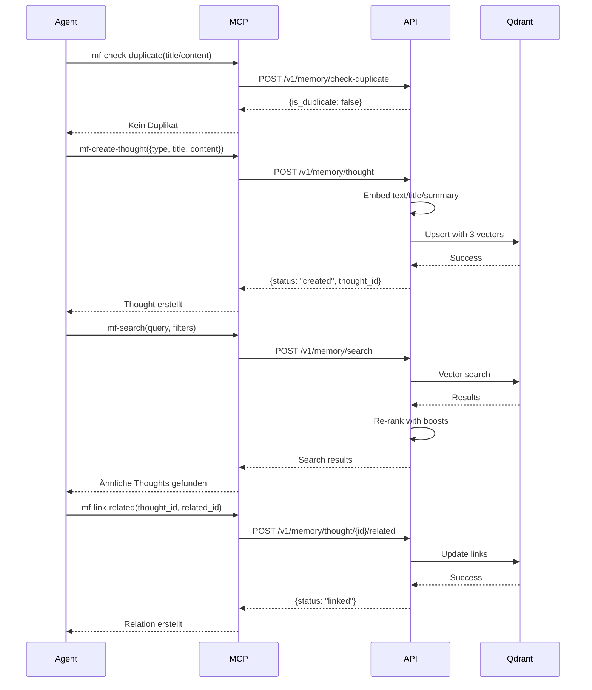

### Search-Strategien

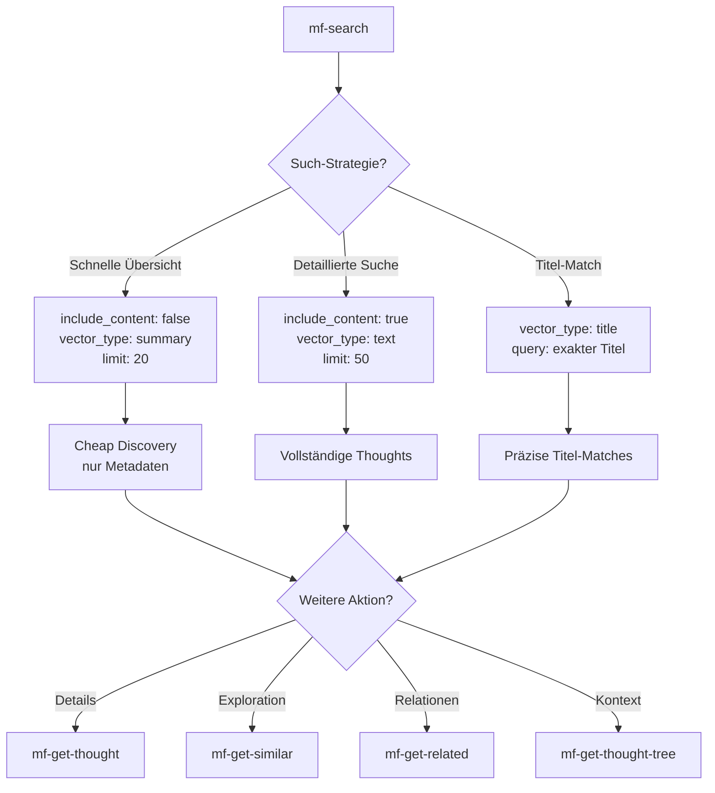

### Quality-Management-Workflow

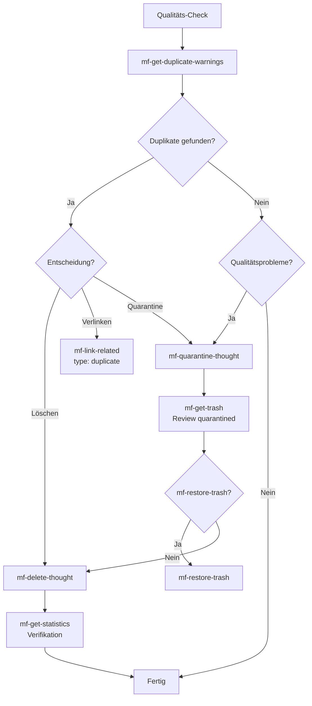

### Exploration-Strategien

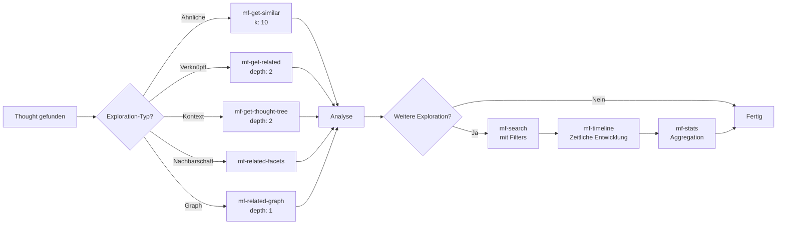

---

## Workflows & Best Practices

### Workflow 1: Strukturierte Gedanken-Erstellung

**Ziel**: Neuen Thought erstellen mit Qualitätsprüfung und Organisation.

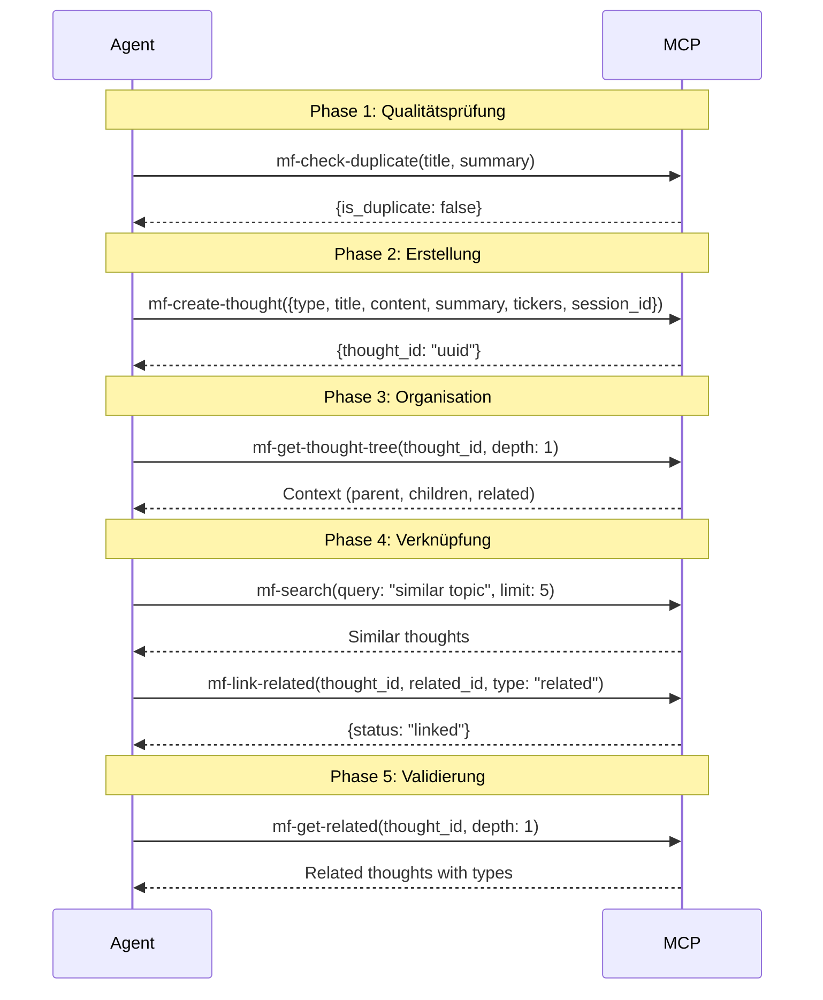

**Best Practices**:
1. ✅ Immer `mf-check-duplicate` vor Erstellung
2. ✅ `type` immer explizit setzen
3. ✅ `summary` sollte prägnant sein (< 280 Zeichen)
4. ✅ `tickers` und `tags` für Filterbarkeit nutzen
5. ✅ Nach Erstellung mit ähnlichen Thoughts verlinken

---

### Workflow 2: Wissens-Exploration

**Ziel**: Themengebiet explorieren und Zusammenhänge verstehen.

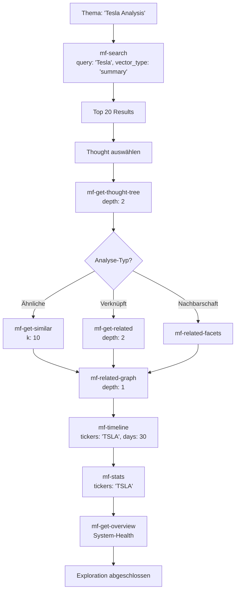

**Best Practices**:
1. ✅ Beginn mit `mf-search` für Übersicht
2. ✅ `include_content: false` für schnelle Exploration
3. ✅ `mf-get-thought-tree` für vollständigen Kontext
4. ✅ Kombination aus Similar + Related für umfassendes Verständnis
5. ✅ Timeline für zeitliche Entwicklung

---

### Workflow 3: Session-Management

**Ziel**: Session erstellen, Thoughts hinzufügen, zusammenfassen.

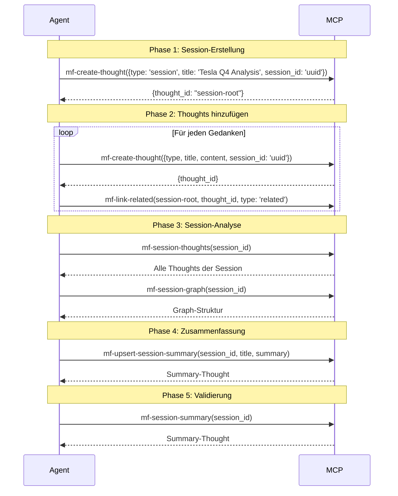

**Best Practices**:
1. ✅ `session_id` konsistent verwenden
2. ✅ Session-Root-Thought mit `type: 'session'` erstellen
3. ✅ Alle Session-Thoughts mit Root verlinken
4. ✅ `mf-upsert-session-summary` am Ende für Reflexion
5. ✅ `mf-session-graph` für Visualisierung nutzen

---

### Workflow 4: Qualitäts-Management

**Ziel**: System bereinigen, Duplikate finden und beheben.

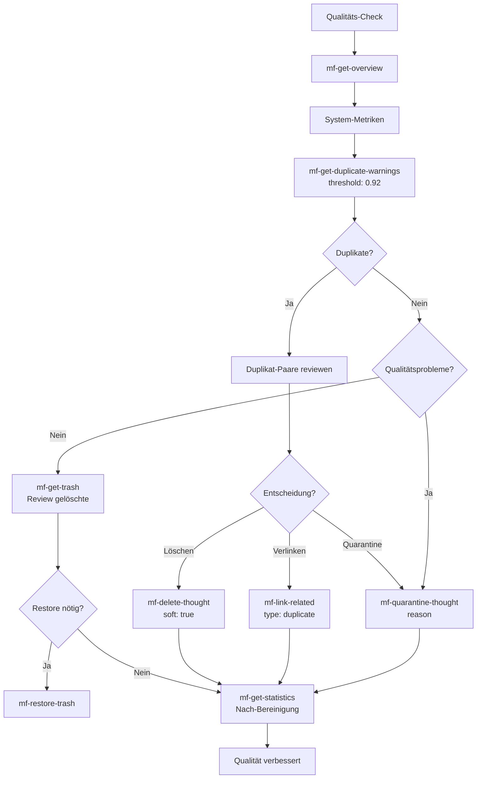

**Best Practices**:
1. ✅ Regelmäßige Qualitäts-Checks (`mf-get-duplicate-warnings`)
2. ✅ `threshold: 0.92` für strikte Duplikat-Erkennung
3. ✅ Soft-Delete bevorzugen (Wiederherstellung möglich)
4. ✅ `reason` bei Quarantine immer angeben
5. ✅ Nach Bereinigung `mf-get-statistics` für Verifikation

---

### Workflow 5: Graph-Analyse

**Ziel**: Netzwerk-Struktur verstehen und wichtige Thoughts identifizieren.

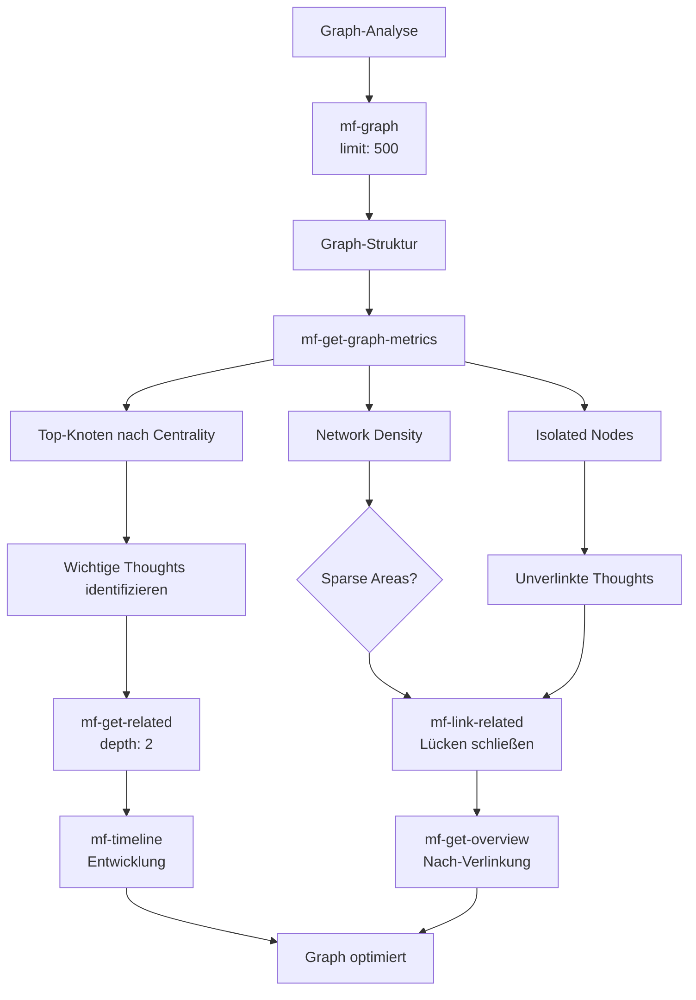

**Best Practices**:
1. ✅ Beginn mit `mf-graph` für Überblick
2. ✅ `mf-get-graph-metrics` für quantitative Analyse
3. ✅ Top-Knoten nach Centrality für wichtige Thoughts
4. ✅ Isolated Nodes für unverlinkte Thoughts identifizieren
5. ✅ Sparse Areas durch gezielte Verlinkung verbessern

---

## Erweiterte Nutzung

### Performance-Optimierung

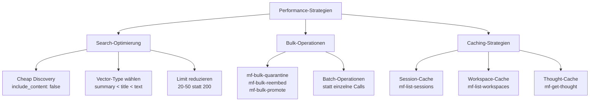

**Tipps**:
- ✅ `include_content: false` für schnelle Übersicht
- ✅ `vector_type: "summary"` für schnellere Suche
- ✅ Bulk-Operationen statt einzelne Calls
- ✅ Thought-Cache für wiederholte Zugriffe
- ✅ Limit reduzieren wenn möglich

---

### Fehlerbehandlung

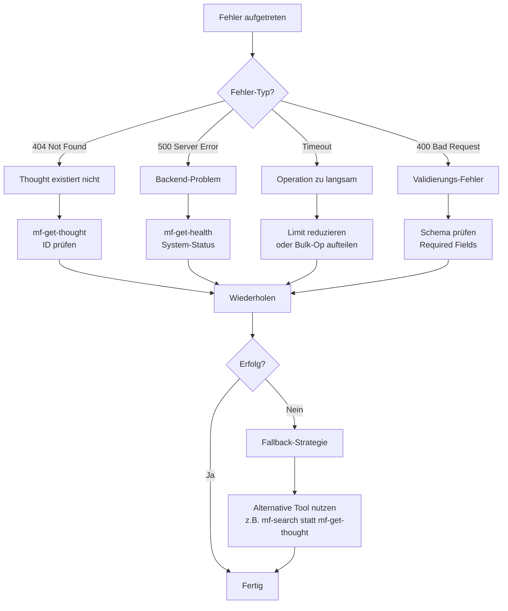

**Best Practices**:
1. ✅ Immer Health-Check bei Fehlern (`mf-get-health`)
2. ✅ Timeouts: Limit reduzieren oder Operation aufteilen
3. ✅ 404: Thought-ID prüfen mit `mf-search`
4. ✅ Validation: Schema-Dokumentation prüfen
5. ✅ Fallback-Strategien haben (z.B. Search statt Get)

---

### Integration mit Ariadne KG

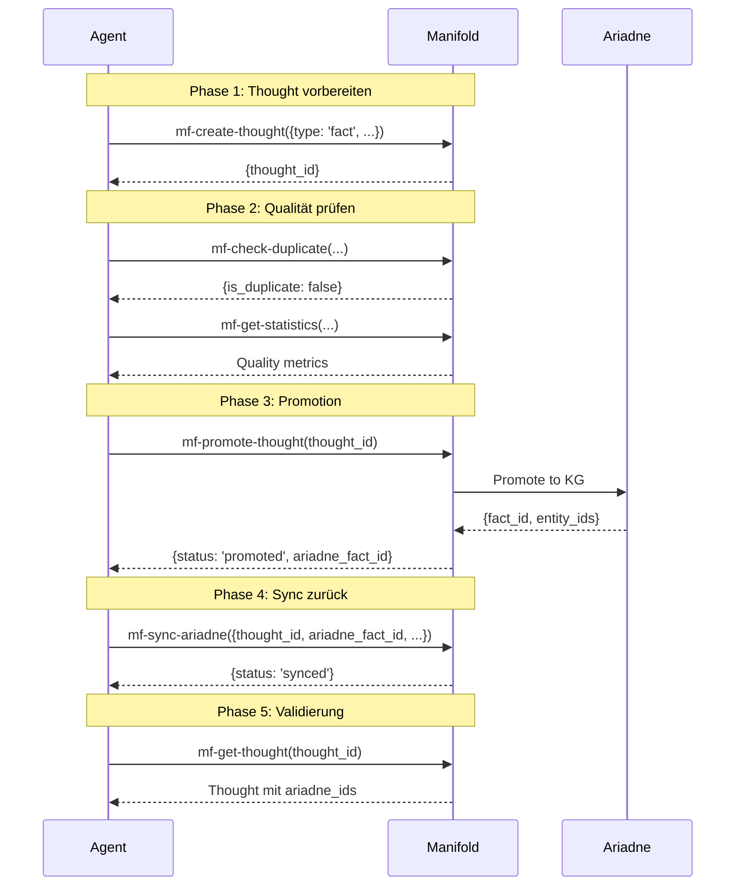

**Best Practices**:
1. ✅ Qualität vor Promotion prüfen (`mf-check-duplicate`, `mf-get-statistics`)
2. ✅ `mf-promote-thought` nur für validierte Thoughts
3. ✅ `mf-sync-ariadne` nach Promotion für Tracking
4. ✅ Ariadne-IDs in Thought speichern für Rückverfolgbarkeit

---

## Datenmodelle

### Thought-Envelope (Vollständig)

```typescript
interface ThoughtEnvelope {
  // Identifikation
  id?: string;                    // UUID, wird generiert wenn nicht angegeben
  type: string;                    // Required: "fact", "hypothesis", "question", "summary", etc.
  status?: string;                 // Optional: "active", "draft", "deleted", "quarantined"
  
  // Inhalte
  title?: string;                  // Optional: Titel
  content?: string;                // Optional: Vollständiger Inhalt
  summary?: string;                // Optional: Zusammenfassung (< 280 Zeichen empfohlen)
  
  // Kategorisierung
  tickers?: string[];              // Optional: ["AAPL", "TSLA"]
  tags?: string[];                 // Optional: ["tech", "analysis"]
  sectors?: string[];              // Optional: ["technology", "energy"]
  
  // Metadaten
  confidence_score?: number;       // Optional: 0.0-1.0
  epistemology?: Record<string, any>; // Optional: Zusätzliche Metadaten
  links?: {
    related_thoughts?: string[];    // Array von Thought-IDs
    relations?: Relation[];         // Typisierte Relationen
  };
  
  // Organisation
  session_id?: string;            // Optional: Session-Gruppierung
  workspace_id?: string;           // Optional: Workspace-Gruppierung
  parent_id?: string;              // Optional: Für Hierarchien
  ordinal?: number;                // Optional: Sortierung (0, 1, 2, ...)
  
  // Timestamps (automatisch)
  created_at?: string;             // ISO8601, wird automatisch gesetzt
  updated_at?: string;              // ISO8601, wird automatisch aktualisiert
  deleted_at?: string;             // ISO8601, bei Soft-Delete
  
  // Versionierung (automatisch)
  version?: number;                // Wird bei jedem Patch inkrementiert
  versions?: VersionSnapshot[];    // Array von Version-Historien
  
  // Promotion
  flags?: {
    promoted_to_kg?: boolean;       // Promotion-Status
  };
  
  // Ariadne-Integration
  ariadne_fact_id?: string;        // Ariadne Fact-ID
  ariadne_entity_ids?: string[];    // Ariadne Entity-IDs
}

interface Relation {
  related_id: string;              // Target Thought-ID
  type: "supports" | "contradicts" | "followup" | "duplicate" | "related";
  weight: number;                   // 0.0-1.0
  created_at: string;               // ISO8601
}

interface VersionSnapshot {
  version: number;
  at: string;                       // ISO8601
  changes?: Record<string, string>; // "old -> new"
}
```

### Search Request Schema

```typescript
interface SearchRequest {
  query?: string;                   // Optional: Suchanfrage
  vector_type?: "text" | "title" | "summary"; // Optional: Welcher Vector
  include_content?: boolean;        // Optional: false = Cheap Discovery
  filters?: {
    must?: FilterClause[];
    must_not?: FilterClause[];
    facets?: string[];              // Für Facet-Berechnung
  };
  boosts?: {
    recency?: number;              // Zeit-basierter Boost
    type?: Record<string, number>; // Type-basierter Boost
    tickers?: Record<string, number>; // Ticker-basierter Boost
  };
  diversity?: {
    mmr_lambda?: number;           // 0.0-1.0 für MMR
  };
  limit?: number;                  // 1-200 (default: 50)
  offset?: number;                  // Pagination (default: 0)
}

interface FilterClause {
  field: string;                    // "type", "status", "tickers", etc.
  op: "match" | "any" | "range";
  value: any;                       // Wert oder Array für "any"
}
```

### Search Response Schema

```typescript
interface SearchResponse {
  status: "ok";
  count: number;
  facets?: Record<string, Record<string, number>>; // Facet-Counts
  facet_suggest?: Record<string, Record<string, number>>; // Top-Keys
  results: SearchResult[];
}

interface SearchResult {
  id: string;
  score: number;                    // Final Score (0.0-1.0)
  score_components: {
    base_similarity: number;        // Vector-Similarity
    recency_boost: number;          // Zeit-basierter Boost
    type_boost: number;             // Type-basierter Boost
    final: number;                  // Final Score
  };
  thought: ThoughtEnvelope | CheapThought; // Vollständig oder Cheap Discovery
}

interface CheapThought {
  id: string;
  title?: string;
  summary?: string;
  type: string;
  tickers?: string[];
  confidence_score?: number;
  created_at: string;
  // content, links, etc. fehlen
}
```

---

## Zusammenfassung

### Tool-Übersicht nach Kategorien

| Kategorie | Anzahl | Haupt-Tools |
|-----------|--------|-------------|
| **Health & Config** | 3 | `mf-get-health`, `mf-get-config`, `mf-get-device` |
| **Thoughts CRUD** | 6 | `mf-create-thought`, `mf-get-thought`, `mf-patch-thought`, `mf-delete-thought`, `mf-get-thought-children`, `mf-get-thought-tree` |
| **Search & Discovery** | 5 | `mf-search`, `mf-timeline`, `mf-stats`, `mf-get-similar`, `mf-check-duplicate` |
| **Relations** | 6 | `mf-link-related`, `mf-unlink-related`, `mf-get-related`, `mf-related-facets`, `mf-related-graph`, `mf-get-thought-tree` |
| **Sessions** | 5 | `mf-list-sessions`, `mf-session-thoughts`, `mf-session-graph`, `mf-session-summary`, `mf-upsert-session-summary` |
| **Workspaces** | 5 | `mf-list-workspaces`, `mf-workspace-thoughts`, `mf-workspace-graph`, `mf-workspace-summary`, `mf-upsert-workspace-summary` |
| **Graph & Analytics** | 5 | `mf-graph`, `mf-get-statistics`, `mf-get-graph-metrics`, `mf-get-overview`, `mf-get-relation-timeline` |
| **Quality Management** | 5 | `mf-quarantine-thought`, `mf-bulk-quarantine`, `mf-get-duplicate-warnings`, `mf-get-trash`, `mf-restore-trash` |
| **Admin & Maintenance** | 8 | `mf-reembed-thought`, `mf-bulk-reembed`, `mf-reindex`, `mf-dedupe`, `mf-bulk-promote`, `mf-get-history`, `mf-explain-search`, `mf-get-statistics` |
| **Promotion** | 2 | `mf-promote-thought`, `mf-sync-ariadne` |

**Gesamt: ~50 Tools**

### Wichtigste Best Practices

1. ✅ **Qualität vor Erstellung**: Immer `mf-check-duplicate` vor `mf-create-thought`
2. ✅ **Strukturierte Organisation**: `type`, `tickers`, `tags` immer setzen
3. ✅ **Hierarchien nutzen**: `parent_id` und `ordinal` für strukturierte Gedankenbäume
4. ✅ **Relationen verwalten**: Typisierte Relationen für Argumentationsketten
5. ✅ **Performance optimieren**: Cheap Discovery für schnelle Übersicht
6. ✅ **Regelmäßige Wartung**: Duplikat-Checks und Qualitäts-Management
7. ✅ **Workspaces bevorzugen**: Für langlebige Projekte, Sessions für temporäre Arbeitseinheiten
8. ✅ **Graph-Analyse**: Regelmäßige Metriken für System-Gesundheit

---

## Glossar

- **Thought**: Eine strukturierte Gedankeneinheit mit Inhalt, Metadaten und Vektoren
- **Vector**: Embedding-Vektor (1024 Dimensionen) für semantische Suche
- **Multi-Vector**: Drei Vektoren pro Thought (text, title, summary)
- **Relation**: Typisierte Verknüpfung zwischen zwei Thoughts
- **Session**: Temporäre Gruppierung von Thoughts (Stunden/Tage)
- **Workspace**: Langlebige Gruppierung von Thoughts (Wochen/Monate)
- **Quarantine**: Markierung für qualitätsproblematische Thoughts
- **Soft-Delete**: Thought wird als gelöscht markiert, bleibt aber im System
- **Hard-Delete**: Thought wird komplett aus dem System entfernt
- **Promotion**: Vorbereitung eines Thoughts für Ariadne Knowledge Graph
- **MMR**: Maximal Marginal Relevance für diverse Suchergebnisse
- **Cheap Discovery**: Schnelle Suche ohne vollständigen Content

---

**Version**: 1.0  
**Letzte Aktualisierung**: 2025-01-15  
**Autor**: Manifold MCP Documentation

