# Satbase MCP - Komplettes Manual

## Inhaltsverzeichnis

1. [Übersicht](#übersicht)
2. [Architektur](#architektur)
3. [Tool-Katalog](#tool-katalog)
4. [Tool-Strategien](#tool-strategien)
5. [Workflows & Best Practices](#workflows--best-practices)
6. [Erweiterte Nutzung](#erweiterte-nutzung)

---

## Übersicht

Der **Satbase MCP** (Model Context Protocol Server) ist eine umfassende Schnittstelle für den Zugriff auf Finanz- und Wirtschaftsdaten. Er bietet **59 Tools** für:

- 📰 **News**: Artikel-Verwaltung, Analyse und Qualitätskontrolle
- 📊 **Macro**: FRED Wirtschaftsdaten (Federal Reserve Economic Data)
- 💰 **Prices**: Historische OHLCV-Daten, Fundamentaldaten, Status
- ₿ **BTC**: Bitcoin-Oracle-Daten und Währungsumrechnungen
- 🔄 **Ingest**: Datenaufnahme und Backfill-Operationen
- 📋 **Jobs**: Job-Verwaltung und Monitoring
- 👁️ **Watchlist**: Verwaltung von beobachteten Tickers, Topics und Makro-Indikatoren
- 🏷️ **Topics**: Topic-Verwaltung und Analyse
- 🛠️ **Admin**: Qualitätskontrolle, Audit-Logs, Metriken

### System-Architektur

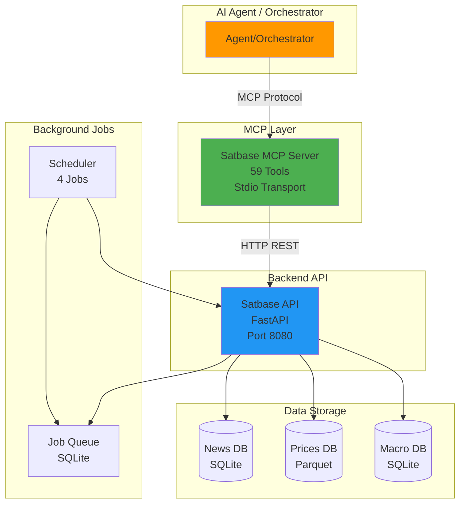

---

## Architektur

### Tool-Kategorien-Hierarchie

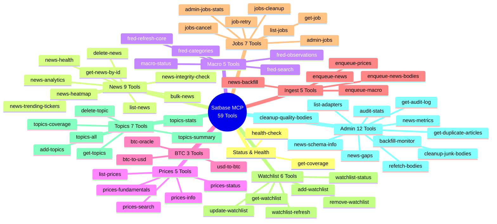

### Datenfluss: News-Pipeline

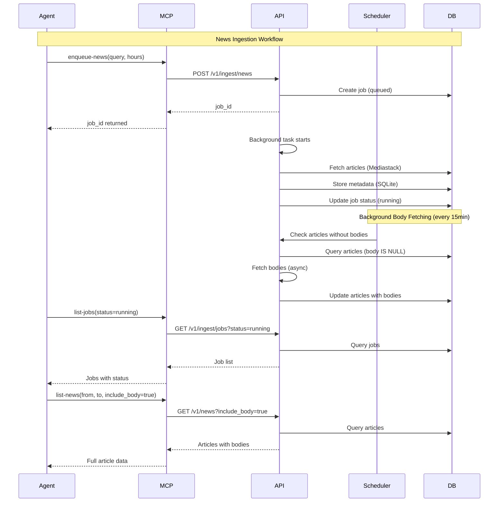

---

## Tool-Katalog

### Status & Health (2 Tools)

#### `get-coverage`
**Beschreibung**: Gibt einen vollständigen Überblick über alle verfügbaren Daten zurück.

**Parameter**: Keine

**Verwendung**:
- Am Anfang einer Session, um zu verstehen, welche Daten verfügbar sind
- Für Dashboard-Übersichten
- Um Coverage-Lücken zu identifizieren

**Strategie**: **Immer zuerst aufrufen**, bevor mit Daten gearbeitet wird.

#### `health-check`
**Beschreibung**: Prüft den Gesundheitsstatus der Satbase API.

**Parameter**: Keine

**Verwendung**:
- Diagnose bei Fehlern
- Monitoring/Heartbeat-Checks
- Vor kritischen Operationen

---

### News Tools (9 Tools)

#### `list-news`
**Beschreibung**: Abrufen von News-Artikeln mit Filtern. **Token-effizient** durch `content_format` Parameter.

**Parameter**:
- `from` (string, required): Startdatum (YYYY-MM-DD)
- `to` (string, required): Enddatum (YYYY-MM-DD)
- `q` (string, optional): Suchquery
- `tickers` (string, optional): Komma-separierte Ticker-Symbole
- `limit` (number, default: 100): Maximale Anzahl Ergebnisse
- `offset` (number, default: 0): Pagination-Offset
- `include_body` (boolean, default: false): Artikel-Inhalt einbeziehen
- `has_body` (boolean, default: false): Nur Artikel mit Body filtern
- `content_format` (enum: 'text' | 'html' | 'both', optional): Inhaltsformat

**Token-Effizienz-Strategie**:
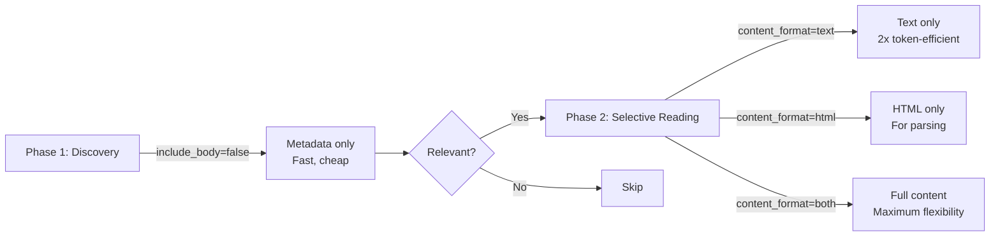

**Best Practices**:
1. **Discovery Phase**: `include_body=false` → Nur Metadaten (id, title, url, tickers)
2. **Selective Reading**: `include_body=true&content_format=text` → Nur Text-Inhalt (2x günstiger)
3. **HTML Parsing**: `include_body=true&content_format=html` → Nur HTML für spezielle Aufgaben
4. **Full Content**: `include_body=true` → Beides für Vergleich/Fallback

#### `delete-news`
**Beschreibung**: Löscht einen News-Artikel anhand der ID.

**Parameter**:
- `news_id` (string, required): ID des zu löschenden Artikels

**Verwendung**: **Vorsichtig verwenden** - entfernt Artikel aus Parquet-Dateien.

#### `news-heatmap`
**Beschreibung**: Erstellt eine Heatmap von Artikelanzahlen nach Topic und Zeitraum.

**Parameter**:
- `topics` (string, required): Komma-separierte Topic-Namen
- `from` (string, optional): Startdatum
- `to` (string, optional): Enddatum
- `granularity` (enum: 'month' | 'year', default: 'month')
- `format` (enum: 'flat' | 'matrix', default: 'flat')

**Verwendung**: Visualisierung von Topic-Coverage über Zeit.

#### `news-trending-tickers`
**Beschreibung**: Gibt trendende Ticker aus aktuellen News zurück.

**Parameter**:
- `hours` (number, default: 24): Lookback-Fenster in Stunden
- `limit` (number, default: 50): Maximale Ergebnisse
- `min_mentions` (number, default: 1): Minimale Erwähnungen

**Verwendung**: Identifikation von aktuell relevanten Tickers.

#### `news-analytics`
**Beschreibung**: Einfache Trendanalyse: Artikelanzahlen über Zeit mit Trend-Richtung.

**Parameter**:
- `days` (number, default: 30): Anzahl Tage zu analysieren
- `topics` (string, optional): Komma-separierte Topic-Namen

**Verwendung**: Schnelle Trend-Analyse ohne detaillierte Heatmap.

#### `get-news-by-id`
**Beschreibung**: Abrufen eines einzelnen News-Artikels anhand der ID.

**Parameter**:
- `article_id` (string, required): Artikel-ID

**Verwendung**: Bei bekannter ID schneller als `list-news` mit Filter.

#### `bulk-news`
**Beschreibung**: Abrufen mehrerer Artikel anhand ihrer IDs in einer Anfrage (token-effizient).

**Parameter**:
- `ids` (array of strings, required): Array von Artikel-IDs
- `include_body` (boolean, default: false): Vollständigen Inhalt einbeziehen

**Verwendung**: **Token-effizienter** als mehrere `get-news-by-id` Aufrufe.

#### `news-health`
**Beschreibung**: Health-Check für News-Ingestion-Pipeline.

**Parameter**: Keine

**Rückgabe**: Status, letzte Ingestion, Artikel heute, Crawl-Erfolgsrate, Staleness.

#### `news-integrity-check`
**Beschreibung**: Überprüft die Datenintegrität der SQLite-Datenbank.

**Parameter**: Keine

**Verwendung**: Bei Verdacht auf Datenkorruption.

---

### Macro Tools (5 Tools)

#### `fred-search`
**Beschreibung**: Suche nach FRED-Wirtschaftsreihen per Keyword.

**Parameter**:
- `q` (string, required): Suchquery
- `limit` (number, default: 20): Maximale Ergebnisse

**Verwendung**: **Erster Schritt** bei unbekannten FRED-Series-IDs.

**Workflow**:
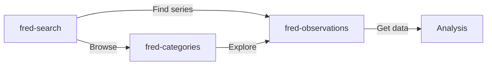

#### `fred-observations`
**Beschreibung**: Abrufen von FRED-Datenbeobachtungen für eine Serie.

**Parameter**:
- `series_id` (string, required): FRED-Series-ID
- `from` (string, optional): Startdatum (YYYY-MM-DD)
- `to` (string, optional): Enddatum (YYYY-MM-DD)

**Verwendung**: **Haupt-Tool** für Makro-Datenabfrage.

#### `fred-categories`
**Beschreibung**: Durchsuchen von FRED-Serien nach wirtschaftlicher Kategorie.

**Parameter**:
- `category` (string, optional): Kategorie filtern (z.B. "inflation", "employment")

**Verwendung**: Entdeckung relevanter Serien durch Kategorien.

#### `fred-refresh-core`
**Beschreibung**: Aktualisiert alle 28 Core-FRED-Indikatoren.

**Parameter**: Keine

**Verwendung**: Tägliche Aktualisierung der wichtigsten Indikatoren.

#### `macro-status`
**Beschreibung**: Status für eine FRED-Serie (Anzahl Beobachtungen, letzter Wert, etc.).

**Parameter**:
- `series_id` (string, required): FRED-Series-ID

**Verwendung**: Überprüfung der Datenqualität vor Abfrage.

---

### Prices Tools (5 Tools)

#### `list-prices`
**Beschreibung**: Abrufen historischer OHLCV-Preisdaten.

**Parameter**:
- `ticker` (string, required): Ticker-Symbol
- `from` (string, required): Startdatum (YYYY-MM-DD)
- `to` (string, required): Enddatum (YYYY-MM-DD)

**Verwendung**: **Haupt-Tool** für Preis-Daten.

#### `prices-search`
**Beschreibung**: Suche nach Aktien per Ticker oder Firmenname (Yahoo Finance).

**Parameter**:
- `q` (string, required): Suchquery
- `limit` (number, default: 10): Maximale Ergebnisse

**Verwendung**: Bei unbekanntem Ticker-Symbol.

#### `prices-info`
**Beschreibung**: Detaillierte Firmeninformationen (Sektor, Industrie, Beschreibung).

**Parameter**:
- `ticker` (string, required): Ticker-Symbol

**Verwendung**: Kontext vor Preis-Analyse.

#### `prices-fundamentals`
**Beschreibung**: Wichtige Finanzkennzahlen (PE-Ratio, Marktkapitalisierung, Umsatz).

**Parameter**:
- `ticker` (string, required): Ticker-Symbol

**Verwendung**: Fundamentale Analyse.

#### `prices-status`
**Beschreibung**: Preis-Daten-Status (letztes Datum, Bar-Anzahl, fehlende Tage).

**Parameter**:
- `ticker` (string, required): Ticker-Symbol

**Verwendung**: Überprüfung der Datenqualität.

---

### BTC Tools (3 Tools)

#### `btc-oracle`
**Beschreibung**: Abrufen von Bitcoin-Oracle-Preisdaten.

**Parameter**:
- `from` (string, required): Startdatum (YYYY-MM-DD)
- `to` (string, required): Enddatum (YYYY-MM-DD)

**Verwendung**: Historische BTC-Preise.

#### `usd-to-btc`
**Beschreibung**: USD zu BTC Umrechnung zum historischen Kurs.

**Parameter**:
- `value` (number, required): USD-Wert
- `on` (string, required): Datum für Umrechnung (YYYY-MM-DD)

**Verwendung**: Historische Bewertungen in BTC.

#### `btc-to-usd`
**Beschreibung**: BTC zu USD Umrechnung zum historischen Kurs.

**Parameter**:
- `value` (number, required): BTC-Wert
- `on` (string, required): Datum für Umrechnung (YYYY-MM-DD)

**Verwendung**: Historische Bewertungen in USD.

---

### Ingest Tools (5 Tools)

#### `enqueue-news`
**Beschreibung**: Startet News-Ingestion im Hintergrund.

**Parameter**:
- `q` (string, required): Suchquery
- `hours` (number, default: 24): Stunden zurückblicken

**Rückgabe**: `job_id` für Monitoring.

**Workflow**:
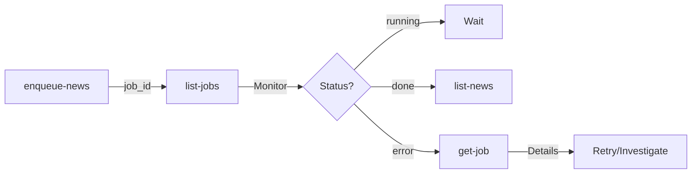

#### `enqueue-news-bodies`
**Beschreibung**: Re-fetched Bodies für Artikel ohne Body.

**Parameter**:
- `max_items` (number, default: 100): Max. Artikel zu verarbeiten
- `dry_run` (boolean, default: false): Vorschau ohne Fetch

**Verwendung**: Nach `reset-bodies` oder bei fehlenden Bodies.

**Hinweis**: Läuft auch automatisch im Hintergrund (Scheduler alle 15min).

#### `enqueue-prices`
**Beschreibung**: Startet Preis-Daten-Ingestion.

**Parameter**:
- `tickers` (array of strings, required): Ticker-Symbole

**Verwendung**: Preis-Daten für neue Ticker abrufen.

#### `enqueue-macro`
**Beschreibung**: Startet FRED-Daten-Ingestion (holt immer alle historischen Daten).

**Parameter**:
- `series` (array of strings, required): FRED-Series-IDs

**Verwendung**: Neue FRED-Serien in Datenbank aufnehmen.

#### `news-backfill`
**Beschreibung**: Backfill historischer News-Daten (max. 365 Tage pro Job).

**Parameter**:
- `query` (string, required): Suchquery
- `from` (string, required): Startdatum (YYYY-MM-DD)
- `to` (string, required): Enddatum (YYYY-MM-DD)
- `topic` (string, optional): Optionaler Topic-Name
- `max_articles_per_day` (number, default: 100): Max. Artikel pro Tag

**Verwendung**: Coverage-Lücken schließen.

**Workflow**:
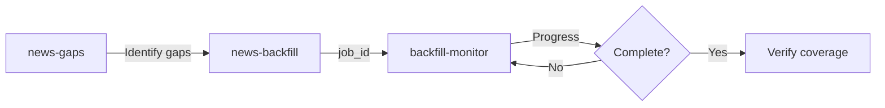

---

### Jobs Tools (7 Tools)

#### `list-jobs`
**Beschreibung**: Liste aller Hintergrund-Jobs mit Status und Fortschritt.

**Parameter**:
- `limit` (number, default: 100): Maximale Ergebnisse
- `status` (enum: 'idle' | 'running' | 'done' | 'error', optional): Status-Filter

**Verwendung**: **Haupt-Tool** für Job-Monitoring.

#### `get-job`
**Beschreibung**: Detaillierte Informationen zu einem spezifischen Job.

**Parameter**:
- `job_id` (string, required): Job-ID

**Verwendung**: Bei Fehlern oder für Details.

#### `jobs-cleanup`
**Beschreibung**: Markiert und bereinigt Jobs, die im "running"-Status stecken (nach Server-Neustart).

**Parameter**: Keine

**Verwendung**: Bei gestoppten/stuck Jobs.

#### `jobs-cancel`
**Beschreibung**: Storniert/löscht einen laufenden oder stuck Job.

**Parameter**:
- `job_id` (string, required): Job-ID

**Verwendung**: Bei fehlerhaften Jobs.

#### `job-retry`
**Beschreibung**: Wiederholt einen fehlgeschlagenen Job mit gleichem Payload.

**Parameter**:
- `job_id` (string, required): Job-ID zum Wiederholen

**Verwendung**: Bei transienten Fehlern.

#### `admin-jobs`
**Beschreibung**: Liste aller Jobs mit optionalen Filtern (Status, Job-Typ).

**Parameter**:
- `status` (enum: 'queued' | 'running' | 'done' | 'error', optional)
- `job_type` (string, optional): Job-Typ filtern
- `limit` (number, default: 100): Maximale Anzahl Jobs

**Verwendung**: Für Frontend-Monitoring oder detaillierte Job-Analyse.

#### `admin-jobs-stats`
**Beschreibung**: Gesamt-Job-Statistiken (Erfolgsrate, durchschnittliche Dauer, etc.).

**Parameter**: Keine

**Verwendung**: System-Monitoring und Performance-Analyse.

---

### Watchlist Tools (6 Tools)

#### `get-watchlist`
**Beschreibung**: Aktuelle Watchlist-Items (Stocks, Topics, Makro-Indikatoren).

**Parameter**:
- `type` (enum: 'stock' | 'topic' | 'macro', optional): Nach Typ filtern
- `enabled` (boolean, optional): Nach enabled-Status filtern
- `active_now` (boolean, default: false): Nur aktive Items

**Verwendung**: Überblick über überwachte Items.

#### `add-watchlist`
**Beschreibung**: Fügt Items zur Watchlist hinzu.

**Parameter**:
- `items` (array, required): Array von Items mit:
  - `type` (enum: 'stock' | 'topic' | 'macro')
  - `key` (string): Ticker/Topic/FRED-Series-ID
  - `label` (string, optional): Anzeige-Label
  - `enabled` (boolean, default: true)
  - `expires_at` (string, optional): Ablaufdatum (YYYY-MM-DD)

**Verwendung**: Neue Items zur automatischen Überwachung hinzufügen.

#### `remove-watchlist`
**Beschreibung**: Entfernt ein Watchlist-Item anhand der ID.

**Parameter**:
- `item_id` (number, required): Watchlist-Item-ID

**Verwendung**: Items aus Watchlist entfernen.

#### `watchlist-refresh`
**Beschreibung**: Bulk-Refresh aller Watchlist-Ticker (triggert Preis- und News-Ingestion).

**Parameter**:
- `prices` (boolean, default: true): Preis-Ingestion triggern
- `news` (boolean, default: true): News-Ingestion triggern
- `news_hours` (number, default: 24): Stunden zurückblicken für News

**Verwendung**: Manueller Refresh aller Watchlist-Items.

**Hinweis**: Läuft auch automatisch im Hintergrund (Scheduler).

#### `watchlist-status`
**Beschreibung**: Alle aktuell aktiven Watchlist-Items (für Scheduler/Monitoring).

**Parameter**: Keine

**Verwendung**: System-Monitoring.

#### `update-watchlist`
**Beschreibung**: Aktualisiert ein Watchlist-Item (partial update).

**Parameter**:
- `item_id` (number, required): Watchlist-Item-ID
- `enabled` (boolean, optional): Enable/Disable
- `label` (string, optional): Anzeige-Label
- `expires_at` (string, optional): Ablaufdatum (YYYY-MM-DD)

**Verwendung**: Watchlist-Items temporär deaktivieren oder Labels ändern.

---

### Topics Tools (7 Tools)

#### `get-topics`
**Beschreibung**: Aktuelle Liste konfigurierter News-Search-Topics.

**Parameter**: Keine

**Verwendung**: Überblick über überwachte Topics.

#### `add-topics`
**Beschreibung**: Fügt ein News-Topic zur konfigurierten Topics-Liste hinzu.

**Parameter**:
- `symbol` (string, required): Topic-Name/Symbol (wird uppercase)
- `expires_at` (string, optional): Ablaufdatum (YYYY-MM-DD, default: 1 Jahr)

**Verwendung**: Neue Topics zur automatischen Überwachung hinzufügen.

**Hinweis**: Läuft auch automatisch im Hintergrund (Scheduler).

#### `topics-all`
**Beschreibung**: Alle Topics, die in Artikeln erwähnt werden (aus Datenbank, nicht nur konfiguriert).

**Parameter**:
- `from` (string, optional): Startdatum (YYYY-MM-DD)
- `to` (string, optional): Enddatum (YYYY-MM-DD)
- `limit` (number, default: 100): Maximale Anzahl Topics

**Verwendung**: Entdeckung neuer Topics aus vorhandenen Daten.

#### `topics-summary`
**Beschreibung**: Leichtgewichtige Topics-Zusammenfassung für Dashboard/Übersicht.

**Parameter**:
- `limit` (number, default: 10): Anzahl Topics
- `days` (number, default: 30): Tage zurückblicken

**Verwendung**: Schnelle Übersicht über Top-Topics.

#### `topics-stats`
**Beschreibung**: Zeitreihen-Anzahl von Artikeln pro Topic.

**Parameter**:
- `from` (string, optional): Startdatum (YYYY-MM-DD)
- `to` (string, optional): Enddatum (YYYY-MM-DD)
- `granularity` (enum: 'month' | 'year', default: 'month')

**Verwendung**: Trend-Analyse von Topics über Zeit.

#### `topics-coverage`
**Beschreibung**: Heatmap-kompatible Topic-Coverage-Daten.

**Parameter**:
- `topics` (string, required): Komma-separierte Topic-Namen
- `from` (string, optional): Startdatum (YYYY-MM-DD)
- `to` (string, optional): Enddatum (YYYY-MM-DD)
- `granularity` (enum: 'month' | 'year', default: 'month')
- `format` (enum: 'flat' | 'matrix', default: 'flat')

**Verwendung**: Visualisierung von Topic-Coverage.

#### `delete-topic`
**Beschreibung**: Entfernt ein Topic aus der konfigurierten Topics-Liste.

**Parameter**:
- `topic_name` (string, required): Topic-Name zum Löschen

**Warnung**: Löscht **keine Artikel**, entfernt nur Topic aus Konfiguration.

---

### Admin Tools (12 Tools)

#### `news-gaps`
**Beschreibung**: Erkennt Datums-Lücken in News-Coverage (Tage mit unzureichenden Artikeln).

**Parameter**:
- `from` (string, optional): Startdatum (default: 365 Tage zurück)
- `to` (string, optional): Enddatum (default: heute)
- `min_articles_per_day` (number, default: 10): Minimale Artikel-Schwelle

**Verwendung**: Planung von Backfill-Operationen.

**Workflow**:
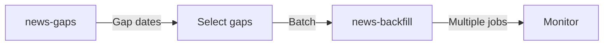

#### `cleanup-junk-bodies`
**Beschreibung**: Scannt und entfernt niedrigqualitative News-Bodies (access denied, Paywalls, etc.).

**Parameter**:
- `dry_run` (boolean, default: true): Vorschau ohne Änderungen
- `max_items` (number, default: 1000): Max. Artikel zu prüfen
- `tag_only` (boolean, default: false): Nur als no_body_crawl taggen, nicht löschen

**Verwendung**: Qualitätskontrolle und Bereinigung.

**Best Practice**: **Immer mit `dry_run=true` starten**.

#### `cleanup-quality-bodies`
**Beschreibung**: Scannt News-Bodies mit wissenschaftlichen Qualitätsmetriken.

**Parameter**:
- `dry_run` (boolean, default: true): Vorschau ohne Änderungen
- `max_items` (number, default: 1000): Max. Artikel zu prüfen
- `quality_threshold` (number, default: 0.35): Qualitäts-Schwelle (0.0-1.0)

**Verwendung**: Entfernung von Bodies unter Qualitäts-Schwelle.

**Best Practice**: **Immer mit `dry_run=true` starten**.

#### `news-schema-info`
**Beschreibung**: Aktuelles news_articles Schema und Indizes für Debugging.

**Parameter**: Keine

**Verwendung**: Datenbank-Struktur-Analyse.

#### `get-audit-log`
**Beschreibung**: Audit-Log aller Datenoperationen (ingested, deleted, tagged, etc.).

**Parameter**:
- `article_id` (string, optional): Nach Artikel-ID filtern
- `action` (string, optional): Nach Aktion filtern
- `days` (number, optional): Zeitraum in Tagen
- `limit` (number, default: 1000): Max. Einträge

**Verwendung**: Nachverfolgung von Datenänderungen.

#### `get-duplicate-articles`
**Beschreibung**: Findet potenzielle Duplikat-Artikel (gleiche URL).

**Parameter**: Keine

**Verwendung**: Datenbereinigung.

#### `news-metrics`
**Beschreibung**: Umfassende Datenqualitäts- und Coverage-Metriken.

**Parameter**: Keine

**Verwendung**: System-Health-Monitoring.

#### `audit-stats`
**Beschreibung**: Audit-Statistiken (Aktions-Anzahlen nach Typ).

**Parameter**:
- `days` (number, default: 30): Zeitraum in Tagen

**Verwendung**: Statistische Analyse von Operationen.

#### `refetch-bodies`
**Beschreibung**: Re-fetched Bodies für Artikel ohne Body UND nicht als no_body_crawl getaggt.

**Parameter**:
- `max_items` (number, default: 100): Max. Artikel zu verarbeiten
- `dry_run` (boolean, default: false): Vorschau ohne Fetch

**Verwendung**: Nach Verbesserungen der Body-Extraktion.

#### `list-adapters`
**Beschreibung**: Liste aller verfügbaren Daten-Adapter.

**Parameter**:
- `category` (string, optional): Nach Kategorie filtern

**Verwendung**: Verfügbare Datenquellen prüfen.

#### `backfill-monitor`
**Beschreibung**: Live-Fortschritt eines Backfill-Jobs.

**Parameter**:
- `job_id` (string, required): Job-ID zum Monitoring

**Verwendung**: Monitoring von Backfill-Operationen.

---

## Tool-Strategien

### Strategie 1: Token-Effiziente News-Lektüre

**Problem**: Vollständige Artikel mit Bodies sind teuer (hohe Token-Kosten).

**Lösung**: 3-Phasen-Ansatz

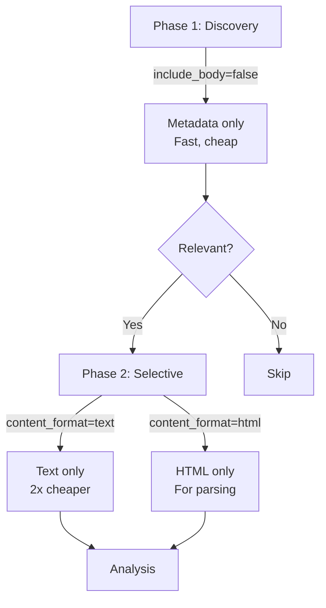

**Beispiel**:
1. `list-news(from="2025-01-20", to="2025-01-24", tickers="NVDA", include_body=false, limit=50)` → 50 Artikel-Metadaten
2. `list-news(from="2025-01-23", to="2025-01-24", tickers="NVDA", include_body=true, content_format="text", limit=10)` → 10 Artikel mit Text
3. Analyse nur der relevanten Artikel

**Ersparnis**: ~50% Token-Kosten bei gleicher Informationsqualität.

---

### Strategie 2: Daten-Pipeline-Management

**Workflow**: Watchlist → Ingestion → Monitoring

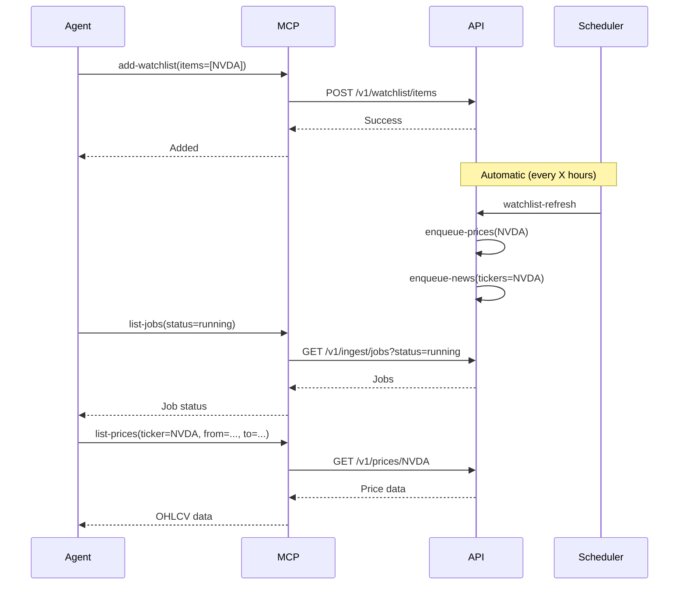

**Best Practices**:
1. **Watchlist verwenden** für kontinuierliche Überwachung
2. **Jobs monitoren** nach Ingestion-Triggern
3. **Status prüfen** vor Datenabfrage (`prices-status`, `macro-status`)

---

### Strategie 3: Coverage-Lücken schließen

**Workflow**: Gap Detection → Backfill → Verification

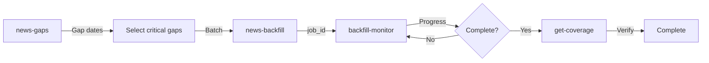

**Beispiel**:
1. `news-gaps(from="2024-01-01", to="2025-01-24", min_articles_per_day=10)` → Gap-Liste
2. `news-backfill(query="AI semiconductor", from="2024-06-01", to="2024-06-30", topic="AI")` → Backfill
3. `backfill-monitor(job_id="...")` → Fortschritt prüfen
4. `get-coverage()` → Verifizieren

---

### Strategie 4: Qualitätskontrolle

**Workflow**: Scan → Analyze → Cleanup

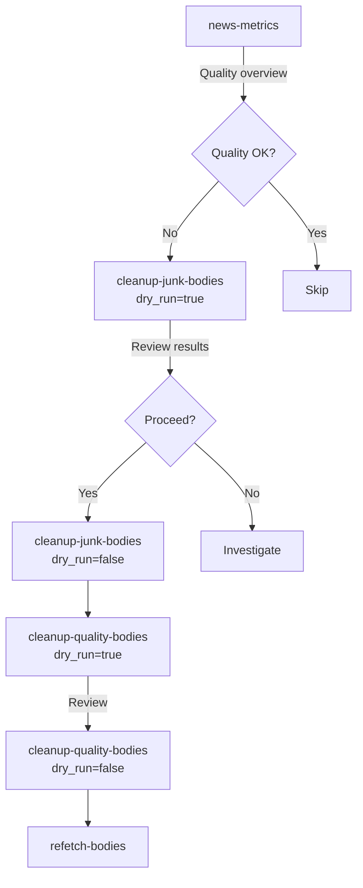

**Best Practices**:
1. **Immer `dry_run=true`** zuerst
2. **Review Results** vor tatsächlicher Bereinigung
3. **Audit-Log prüfen** nach Cleanup
4. **Metriken verfolgen** über Zeit

---

### Strategie 5: FRED-Makro-Daten-Entdeckung

**Workflow**: Search → Explore → Fetch

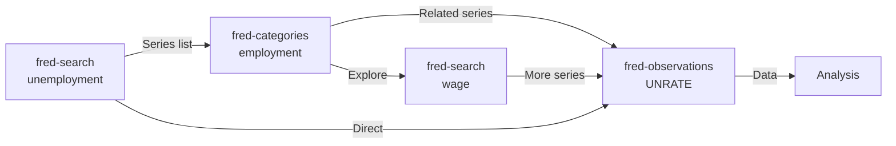

**Beispiel**:
1. `fred-search(q="unemployment rate")` → Finde UNRATE
2. `fred-categories(category="employment")` → Entdecke verwandte Serien
3. `fred-observations(series_id="UNRATE", from="2020-01-01", to="2025-01-24")` → Daten abrufen
4. `macro-status(series_id="UNRATE")` → Status prüfen

---

## Workflows & Best Practices

### Workflow 1: Tägliche Datenaktualisierung

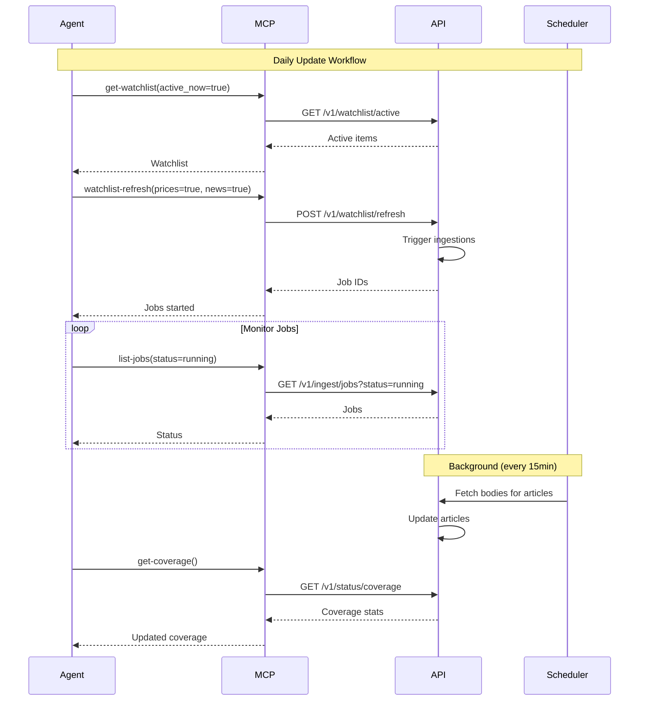

**Best Practices**:
- Watchlist für kontinuierliche Überwachung verwenden
- Jobs asynchron monitoren
- Coverage nach Updates prüfen

---

### Workflow 2: Research-Workflow

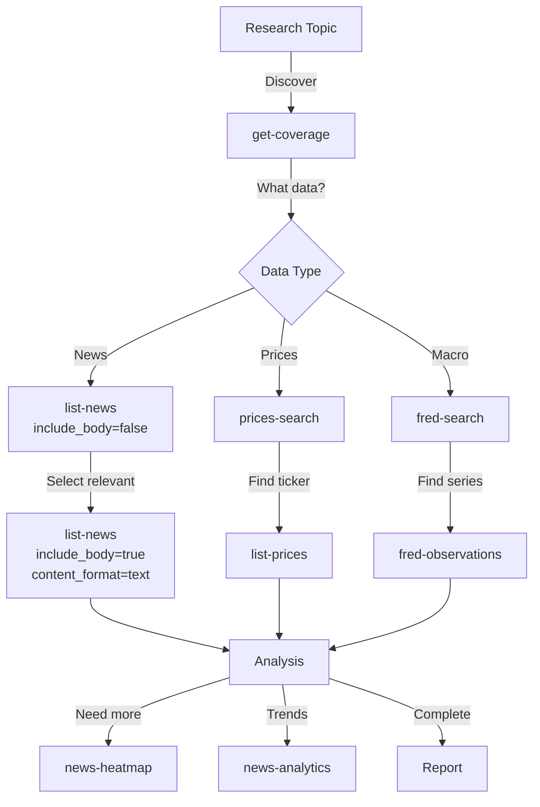

**Best Practices**:
- Immer mit `get-coverage` starten
- Token-effizient vorgehen (Phasen-Ansatz)
- Kombiniere verschiedene Datenquellen

---

### Workflow 3: Qualitätskontrolle

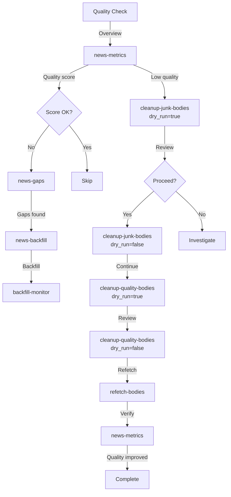

**Best Practices**:
- Regelmäßige Qualitätsprüfungen
- Immer `dry_run=true` zuerst
- Audit-Log nach Cleanup prüfen

---

## Erweiterte Nutzung

### Token-Optimierung: Content-Format-Strategien

| Strategie | `include_body` | `content_format` | Token-Kosten | Verwendung |
|-----------|----------------|------------------|--------------|------------|
| Discovery | `false` | - | Minimal | Schnelle Überprüfung |
| Text-Only | `true` | `text` | Niedrig (~50% Ersparnis) | Standard-Analyse |
| HTML-Only | `true` | `html` | Mittel | DOM-Parsing |
| Full Content | `true` | `both` | Hoch | Vergleich/Fallback |

**Beispiel-Token-Verbrauch** (für 100 Artikel):
- Discovery: ~5K Tokens
- Text-Only: ~50K Tokens
- HTML-Only: ~80K Tokens
- Full Content: ~150K Tokens

---

### Job-Monitoring-Strategien

**Polling-Intervall**: 
- Während Ingestion: Alle 30-60 Sekunden
- Nach Completion: Einmal zur Verifizierung

**Error-Handling**:
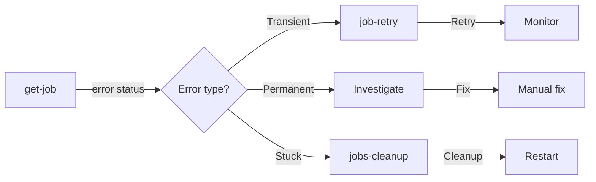

---

### Watchlist-Management-Strategien

**Automatische vs. Manuelle Ingestion**:

| Methode | Vorteil | Nachteil |
|---------|--------|----------|
| Watchlist + Scheduler | Automatisch, kontinuierlich | Weniger Kontrolle |
| Manuelle `enqueue-*` | Volle Kontrolle | Manuell auslösen |

**Best Practice**: Kombiniere beide:
- Watchlist für kontinuierliche Überwachung
- Manuelle Ingestion für spezielle Anforderungen

---

### Datenqualitäts-Metriken

**Wichtige Metriken** (aus `news-metrics`):
- `total_articles`: Gesamtanzahl Artikel
- `articles_with_body`: Artikel mit Body
- `body_fetch_rate`: Body-Fetch-Rate (%)
- `coverage_percentage`: Coverage (%)
- `quality_score`: Qualitäts-Score (0-1)

**Qualitäts-Schwellen**:
- `body_fetch_rate > 80%`: Gut
- `body_fetch_rate 50-80%`: Akzeptabel
- `body_fetch_rate < 50%`: Verbesserung nötig

---

## Fazit

Der Satbase MCP bietet eine umfassende, token-effiziente Schnittstelle für Finanz- und Wirtschaftsdaten. Die **59 Tools** decken alle Aspekte von Datenabfrage, Ingestion, Monitoring und Qualitätskontrolle ab.

**Key Takeaways**:
1. **Token-Effizienz**: Nutze Phasen-Ansatz für News-Lektüre
2. **Watchlist**: Für kontinuierliche Überwachung
3. **Jobs**: Asynchron monitoren, nicht blockieren
4. **Qualität**: Regelmäßige Checks mit `dry_run=true`
5. **Coverage**: Gap-Detection und Backfill für Vollständigkeit

---

## Anhang

### Tool-Übersicht nach Kategorie

| Kategorie | Anzahl | Haupt-Tools |
|-----------|--------|-------------|
| Status & Health | 2 | `get-coverage`, `health-check` |
| News | 9 | `list-news`, `news-heatmap`, `bulk-news` |
| Macro | 5 | `fred-search`, `fred-observations` |
| Prices | 5 | `list-prices`, `prices-search` |
| BTC | 3 | `btc-oracle`, `usd-to-btc` |
| Ingest | 5 | `enqueue-news`, `news-backfill` |
| Jobs | 7 | `list-jobs`, `get-job` |
| Watchlist | 6 | `get-watchlist`, `add-watchlist` |
| Topics | 7 | `get-topics`, `topics-stats` |
| Admin | 12 | `news-gaps`, `cleanup-junk-bodies` |
| **Total** | **59** | |

### Timeout-Strategien

| Tool-Kategorie | Timeout | Grund |
|----------------|---------|-------|
| Health/Status | 5-10s | Schnelle Queries |
| Data Retrieval | 30s | News, Macro, Prices |
| Ingestion Triggers | 60s | Validierung-Overhead |
| Body Fetching | 120s | Langsame Crawls |
| Admin Operations | 20-30s | Komplexe Operationen |

---

**Version**: 1.0.0  
**Letzte Aktualisierung**: 2025-01-24  
**Autor**: Satbase MCP Documentation

