# Tesseract MCP - Komplettes Manual

## Inhaltsverzeichnis

1. [Übersicht](#übersicht)
2. [Architektur](#architektur)
3. [Tool-Katalog](#tool-katalog)
4. [Tool-Strategien](#tool-strategien)
5. [Workflows & Best Practices](#workflows--best-practices)
6. [Erweiterte Nutzung](#erweiterte-nutzung)

---

## Übersicht

Der **Tesseract MCP** (Model Context Protocol Server) ist eine semantische Suchmaschine für den Satbase News-Corpus. Er bietet **11 Tools** für:

- 🔍 **Semantic Search**: Multilinguale semantische Suche über News-Artikel
- 🔗 **Similarity**: Ähnliche Artikel finden und Content-Konsistenz prüfen
- 📊 **Search Analytics**: Suchhistorie und Statistiken analysieren
- 🔧 **Collection Management**: Qdrant Collections verwalten (Versionierung, Zero-Downtime Updates)
- ⚙️ **Embedding Operations**: Batch-Embedding von News-Artikeln in Vektordatenbank

### Kern-Technologie

- **Embedding-Modell**: `intfloat/multilingual-e5-large` (1024 Dimensionen)
- **Vektordatenbank**: Qdrant (Cosine Similarity)
- **Multi-Vector Support**: Separate Vektoren für `title`, `summary`, `body`
- **Sprachen**: Deutsch, Englisch, Chinesisch, Spanisch, etc. (multilingual)

### System-Architektur

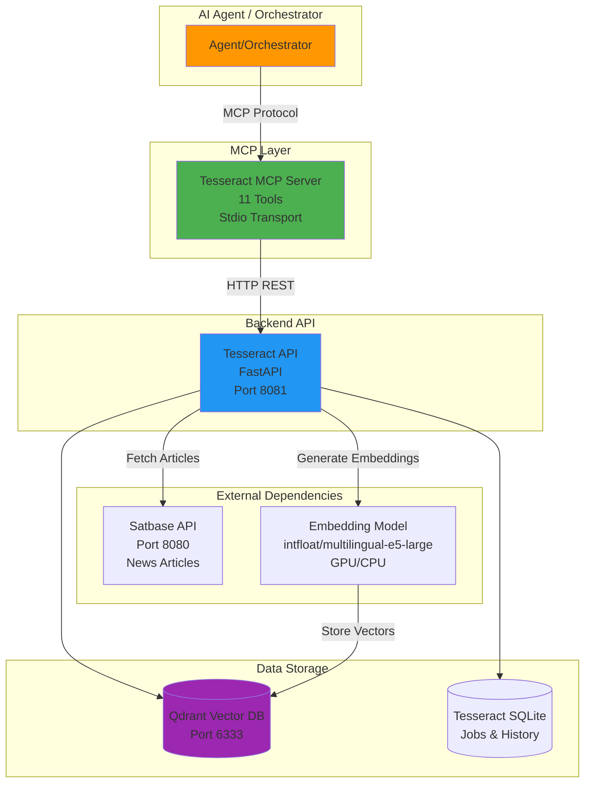

---

## Architektur

### Tool-Kategorien-Hierarchie

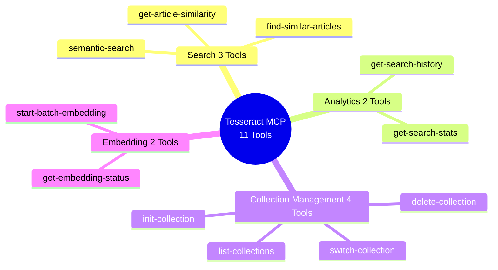

### Datenfluss: Semantic Search Pipeline

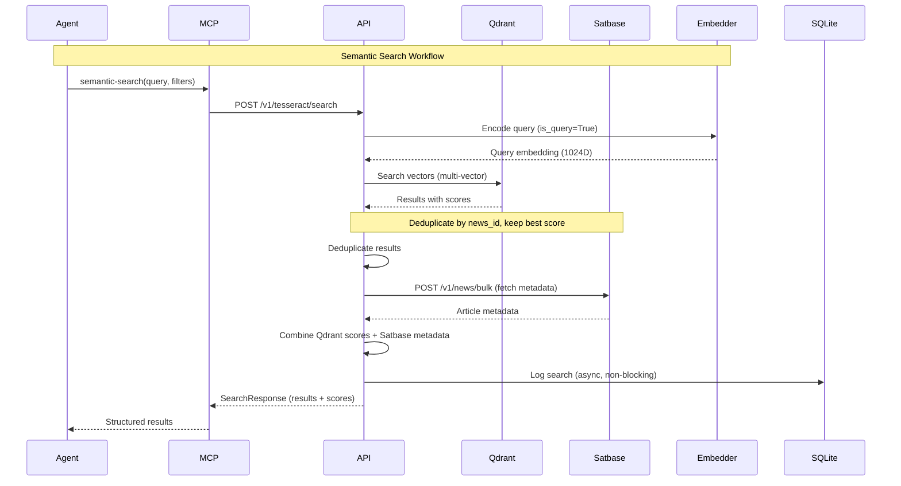

### Datenfluss: Batch Embedding Pipeline

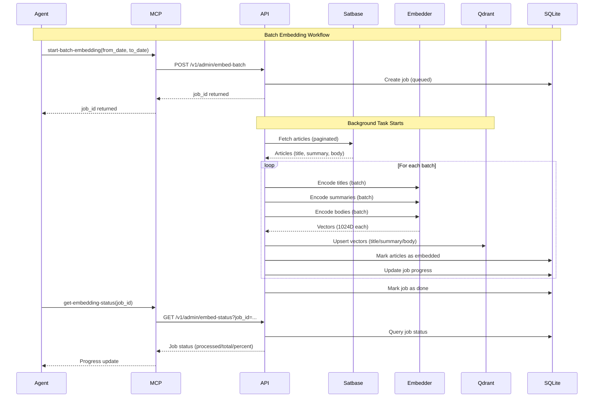

### Multi-Vector Architecture

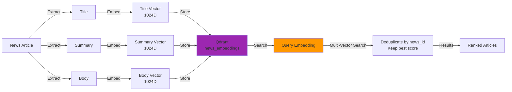

---

## Tool-Katalog

### Search Tools (3 Tools)

#### `semantic-search`
**Beschreibung**: Semantische Suche über News-Artikel mit multilingualen Embeddings.

**Parameter**:
- `query` (string, required): Natural Language Suchquery (multilingual)
- `tickers` (array of strings, optional): Filter nach Ticker-Symbolen
- `from_date` (string, optional): Startdatum (YYYY-MM-DD)
- `to_date` (string, optional): Enddatum (YYYY-MM-DD)
- `topics` (array of strings, optional): Filter nach Topics
- `language` (string, optional): Sprachfilter (z.B. "en", "de")
- `body_available` (boolean, optional): Nur Artikel mit Body
- `vector_type` (string, optional): Vector-Typ für Suche ("title" | "summary" | "body")
- `limit` (number, default: 20): Maximale Anzahl Ergebnisse

**Multi-Vector Suche**:
- Durchsucht automatisch alle Vector-Typen (title/summary/body)
- Dedupliziert nach `news_id` (behält besten Score)
- Kombiniert Qdrant-Scores mit Satbase-Metadaten

**Filter-Strategie**:
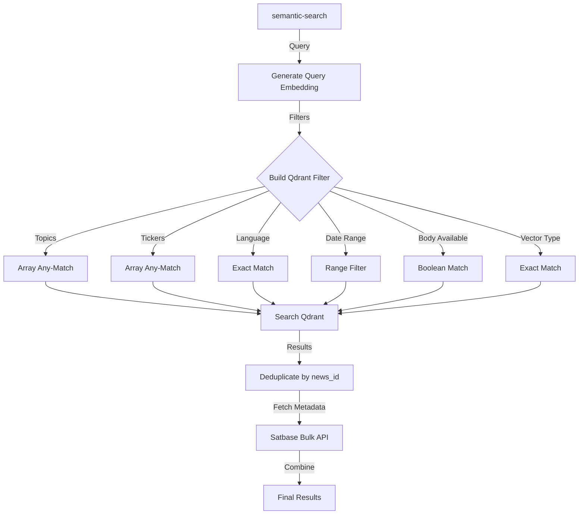

**Best Practices**:
1. **Natural Language Queries**: Nutze natürliche Sprache statt Keywords
   - ✅ "Semiconductor supply chain constraints Taiwan"
   - ❌ "semiconductor AND supply AND chain"
2. **Filter-Kombinationen**: Kombiniere Filter für präzise Ergebnisse
   - `tickers: ["NVDA"]` + `from_date: "2025-01-01"` + `body_available: true`
3. **Limit anpassen**: Bei breiten Queries höhere Limits (50-100), bei spezifischen niedrigere (10-20)
4. **Vector-Type nur bei Bedarf**: Standard ist Multi-Vector (beste Ergebnisse)

**Beispiel**:
```typescript
semantic-search({
  query: "AI chip shortage impact on automotive industry",
  tickers: ["NVDA", "TSM"],
  from_date: "2025-01-01",
  to_date: "2025-01-24",
  language: "en",
  body_available: true,
  limit: 20
})
```

#### `find-similar-articles`
**Beschreibung**: Findet ähnliche Artikel zu einem gegebenen Artikel basierend auf Vektor-Ähnlichkeit.

**Parameter**:
- `news_id` (string, required): UUID des Source-Artikels (Satbase ID)
- `limit` (number, default: 10): Maximale Anzahl ähnlicher Artikel

**Multi-Vector Logic**:
- Sucht alle Vektoren für `news_id` (title/summary/body)
- Wählt besten Vector für Similarity: `summary > body > title`
- Sucht ähnliche Artikel mit gleichem Vector-Type
- Dedupliziert nach `news_id`, schließt Source-Artikel aus

**Use Cases**:
1. **Related Articles Discovery**: Finde verwandte Artikel zu einem interessanten Artikel
2. **Topic Exploration**: Entdecke weitere Perspektiven zu einem Thema
3. **Quality Validation**: Prüfe ob ähnliche Artikel existieren (für Fact-Checking)

**Workflow**:
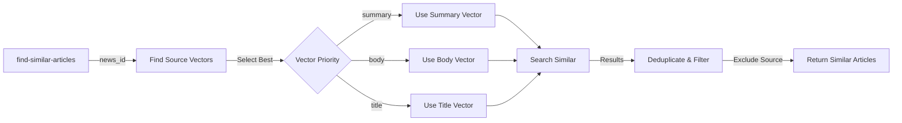

**Beispiel**:
```typescript
find-similar-articles({
  news_id: "abc123-def456-ghi789",
  limit: 15
})
```

#### `get-article-similarity`
**Beschreibung**: Berechnet Cosine Similarity zwischen title/summary/body Vektoren eines Artikels. **Kritisch für Content-Qualitätsbewertung**.

**Parameter**:
- `news_id` (string, required): UUID des Artikels

**Rückgabe**:
- `available`: Welche Vektoren existieren (title, summary, body)
- `similarity.title_body`: Cosine Similarity zwischen Title und Body (0-1)
- `similarity.summary_body`: Cosine Similarity zwischen Summary und Body (0-1)

**Interpretation**:
| Similarity Score | Bedeutung | Interpretation |
|-----------------|-----------|----------------|
| **> 0.8** | Sehr konsistent | Gut strukturierter, konsistenter Content |
| **0.6 - 0.8** | Moderat konsistent | Normaler Content, kleine Abweichungen |
| **0.4 - 0.6** | Niedrig konsistent | Mögliche Qualitätsprobleme |
| **< 0.4** | Sehr niedrig | Potenziell Clickbait, schlechte Extraktion, irreführender Title |

**Use Cases**:
1. **Content Quality Assessment**: Identifiziere hochwertige Artikel
2. **Clickbait Detection**: Erkenne irreführende Titel
3. **Extraction Validation**: Prüfe ob Body-Extraktion erfolgreich war
4. **Content Filtering**: Filtere niedrigqualitative Artikel vor Analyse

**Workflow**:
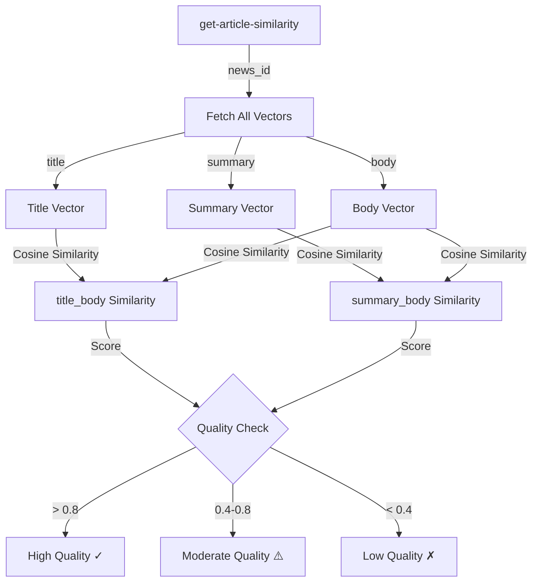

**Best Practices**:
1. **Vor Analyse prüfen**: Nutze bei kritischen Artikeln zur Qualitätsbewertung
2. **Batch-Filterung**: Filtere Artikel mit `similarity < 0.5` vor Deep-Dive-Analyse
3. **Clickbait-Detection**: Artikel mit `title_body < 0.4` sind verdächtig

**Beispiel**:
```typescript
get-article-similarity({
  news_id: "abc123-def456-ghi789"
})

// Response:
// {
//   "news_id": "abc123-def456-ghi789",
//   "available": { "title": true, "summary": true, "body": true },
//   "similarity": {
//     "title_body": 0.87,  // ✓ Sehr konsistent
//     "summary_body": 0.92  // ✓ Sehr konsistent
//   }
// }
```

---

### Analytics Tools (2 Tools)

#### `get-search-history`
**Beschreibung**: Ruft Historie aller durchgeführten semantischen Suchen ab. **Nützlich für Metakognition und Vermeidung von Duplikaten**.

**Parameter**:
- `limit` (number, default: 50): Maximale Anzahl Einträge
- `query_filter` (string, optional): Filter nach Query-Text (LIKE-Suche)
- `days` (number, optional): Filter nach Tagen zurück (z.B. 7 für letzte Woche)

**Rückgabe**:
- `history`: Array von Search-Einträgen mit:
  - `id`: Eintrags-ID
  - `query`: Suchquery
  - `filters`: Verwendete Filter (JSON)
  - `result_count`: Anzahl gefundener Ergebnisse
  - `created_at`: Timestamp (Unix)
- `count`: Anzahl Einträge
- `filters`: Angewendete Filter

**Use Cases**:
1. **Avoid Duplicate Searches**: Prüfe ob Query bereits gesucht wurde
2. **Understand Search Patterns**: Analysiere welche Queries häufig verwendet werden
3. **Learn from History**: Identifiziere erfolgreiche Query-Patterns
4. **Debugging**: Verstehe welche Suchen durchgeführt wurden

**Strategie**:
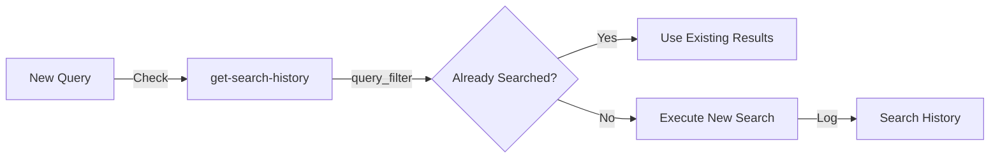

**Beispiel**:
```typescript
// Prüfe ob Query bereits gesucht wurde
get-search-history({
  query_filter: "semiconductor supply chain",
  days: 7,
  limit: 10
})

// Response zeigt ob ähnliche Queries bereits durchgeführt wurden
```

#### `get-search-stats`
**Beschreibung**: Aggregierte Statistiken über Suchmuster. **Hilft beim Verstehen von Suchverhalten**.

**Parameter**:
- `days` (number, default: 30): Anzahl Tage zu analysieren

**Rückgabe**:
- `total_searches`: Gesamtanzahl Suchen
- `unique_queries`: Anzahl eindeutiger Queries
- `avg_result_count`: Durchschnittliche Anzahl Ergebnisse pro Suche
- `top_queries`: Top-Queries mit Häufigkeit
- `days`: Analysierter Zeitraum

**Use Cases**:
1. **System-Überblick**: Verstehe Suchintensität und Patterns
2. **Topic Discovery**: Identifiziere häufig gesuchte Topics (aus top_queries)
3. **Performance Monitoring**: Überwache durchschnittliche Result-Counts
4. **Optimization**: Erkenne redundante oder ineffiziente Queries

**Beispiel**:
```typescript
get-search-stats({
  days: 30
})

// Response:
// {
//   "total_searches": 1247,
//   "unique_queries": 423,
//   "avg_result_count": 18.5,
//   "top_queries": [
//     { "query": "AI semiconductor", "count": 45 },
//     { "query": "Bitcoin price", "count": 32 },
//     ...
//   ],
//   "days": 30
// }
```

---

### Collection Management Tools (4 Tools)

#### `init-collection`
**Beschreibung**: Erstellt eine neue versionierte Qdrant Collection und richtet Alias für Zero-Downtime Updates ein.

**Parameter**: Keine

**Verwendung**:
- **Erstmalige Initialisierung**: Beim ersten Setup von Tesseract
- **Factory Reset**: Nach vollständiger Löschung aller Collections
- **Collection-Recreation**: Wenn aktuelle Collection korrupt ist

**Hinweis**: Erstellt automatisch versionierte Collection (z.B. `news_embeddings_v1761065572`) und setzt Alias `news_embeddings` darauf.

**Workflow**:
```mermaid
graph LR
    A[init-collection] -->|Create| B[Versioned Collection<br/>news_embeddings_v{timestamp}]
    B -->|Create Alias| C[news_embeddings → Collection]
    C -->|Ready| D[Search & Embedding Ready]
```

#### `list-collections`
**Beschreibung**: Listet alle Qdrant Collections mit Metadaten auf.

**Parameter**: Keine

**Rückgabe**:
- `collections`: Array mit:
  - `name`: Collection-Name
  - `points_count`: Anzahl Vektoren
  - `vector_size`: Vektor-Dimension (1024)
  - `distance`: Distanz-Metrik ("COSINE")
- `active_alias`: Aktiver Alias-Name ("news_embeddings")
- `active_target`: Collection hinter dem Alias

**Use Cases**:
1. **System-Überblick**: Verstehe welche Collections existieren
2. **Version Management**: Identifiziere alte Versionen für Cleanup
3. **Capacity Planning**: Überwache Collection-Größen
4. **Before Switch**: Prüfe verfügbare Collections vor `switch-collection`

**Beispiel**:
```typescript
list-collections()

// Response:
// {
//   "collections": [
//     {
//       "name": "news_embeddings_v1761065572",
//       "points_count": 125847,
//       "vector_size": 1024,
//       "distance": "COSINE"
//     },
//     {
//       "name": "news_embeddings_v1750000000",
//       "points_count": 98234,
//       "vector_size": 1024,
//       "distance": "COSINE"
//     }
//   ],
//   "active_alias": "news_embeddings",
//   "active_target": "news_embeddings_v1761065572"
// }
```

#### `switch-collection`
**Beschreibung**: Wechselt aktiven Collection-Alias zu einer anderen Collection (Zero-Downtime).

**Parameter**:
- `name` (string, required): Collection-Name zum Wechseln

**Zero-Downtime Strategy**:
- Löscht alten Alias (falls vorhanden)
- Erstellt neuen Alias auf Ziel-Collection
- Sofortige Umstellung ohne Service-Unterbrechung

**Use Cases**:
1. **Version Updates**: Wechsle zu neuer Collection-Version nach Batch-Embedding
2. **Rollback**: Wechsle zurück zu vorheriger Version bei Problemen
3. **A/B Testing**: Teste verschiedene Collection-Versionen
4. **Maintenance**: Wechsle zu Clean-Collection während Cleanup

**Workflow**:
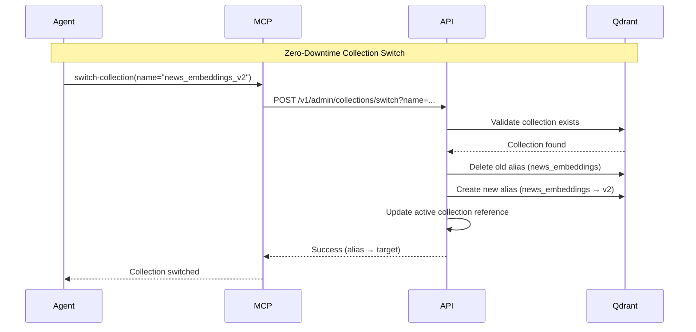

**Best Practices**:
1. **Prüfe Collection-Existenz**: Nutze `list-collections` vor Switch
2. **Backup-Strategie**: Behalte alte Collection für Rollback
3. **Test nach Switch**: Führe Test-Suche durch um Funktionalität zu verifizieren

**Beispiel**:
```typescript
// 1. Prüfe verfügbare Collections
list-collections()

// 2. Wechsle zu neuer Version
switch-collection({
  name: "news_embeddings_v1761065572"
})

// 3. Verifiziere Switch
list-collections()  // active_target sollte jetzt neue Collection sein
```

#### `delete-collection`
**Beschreibung**: Löscht eine Qdrant Collection (mit Safety-Checks - kann aktive Collection nicht löschen).

**Parameter**:
- `collection_name` (string, required): Name der zu löschenden Collection

**Safety Checks**:
- ❌ Kann **nicht** aktive Collection löschen (muss zuerst wechseln)
- ✅ Prüft Collection-Existenz vor Löschung
- ✅ Gibt klare Fehlermeldungen bei ungültigen Operationen

**Use Cases**:
1. **Cleanup**: Lösche alte Collection-Versionen nach erfolgreichem Switch
2. **Disk Space**: Freigabe von Speicherplatz bei sehr großen Collections
3. **Testing**: Lösche Test-Collections nach Entwicklung

**Workflow**:
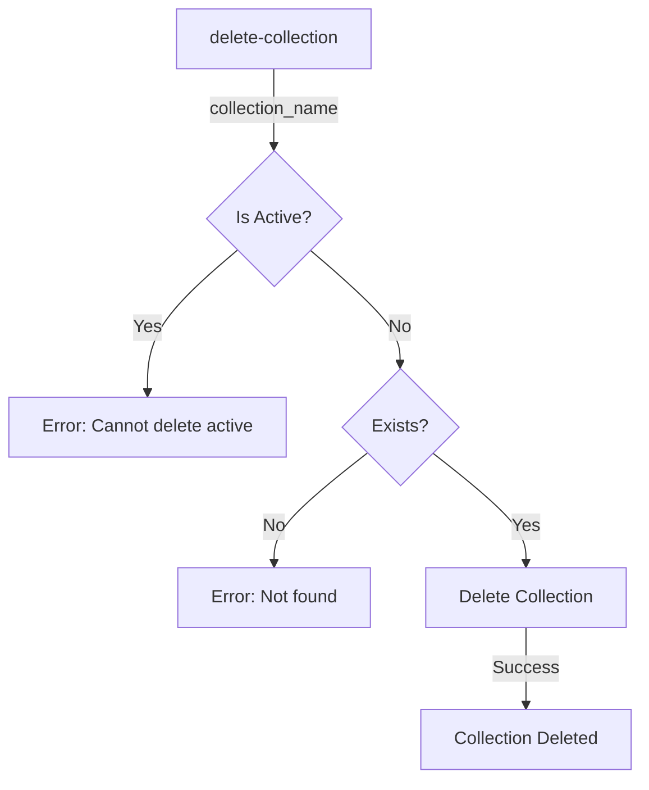

**Best Practices**:
1. **Immer prüfen**: Nutze `list-collections` um aktive Collection zu identifizieren
2. **Switch zuerst**: Wechsle zu anderer Collection vor Löschung
3. **Backup-Strategie**: Lösche nur nach erfolgreichem Switch und Verifizierung

**Beispiel**:
```typescript
// 1. Prüfe aktive Collection
const collections = list-collections()
// active_target: "news_embeddings_v2"

// 2. Lösche alte Version (nicht aktiv)
delete-collection({
  collection_name: "news_embeddings_v1"  // ✓ Nicht aktiv, kann gelöscht werden
})

// 3. FEHLER: Versuch aktive Collection zu löschen
delete-collection({
  collection_name: "news_embeddings_v2"  // ❌ Error: Cannot delete active collection
})
```

---

### Embedding Tools (2 Tools)

#### `start-batch-embedding`
**Beschreibung**: Startet Hintergrund-Batch-Embedding von News-Artikeln aus Satbase in Qdrant.

**Parameter**:
- `from_date` (string, required): Startdatum (YYYY-MM-DD)
- `to_date` (string, required): Enddatum (YYYY-MM-DD)
- `topics` (string, optional): Komma-separierte Topics (z.B. "AI,Bitcoin")
- `tickers` (string, optional): Komma-separierte Ticker (z.B. "NVDA,TSM")
- `language` (string, optional): Sprachfilter (z.B. "en", "de")
- `body_only` (boolean, default: true): Nur Artikel mit Body embedden
- `incremental` (boolean, default: true): Überspringe bereits embedded Artikel

**Rückgabe**:
- `status`: "started"
- `job_id`: UUID für Job-Monitoring
- `message`: Beschreibung
- `check_progress`: URL für Status-Check

**Multi-Vector Embedding**:
- Erstellt **3 Vektoren pro Artikel**:
  - `title`: Title-Vektor
  - `summary`: Summary-Vektor (description)
  - `body`: Body-Vektor (nur wenn verfügbar)
- Batch-Processing: Verarbeitet in Batches (32 auf GPU, 16 auf CPU)
- Incremental Mode: Überspringt bereits embedded Artikel (schneller)

**Workflow**:
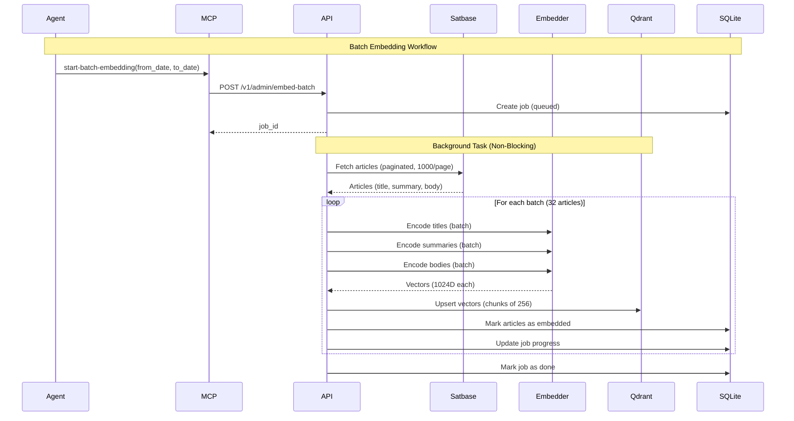

**Best Practices**:
1. **Incremental Mode**: Immer `incremental: true` verwenden (deutlich schneller)
2. **Body-Only**: Nutze `body_only: true` für qualitativ hochwertige Embeddings
3. **Date Ranges**: Begrenze auf max. 30-90 Tage pro Job (für Monitoring)
4. **Monitor Progress**: Nutze `get-embedding-status` regelmäßig

**Beispiel**:
```typescript
// Starte Batch-Embedding für letzten Monat
start-batch-embedding({
  from_date: "2025-01-01",
  to_date: "2025-01-31",
  topics: "AI,semiconductor",
  language: "en",
  body_only: true,
  incremental: true
})

// Response:
// {
//   "status": "started",
//   "job_id": "abc123-def456-ghi789",
//   "message": "Batch embedding from 2025-01-01 to 2025-01-31 started in background",
//   "check_progress": "/v1/admin/embed-status?job_id=abc123-def456-ghi789"
// }
```

#### `get-embedding-status`
**Beschreibung**: Ruft aktuellen Batch-Embedding-Status, Fortschritt und Collection-Metadaten ab.

**Parameter**: Keine (optional: `job_id` als Query-Parameter im Backend, aber nicht als Tool-Parameter)

**Rückgabe** (Union-Typ):
- **Job-Status** (wenn `job_id` im Backend übergeben):
  - `job_id`: Job-ID
  - `status`: "queued" | "fetching" | "running" | "done" | "error"
  - `processed`: Anzahl verarbeiteter Artikel
  - `total`: Gesamtanzahl Artikel
  - `percent`: Fortschritt in Prozent
  - `started_at`: Start-Timestamp
  - `completed_at`: Completion-Timestamp (nullable)
  - `error`: Fehlermeldung (nullable)
  - `params`: Job-Parameter
- **Overall Status** (wenn kein `job_id`):
  - `collection_name`: Aktive Collection
  - `total_vectors`: Gesamtanzahl Vektoren
  - `vector_size`: Vektor-Dimension (1024)
  - `total_embedded_articles`: Anzahl embedded Artikel
  - `recent_jobs`: Letzte 10 Jobs

**Use Cases**:
1. **Job-Monitoring**: Überwache Fortschritt laufender Embedding-Jobs
2. **System-Überblick**: Verstehe Gesamtstatus der Embedding-Pipeline
3. **Capacity Planning**: Überwache Collection-Größe
4. **Error Handling**: Identifiziere fehlgeschlagene Jobs

**Monitoring-Strategie**:
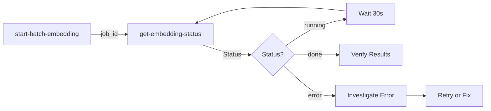

**Best Practices**:
1. **Polling-Intervall**: Prüfe alle 30-60 Sekunden während laufender Jobs
2. **Overall Status**: Nutze ohne `job_id` für System-Überblick
3. **Job-Specific**: Backend unterstützt `job_id` als Query-Parameter (aktuell nicht als Tool-Parameter)

**Beispiel**:
```typescript
// 1. Starte Job
const job = start-batch-embedding({...})
// job_id: "abc123"

// 2. Monitor Progress (Polling)
while (true) {
  const status = get-embedding-status()
  // Status zeigt overall status oder job-spezifisch wenn job_id übergeben
  
  if (status.status === "done") break
  if (status.status === "error") {
    // Handle error
    break
  }
  
  await sleep(30)  // Wait 30 seconds
}

// 3. Final Status
const final = get-embedding-status()
// final.percent sollte 100 sein
```

---

## Tool-Strategien

### Strategie 1: Effiziente Semantic Search

**Problem**: Große Result-Sets sind teuer (Token-Kosten) und langsam.

**Lösung**: Multi-Stage Search mit Filterung

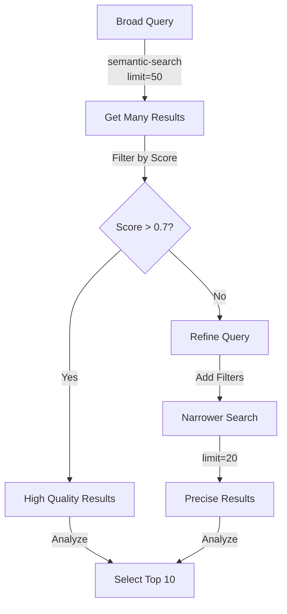

**Beispiel**:
1. **Stage 1 - Discovery**: Breite Suche mit vielen Ergebnissen
   ```typescript
   semantic-search({
     query: "AI semiconductor",
     limit: 50
   })
   ```
2. **Stage 2 - Filter**: Filtere nach Score und Relevanz
3. **Stage 3 - Deep Dive**: Selektive Analyse der Top-Ergebnisse

---

### Strategie 2: Content Quality Filtering

**Problem**: Nicht alle Artikel sind hochwertig (Clickbait, schlechte Extraktion).

**Lösung**: Pre-Filterung mit Similarity-Checks

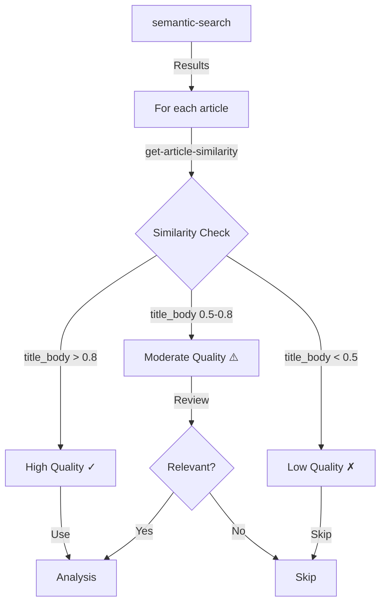

**Workflow**:
1. **Search**: Führe semantische Suche durch
2. **Quality Check**: Prüfe Top-Ergebnisse mit `get-article-similarity`
3. **Filter**: Nutze nur Artikel mit `similarity > 0.7`
4. **Analyze**: Analysiere hochwertige Artikel

**Beispiel**:
```typescript
// 1. Search
const results = semantic-search({
  query: "Bitcoin regulation",
  limit: 20
})

// 2. Quality Filter
const highQuality = []
for (const article of results.results) {
  const similarity = get-article-similarity({
    news_id: article.id
  })
  
  if (similarity.similarity.title_body > 0.7) {
    highQuality.push(article)
  }
}

// 3. Analyze only high-quality articles
// ... analysis with highQuality ...
```

---

### Strategie 3: Systematic Knowledge Building

**Problem**: Wissen muss systematisch aufgebaut werden, nicht ad-hoc.

**Lösung**: Coverage-Gap Detection + Batch Embedding

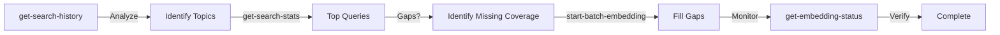

**Workflow**:
1. **Analyze Search Patterns**: Nutze `get-search-stats` um häufige Topics zu identifizieren
2. **Identify Gaps**: Prüfe welche Zeiträume/Topics wenig Coverage haben
3. **Batch Embed**: Starte `start-batch-embedding` für Lücken
4. **Monitor**: Überwache Fortschritt mit `get-embedding-status`
5. **Verify**: Führe Test-Suche durch um Coverage zu verifizieren

**Beispiel**:
```typescript
// 1. Analyze search patterns
const stats = get-search-stats({ days: 30 })
// Top queries: ["AI semiconductor", "Bitcoin regulation", ...]

// 2. Identify coverage gaps (manually oder automatisch)
// Missing: Articles from 2024-06-01 to 2024-06-30 for "AI"

// 3. Fill gaps
const job = start-batch-embedding({
  from_date: "2024-06-01",
  to_date: "2024-06-30",
  topics: "AI",
  body_only: true,
  incremental: true
})

// 4. Monitor
while (true) {
  const status = get-embedding-status()
  if (status.status === "done") break
  await sleep(30)
}

// 5. Verify
const results = semantic-search({
  query: "AI semiconductor June 2024",
  from_date: "2024-06-01",
  to_date: "2024-06-30"
})
// Should now return results
```

---

### Strategie 4: Collection Versioning & Zero-Downtime Updates

**Problem**: Collection-Updates sollten ohne Service-Unterbrechung erfolgen.

**Lösung**: Versionierte Collections mit Alias-Switching

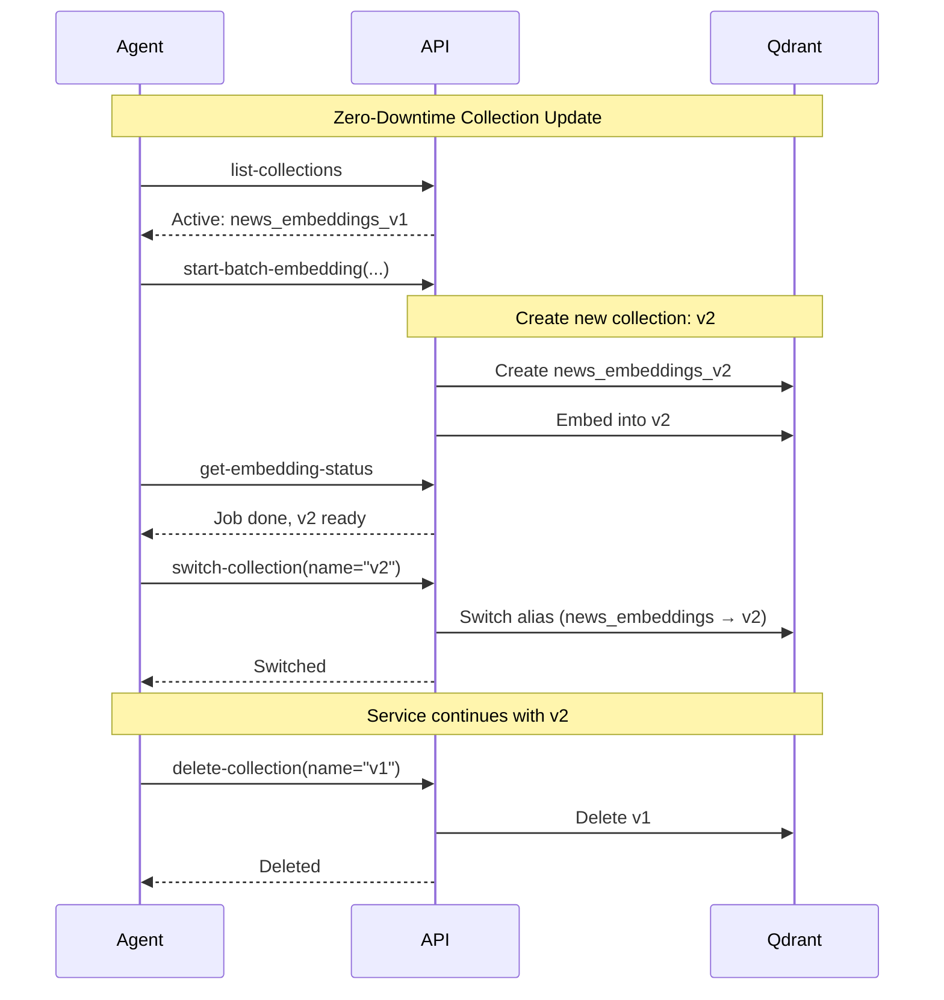

**Best Practices**:
1. **Create New Version**: Starte Batch-Embedding (erstellt automatisch neue Collection)
2. **Monitor Progress**: Überwache Job bis Completion
3. **Switch**: Wechsle Alias zur neuen Collection (Zero-Downtime)
4. **Verify**: Führe Test-Suche durch
5. **Cleanup**: Lösche alte Collection nach Verifizierung

---

## Workflows & Best Practices

### Workflow 1: Research-Workflow mit Quality-Filtering

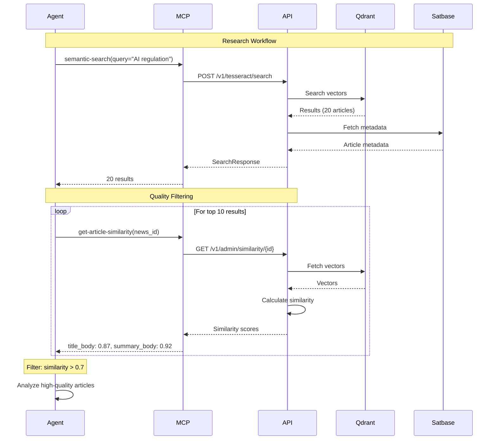

**Best Practices**:
- Filtere nach Quality-Score vor Deep-Dive-Analyse
- Nutze `find-similar-articles` für verwandte Perspektiven
- Kombiniere mit Satbase MCP für zusätzliche Metadaten

---

### Workflow 2: Systematic Knowledge Building

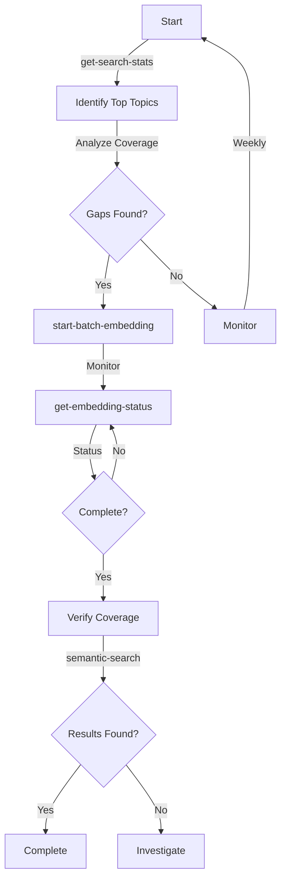

**Best Practices**:
- Regelmäßige Coverage-Analyse (wöchentlich)
- Incremental Embedding für Effizienz
- Monitor Jobs nicht-blockierend

---

### Workflow 3: Collection Maintenance

```mermaid
graph TD
    A[list-collections] -->|Review| B{Old Versions?}
    B -->|Yes| C[Verify Active]
    C -->|Switch if Needed| D[switch-collection]
    D -->|Test| E[semantic-search Test]
    E -->|Success| F[delete-collection Old]
    E -->|Failure| G[Rollback]
    G -->|switch-collection| D
    B -->|No| H[Monitor]
```

**Best Practices**:
- Regelmäßige Collection-Cleanup (monatlich)
- Behalte mindestens 1 Backup-Version
- Teste nach jedem Switch

---

## Erweiterte Nutzung

### Multi-Vector Search Strategy

**Konzept**: Tesseract speichert separate Vektoren für `title`, `summary`, `body`.

**Vorteile**:
- **Title-Vektoren**: Schnelle, oberflächliche Suche
- **Summary-Vektoren**: Ausgewogene Balance (Standard)
- **Body-Vektoren**: Tiefe, kontextuelle Suche

**Strategie**:
```mermaid
graph LR
    A[Query Type] -->|Quick Overview| B[vector_type: title]
    A -->|Standard Search| C[vector_type: summary]
    A -->|Deep Research| D[vector_type: body]
    
    B -->|Fast Results| E[Title Matches]
    C -->|Balanced| F[Summary Matches]
    D -->|Comprehensive| G[Body Matches]
```

**Default Behavior**: Multi-Vector Suche (alle Typen) ist Standard und liefert beste Ergebnisse.

---

### Incremental Embedding Strategy

**Problem**: Re-Embedding aller Artikel ist langsam und teuer.

**Lösung**: Incremental Mode (`incremental: true`)

**Wie es funktioniert**:
1. Tesseract prüft SQLite-DB ob Artikel bereits embedded sind
2. Überspringt bereits embedded Artikel
3. Embeddet nur neue/aktualisierte Artikel

**Performance**:
- **Full Embedding**: ~1000 Artikel/Minute (GPU)
- **Incremental**: ~5000 Artikel/Minute (nur neue Artikel)

**Best Practice**: **Immer** `incremental: true` verwenden außer bei Factory Reset.

---

### Search History Learning

**Konzept**: Nutze `get-search-history` um aus vergangenen Suchen zu lernen.

**Strategien**:
1. **Avoid Duplicates**: Prüfe ob Query bereits gesucht wurde
2. **Refine Queries**: Lerne aus erfolgreichen Query-Patterns
3. **Identify Gaps**: Erkenne häufige Queries mit wenigen Ergebnissen → Embed mehr

**Beispiel**:
```typescript
// 1. Check if query was already searched
const history = get-search-history({
  query_filter: "semiconductor supply chain",
  days: 7
})

if (history.count > 0) {
  // Query already searched, check if results still relevant
  // Or use existing results
} else {
  // New query, execute search
  semantic-search({...})
}
```

---

### Error Handling & Retry Strategies

**Job-Fehler**:
```mermaid
graph LR
    A[get-embedding-status] -->|error| B{Error Type?}
    B -->|Transient| C[Retry Job]
    B -->|Permanent| D[Investigate]
    C -->|start-batch-embedding| E[New Job]
    D -->|Fix| F[Manual Fix]
```

**Search-Fehler**:
- **No Results**: Verfeinere Query oder erweitere Filter
- **Low Scores**: Query zu spezifisch, verwende breitere Query
- **Timeout**: Reduziere `limit` oder Date-Range

---

## Fazit

Der Tesseract MCP bietet eine umfassende semantische Suchmaschine für den Satbase News-Corpus. Die **11 Tools** decken alle Aspekte von Suche, Similarity, Analytics, Collection-Management und Embedding ab.

**Key Takeaways**:
1. **Multi-Vector Search**: Nutze Standard-Multi-Vector für beste Ergebnisse
2. **Quality Filtering**: Prüfe Content-Qualität mit `get-article-similarity`
3. **Incremental Embedding**: Immer `incremental: true` für Effizienz
4. **Collection Versioning**: Zero-Downtime Updates mit Alias-Switching
5. **Systematic Learning**: Nutze Search-History für Metakognition

---

## Anhang

### Tool-Übersicht nach Kategorie

| Kategorie | Anzahl | Haupt-Tools |
|----------|--------|-------------|
| **Search** | 3 | `semantic-search`, `find-similar-articles`, `get-article-similarity` |
| **Analytics** | 2 | `get-search-history`, `get-search-stats` |
| **Collection Management** | 4 | `init-collection`, `list-collections`, `switch-collection`, `delete-collection` |
| **Embedding** | 2 | `start-batch-embedding`, `get-embedding-status` |
| **Total** | **11** | |

### Performance-Erwartungen

| Operation | Geschwindigkeit | Bemerkung |
|-----------|----------------|-----------|
| Semantic Search | 100-500ms | Abhängig von Collection-Größe |
| Find Similar | 200-800ms | Abhängig von Vector-Type |
| Article Similarity | 50-200ms | Schnell, nur Vector-Lookup |
| Batch Embedding | ~1000 Artikel/Min (GPU) | Abhängig von Hardware |
| Collection Switch | <100ms | Zero-Downtime, sofort |

### Embedding-Modell Details

- **Modell**: `intfloat/multilingual-e5-large`
- **Dimensionen**: 1024
- **Sprachen**: Multilingual (DE, EN, ZH, ES, FR, etc.)
- **Query Prefix**: `query:` für Queries
- **Passage Prefix**: Kein Prefix für Passages
- **Normalization**: L2-normalized Vektoren
- **Similarity**: Cosine Similarity (0-1)

---

**Version**: 1.0.0  
**Letzte Aktualisierung**: 2025-01-24  
**Autor**: Tesseract MCP Documentation


