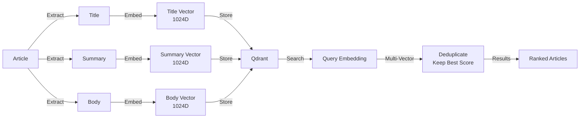

# Tesseract MCP - Quick Reference

## Tool-Übersicht (11 Tools)

### Search (3)
- `semantic-search` ⭐ - Semantische Suche (multilingual)
- `find-similar-articles` ⭐ - Ähnliche Artikel finden
- `get-article-similarity` ⭐ - Content-Qualität prüfen

### Analytics (2)
- `get-search-history` - Suchhistorie abrufen
- `get-search-stats` - Suchstatistiken abrufen

### Collection Management (4)
- `init-collection` - Collection initialisieren
- `list-collections` - Collections auflisten
- `switch-collection` - Collection wechseln (Zero-Downtime)
- `delete-collection` - Collection löschen

### Embedding (2)
- `start-batch-embedding` ⭐ - Batch-Embedding starten
- `get-embedding-status` ⭐ - Embedding-Status prüfen

⭐ = Häufig verwendete Tools

---

## Häufige Workflows

### 1. Semantische Suche mit Filterung

```typescript
// Basic Search
semantic-search({
  query: "AI semiconductor supply chain",
  limit: 20
})

// Mit Filtern
semantic-search({
  query: "Bitcoin regulation",
  tickers: ["BTC"],
  from_date: "2025-01-01",
  to_date: "2025-01-24",
  language: "en",
  body_available: true,
  limit: 20
})
```

### 2. Quality-Filtering Workflow

```typescript
// 1. Search
const results = semantic-search({
  query: "AI regulation",
  limit: 20
})

// 2. Quality Check (für Top 10)
const highQuality = []
for (const article of results.results.slice(0, 10)) {
  const similarity = get-article-similarity({
    news_id: article.id
  })
  
  // Filter: Nur Artikel mit title_body > 0.7
  if (similarity.similarity.title_body > 0.7) {
    highQuality.push(article)
  }
}

// 3. Analyze only high-quality articles
// ... analysis ...
```

### 3. Ähnliche Artikel finden

```typescript
// Finde ähnliche Artikel zu einem interessanten Artikel
find-similar-articles({
  news_id: "abc123-def456-ghi789",
  limit: 15
})
```

### 4. Batch-Embedding Workflow

```typescript
// 1. Starte Batch-Embedding
const job = start-batch-embedding({
  from_date: "2025-01-01",
  to_date: "2025-01-31",
  topics: "AI,semiconductor",
  language: "en",
  body_only: true,
  incremental: true  // ← Wichtig: Skip bereits embedded
})

// job_id: "abc123-def456-ghi789"

// 2. Monitor Progress
while (true) {
  const status = get-embedding-status()
  
  if (status.status === "done") {
    console.log(`Complete: ${status.processed}/${status.total}`)
    break
  }
  
  if (status.status === "error") {
    console.error(`Error: ${status.error}`)
    break
  }
  
  console.log(`Progress: ${status.percent}%`)
  await sleep(30)  // Wait 30 seconds
}

// 3. Verify
const results = semantic-search({
  query: "AI semiconductor January 2025",
  from_date: "2025-01-01",
  to_date: "2025-01-31"
})
```

### 5. Collection Management

```typescript
// 1. Liste alle Collections
list-collections()

// 2. Wechsle zu neuer Version (Zero-Downtime)
switch-collection({
  name: "news_embeddings_v1761065572"
})

// 3. Lösche alte Version (nach Verifizierung)
delete-collection({
  collection_name: "news_embeddings_v1750000000"
})
```

### 6. Search Analytics

```typescript
// Suchhistorie prüfen
get-search-history({
  query_filter: "semiconductor",
  days: 7,
  limit: 20
})

// Suchstatistiken
get-search-stats({
  days: 30
})
```

---

## Parameter-Referenz

### Datumsformat
Alle Datumsparameter: `YYYY-MM-DD` (z.B. `"2025-01-24"`)

### Similarity-Scores

| Score | Bedeutung | Interpretation |
|-------|-----------|----------------|
| **> 0.8** | Sehr konsistent | Hochwertiger Content ✓ |
| **0.6 - 0.8** | Moderat konsistent | Normaler Content ⚠️ |
| **0.4 - 0.6** | Niedrig konsistent | Qualitätsprobleme |
| **< 0.4** | Sehr niedrig | Clickbait/Poor Extraction ✗ |

### Vector-Typen

| Typ | Beschreibung | Verwendung |
|-----|--------------|------------|
| `title` | Title-Vektor | Schnelle, oberflächliche Suche |
| `summary` | Summary-Vektor | Standard (ausgewogen) |
| `body` | Body-Vektor | Tiefe, kontextuelle Suche |

**Standard**: Multi-Vector Suche (alle Typen) - beste Ergebnisse

### Job-Status

| Status | Bedeutung |
|--------|-----------|
| `queued` | In Warteschlange |
| `fetching` | Artikel werden abgerufen |
| `running` | Embedding läuft |
| `done` | Erfolgreich abgeschlossen |
| `error` | Fehlgeschlagen |

---

## Best Practices

### ✅ DO

- **Natural Language Queries**: Nutze natürliche Sprache statt Keywords
  - ✅ "AI chip shortage impact on automotive"
  - ❌ "AI AND chip AND shortage"
- **Quality Filtering**: Prüfe Content-Qualität mit `get-article-similarity` vor Deep-Dive
- **Incremental Embedding**: Immer `incremental: true` verwenden (deutlich schneller)
- **Body-Only**: Nutze `body_only: true` für qualitativ hochwertige Embeddings
- **Monitor Jobs**: Überwache Batch-Embedding-Jobs regelmäßig (alle 30-60s)
- **Collection Versioning**: Nutze Zero-Downtime Updates mit `switch-collection`

### ❌ DON'T

- **Nicht zu spezifische Queries**: Zu spezifische Queries können keine Ergebnisse liefern
- **Nicht auf Jobs synchron warten**: Nutze Polling mit `get-embedding-status`
- **Nicht ohne Quality-Check**: Analysiere nicht alle Artikel blind - filtere nach Qualität
- **Nicht alte Collections sofort löschen**: Behalte Backup für Rollback
- **Nicht große Date-Ranges ohne Monitoring**: Begrenze auf 30-90 Tage pro Job

---

## Fehlerbehandlung

### Search-Fehler

```typescript
// Keine Ergebnisse
const results = semantic-search({ query: "..." })
if (results.count === 0) {
  // Optionen:
  // 1. Verfeinere Query
  // 2. Erweitere Date-Range
  // 3. Entferne Filter
  // 4. Nutze breitere Query
}

// Niedrige Scores
if (results.results[0].score < 0.5) {
  // Query zu spezifisch oder wenig Coverage
  // Verwende breitere Query oder prüfe Coverage
}
```

### Embedding-Fehler

```typescript
// Job-Status prüfen
const status = get-embedding-status()

if (status.status === "error") {
  // Fehler analysieren
  console.error(`Error: ${status.error}`)
  
  // Optionen:
  // 1. Retry mit angepassten Parametern
  // 2. Reduziere Date-Range
  // 3. Prüfe Satbase-Verfügbarkeit
  // 4. Manuelle Investigation
}
```

### Collection-Fehler

```typescript
// Versuch aktive Collection zu löschen
try {
  delete-collection({
    collection_name: "news_embeddings_v2"  // Aktive Collection
  })
} catch (error) {
  // Error: Cannot delete active collection
  // Lösung: Switch zuerst zu anderer Collection
  switch-collection({ name: "news_embeddings_v1" })
  delete-collection({ collection_name: "news_embeddings_v2" })
}
```

---

## Performance-Tipps

### Schnelle Operationen (< 500ms)
- `get-article-similarity` - Nur Vector-Lookup
- `get-search-history` - SQLite-Query
- `list-collections` - Qdrant-Metadaten
- `switch-collection` - Alias-Update

### Mittlere Operationen (500ms - 2s)
- `semantic-search` (kleine Collections) - Vector-Search + Metadata-Fetch
- `find-similar-articles` - Vector-Search
- `get-search-stats` - SQLite-Aggregation

### Langsame Operationen (2s+)
- `semantic-search` (große Collections) - Abhängig von Collection-Größe
- `start-batch-embedding` - Background-Job (kann Minuten dauern)

### Sehr langsame Operationen (Minuten)
- `start-batch-embedding` - Batch-Processing für große Date-Ranges

---

## Beispiel: Kompletter Research-Workflow

```typescript
// 1. Prüfe ob Query bereits gesucht wurde
const history = get-search-history({
  query_filter: "AI semiconductor regulation",
  days: 7
})

if (history.count === 0) {
  // 2. Neue Suche durchführen
  const results = semantic-search({
    query: "AI semiconductor regulation",
    from_date: "2025-01-01",
    to_date: "2025-01-24",
    language: "en",
    body_available: true,
    limit: 30
  })
  
  // 3. Quality-Filtering für Top 15
  const highQuality = []
  for (const article of results.results.slice(0, 15)) {
    const similarity = get-article-similarity({
      news_id: article.id
    })
    
    if (similarity.similarity.title_body > 0.7) {
      highQuality.push({
        article,
        similarity: similarity.similarity.title_body
      })
    }
  }
  
  // 4. Sortiere nach Score + Quality
  highQuality.sort((a, b) => {
    const scoreA = a.article.score * a.similarity
    const scoreB = b.article.score * b.similarity
    return scoreB - scoreA
  })
  
  // 5. Analysiere Top 10
  const topArticles = highQuality.slice(0, 10)
  
  // 6. Finde ähnliche Artikel für interessante Ergebnisse
  for (const item of topArticles.slice(0, 3)) {
    const similar = find-similar-articles({
      news_id: item.article.id,
      limit: 5
    })
    
    // Analysiere ähnliche Perspektiven
    // ...
  }
  
  // 7. Analyse & Report
  // ... analyse mit topArticles ...
} else {
  // Query bereits gesucht, verwende vorhandene Ergebnisse
  // Oder prüfe ob aktuelle Suche nötig ist
}
```

---

## Embedding-Performance

### Hardware-Abhängigkeit

| Hardware | Geschwindigkeit | Batch-Size |
|----------|----------------|------------|
| **GPU (CUDA)** | ~1000 Artikel/Min | 32 |
| **CPU** | ~200 Artikel/Min | 16 |

### Optimierung

- **Incremental Mode**: **Immer** `incremental: true` (5x schneller)
- **Body-Only**: `body_only: true` reduziert zu verarbeitende Artikel
- **Date-Range**: Begrenze auf 30-90 Tage pro Job für besseres Monitoring
- **Batch-Size**: Automatisch optimiert (32 GPU, 16 CPU)

---

## Multi-Vector Architecture

### Wie es funktioniert



### Vorteile

- **Redundanz**: Mehrere Vektoren pro Artikel erhöhen Trefferquote
- **Flexibilität**: Verschiedene Vector-Types für verschiedene Use Cases
- **Deduplikation**: Automatische Deduplizierung nach `news_id`

---

## Troubleshooting

### Problem: Keine Suchergebnisse

**Mögliche Ursachen**:
1. Query zu spezifisch → Verwende breitere Query
2. Keine Coverage für Zeitraum → Prüfe mit `get-embedding-status`
3. Filter zu restriktiv → Entferne oder lockere Filter

**Lösung**:
```typescript
// 1. Prüfe Coverage
const status = get-embedding-status()
// Prüfe total_vectors und total_embedded_articles

// 2. Teste ohne Filter
semantic-search({
  query: "broad query",
  limit: 20
})

// 3. Erweitere Date-Range
semantic-search({
  query: "...",
  from_date: "2024-01-01",  // Früherer Start
  to_date: "2025-01-24"
})
```

### Problem: Niedrige Similarity-Scores

**Mögliche Ursachen**:
1. Clickbait-Titel
2. Schlechte Body-Extraktion
3. Irreführender Title

**Lösung**:
```typescript
// Filtere nach Quality-Score
const similarity = get-article-similarity({ news_id: "..." })
if (similarity.similarity.title_body < 0.5) {
  // Skip oder markiere als niedrige Qualität
}
```

### Problem: Embedding-Job hängt

**Mögliche Ursachen**:
1. Satbase-API nicht erreichbar
2. Zu große Date-Range
3. GPU/CPU-Überlastung

**Lösung**:
```typescript
// 1. Prüfe Job-Status
const status = get-embedding-status()
// Prüfe error-Meldung

// 2. Reduziere Date-Range
start-batch-embedding({
  from_date: "2025-01-01",
  to_date: "2025-01-15",  // Kürzere Range
  ...
})

// 3. Prüfe Satbase-Verfügbarkeit
// Nutze Satbase MCP health-check
```

---

**Siehe auch**: [Tesseract MCP Manual](./tesseract-mcp-manual.md) für detaillierte Dokumentation.


